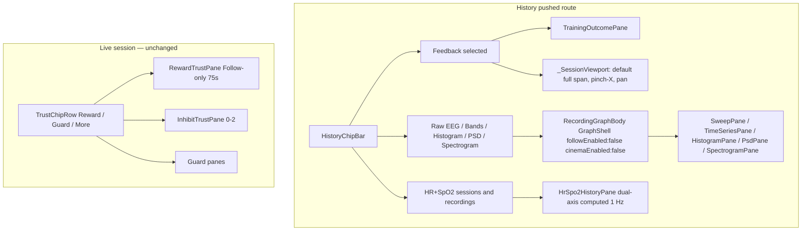
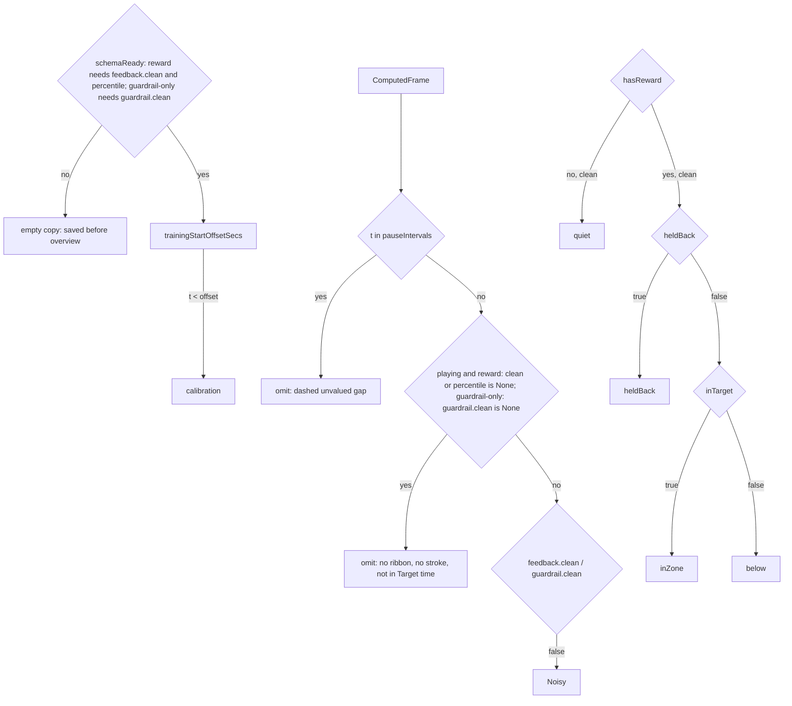
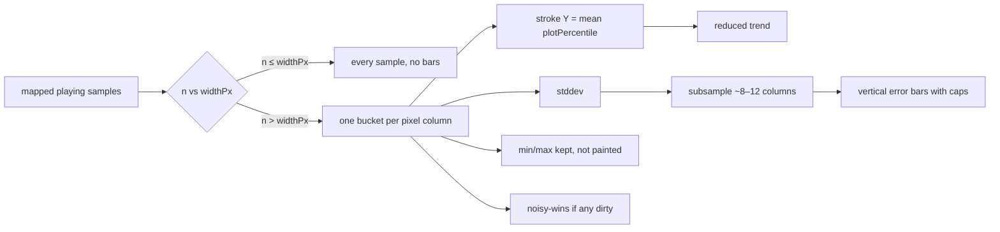
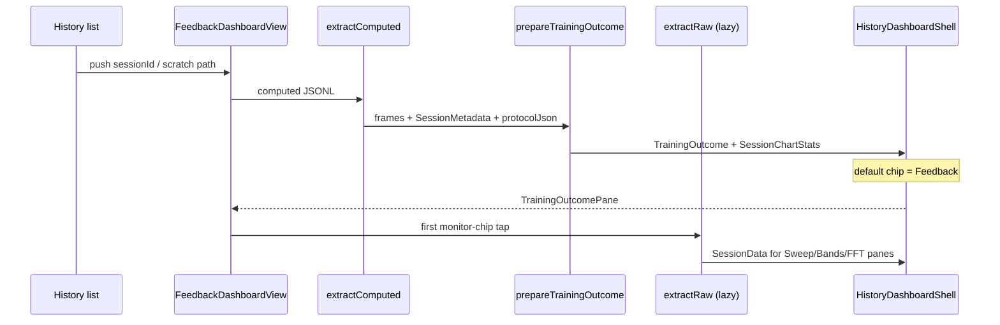

# History session summary ↔ recording dashboard unification

| Field | Value |
|---|---|
| **Status** | Draft |
| **Author** | Grok (design-doc-writer) |
| **Date** | 2026-09-20 |
| **Audience** | Senior engineers on NeuroFeed |
| **Surface** | History pushed routes: `FeedbackDashboardView`, `RecordingDashboardView` |
| **Does not reopen** | Feedback pipeline Key Decisions (`.ai/feedback/pipeline-contract.md`); Crown Start; Connect UX; DeviceKind Muse \| Neurosity; v5 68-byte header / tags 1–10; live GraphShell Follow/Inspect semantics (`.ai/monitor.md`); RatioEngine 80/40; live trust-graph Key Decisions (`.ai/trust-graphs.md`); data-plane spine contract |

Spoken UI names in this doc match [`.ai/ui-map.md`](../ui-map.md). New chrome names land in `ui-map.md` in the same PR that ships them.

**Handoff (PR manager, sequential):** [handoff-history-dashboard.md](handoff-history-dashboard.md).

**Locked owner decisions (2026-09-20, final):**

1. History chip on-screen **`Feedback`**. Live session chip stays **`Reward`**. Different surfaces; ui-map lists both.
2. The overview **replaces** stacked Alpha vs Theta. Bands and HR become chips. Alpha vs Theta is gone as a first-class view **and** as the default PDF page. PDF still keeps Bands / Movement / Heart rate / SpO₂.
3. **Target time %** = `100 * inZone / (playing AND not noisy)`, `—` / null if none. Matches live More. Recomputed on open. Replaces `_inTarget()` band-dominance on the strip and on new `stats.targetPct`.
4. **OQ 8 — reconstruct the live trust graph.** Clean sheet; **no** backward-compat requirement for the Feedback overview. Keep existing JSONL keys and **add** live-graph fields. Stop dirty-latch. Persist calibration `_baseline` samples + `inhibitCeilingOverrides`. History Y = stored **percentile** 0–100. FRB + computed-JSONL schema **are in ship path**. v5 68-byte header / tags 1–10 still out.
5. **History thumbnail is the Feedback overview** (ribbon + percentile stroke + threshold line), not the session stats card. Stats already live in sqlite; the WebP must be the graph. First Save after the painter PR writes that graph. Assemble-at-`end()` placeholder WebP until Save is OK.
6. **OQ 3 — spread on zoom-out is in the ship path** for the Feedback overview (not skip). Default full-session view (including 1 h) must **not** draw every 1 Hz sample as a scribble. One bucket per pixel column when `n > widthPx`; stroke Y = **mean of `plotPercentile`**; spread = **stddev** (min/max kept); **error bars** at ~8–12 subsampled columns. Noisy-wins. Pause and calibration excluded from buckets. Width/alpha is **not** v1. Lands in the **painter PR**. No error bars on Raw EEG in this series.
7. **OQ 4 — HR+SpO2 chip on recordings: yes, this series.** Same dual-axis computed 1 Hz pane as sessions. Chip on the recording row (not GraphShell optical live view). Empty copy if no pulse/spo2. PR 5 / 5b. Recordings default chip stays Raw EEG.
8. **OQ 6 — Pause: persist and draw as a dashed gap.** `pauseIntervals: [{startT, endT}]` in session metadata JSON, timestamps in **`ComputedFrame.t` domain**. Overview: dashed unvalued gaps (lost-signal). Zoom-out buckets skip them. Emit/metadata PR + painter. Recal hairlines mapping is now possible. Feedback-session only (monitor recordings have no Pause).
9. **OQ 7 — `cinemaEnabled: false` on History** (keep toolbar).
10. **OQ 9 — notes** expanded on live Save/Discard; **collapsed on History**. Painter PR still keeps notes reachable.

---

## Overview

History today splits into two visual languages. A **recording** opens `RecordingDashboardView`: a compact `SegmentedButton` chip row (`Raw EEG` `Bands` `Histogram` `PSD` `Spectrogram`) over a `GraphShell` pane with Follow disabled. A **feedback session** opens `FeedbackDashboardView`: a long `ListView` of protocol metadata, stat chips, then stacked zoomable charts (Alpha vs Theta, five-band relative power, movement, heart rate / SpO₂, optional sleep-guardrail / music / gestures). The session charts do not answer the question the user actually has after training: **“I trained this — how did I do, at what time?”**

This design unifies both History rows behind one chip-shell. Feedback sessions gain a **leading Feedback chip** whose pane is a **session-length training-outcome timeline** that **replays stored live-trust fields** (percentile Y, clean / heldBack / inTarget, inhibit tags) — one overview pane, not the live 1–4 stack. Current JSONL is not enough; we **keep** `ratio` / `threshold` / `inTarget` / `pct` / `guardrail.*` and **add** the missing `Trust*Sample` fields, stop dirty-latch, and persist the calibration baseline vector. That is a computed-JSONL + FRB change (not a v5 header/tags 1–10 change). Monitor chips reuse recording panes (lazy raw). **HR+SpO2** is a new dual-axis computed 1 Hz pane on **both** session and recording History rows (recordings default chip stays Raw EEG). Recordings do **not** gain a Feedback chip. Zoomed-out Feedback overview **does not** draw every 1 Hz sample as a scribble: one bucket per pixel column, mean stroke, subsampled stddev error bars. Pause is persisted as `pauseIntervals` and painted as dashed unvalued gaps.

---

## Background & Motivation

### Two History pushed routes

`FeedbackHistoryView` (`lib/src/views/feedback_history.dart`) is the sidebar **History** list (`AppView.feedbackHistory`). Filter All | Feedback | Recordings. Tap:

| Kind | Route | Widget |
|---|---|---|
| `kind = feedback` | `Navigator.push` | `FeedbackDashboardView(sessionId:, metadata:, readOnly: true)` |
| `kind = recording` | `Navigator.push` | `RecordingDashboardView(sessionId:, path:)` |

Live unsaved session summary is the **same** `FeedbackDashboardView` with `readOnly: false`, reached by `pushReplacement` from `FeedbackSessionView` after `end()`, or by leftover `session_*` crash recovery. Back is blocked until Save or Discard.

These are **not** `AppView` graph pages. Landscape cinema (`GraphCinema` in `AppShell`) is defined as live graph views only — “Not Settings / Feedback / Streaming / History” (ui-map). Both dashboards are full-screen `Scaffold`s with their own `AppBar`.

### Recording dashboard (the visual language we want)

`lib/src/monitor/views/recording_dashboard.dart`:

```
AppBar(device name)
[ Raw EEG | Bands | Histogram | PSD | Spectrogram ]   // SegmentedButton, compact
GraphShell(followEnabled: false, showRecord: false)
  Follow (disabled) | Inspect | window length | per-graph extras
  pane (SweepPane / TimeSeriesPane / HistogramPane / PsdPane / SpectrogramPane)
```

Default chip: **Raw EEG** (unchanged). Follow is visible but disabled. Inspect uses in-memory `extractRaw` → `sessionParseBody`. Histogram/PSD have **no** Bands context strip (unlike live). No notes, no Save/Discard (already published). **This series adds an HR+SpO2 chip** on the recording row (same dual-axis computed pane as sessions; empty copy if no pulse/spo2). Not a GraphShell optical live view.

### Session summary (the visual language we are leaving)

`lib/src/views/feedback_dashboard.dart` `_DashboardBody` is a padded `ListView`:

1. **Session summary** card (today captured as the History WebP thumbnail — **wrong**; those numbers are already in `session_metadata.db`): protocol, duration, elapsed, background / feedback sound, `_StatChip`s (Peak alpha, Target time, Stillness, Avg BPM, optional Drift time). `_thumbKey` is a `RepaintBoundary` around that Card; `_capture()` → PNG @ pixelRatio 2 → `encodeThumbnailWebP` (640×360) into the v5 slot and sqlite BLOB. Assemble-at-`end()` still writes **placeholder WebP** into scratch before Save.
2. **Alpha vs Theta** (AF7/AF8 relative power, Y 0–1).
3. **Notes** + live **Save / Discard**.
4. **Bands** (five relative series).
5. **Movement score**.
6. **Heart rate / SpO₂** (dual axis).
7. Optional sleep-guardrail, music-feedback, gesture-marker cards.

All charts share one `_ChartViewport` (pinch / Ctrl+scroll, pan when zoomed, default **full session**). `prepareChartDataFromComputed` (`lib/src/feedback/session_chart_data.dart`) **drops calibration** via `trainingStartOffset` and never reads `ComputedFrame.feedback`. “Target time” is `_inTarget()` band-dominance (`alphaRel > thetaRel` for ATR, plus protocol ceilings) — **not** the reward lane’s `inTarget` AND-gate.

That is why the current graph feels like a monitor dump, not a training debrief.

### What is stored today vs what we will store

Computed capture is a **1 Hz full JSONL snapshot**, Dart-originated (`ComputedSampler` → `capture_append_computed_line`). History **reads** it through Rust `extract_computed` → serde `FeedbackInfo` / `GuardrailInfo`. Extra JSON keys Dart writes are **dropped on extract** unless they exist on `rust/src/api/session_format.rs`. Dart’s parallel writer is `lib/src/session_format/computed_frame.dart`, mapped in `lib/src/spine/assemble.dart` `toFfiFrame`. Changing those structs **is** a computed-JSONL schema change and **does** need FRB codegen both sides + `cargo test --lib session_format`. It is **not** a v5 68-byte header / tags 1–10 change.

Live Reward Y is `RatioEngine.percentileOf(native)` = rank vs calibration **`_baseline`**, fallback **50** if empty. Spec text “session’s reward pile” does **not** match the code. Recalibration re-anchors `_threshold` from `_recent` but **`percentileOf` still uses `_baseline`**. `feedback.pct` today is `successRate` (75 s in-target fraction), **not** that Y.

`RewardLane._emit` / `onComputedFeedback` runs only on **clean** playing samples. Dirty `return`s without updating the sampler, so JSONL latches last clean `feedback.*`. Live `TrustTrace.pushReward` **does** record dirty seconds (dotted, hold last-clean plot Y).

**Owner (final):** not worried about old files; clean sheet; current JSONL is **not enough**; reconstruct the live trust graph; keep current values and **add more**; 1 Hz space is not a problem.

#### Keep (do not replace)

| Key | Meaning — still needed so native vs line and today’s charts/export keep working |
|---|---|
| `feedback.ratio` | Native reward scalar. **Cannot** derive this from percentile. |
| `feedback.threshold` | Native release. `0` = sampler null (`?? 0.0`); live null test is `atr > 1.0`. |
| `feedback.inTarget` | AND-gate on clean emits (will also be written on dirty as `false` after the latch fix). |
| `feedback.pct` | `successRate ?? 0` — **keep**; not History Y, not Target time. |
| `guardrail.{sleepDir,clarity,warning,delta}` | Guard **is** stored. |
| `bands`, `movement`, `signalQuality`, `pulse`, `spo2`, `t`, … | Unchanged. |

You **can** recompute percentile from native + the frozen `_baseline` vector. You **cannot** honestly derive dirty / heldBack / inhibitTags from current JSONL (dirty skip + no heldBack bit + slider overrides not in metadata). You cannot derive native from percentile. **Keep native keys and add live-graph fields.**

#### Add at 1 Hz (exact names)

**JSON wire names (PR 2, critical).** Capture writes **Dart** `ComputedFrame.toJson()` as opaque bytes (`inTarget`, `peakAlpha`, `lineNoise`, `sleepDir`, …). `extract_computed` serde-deserializes **Rust** field names (`in_target`, `peak_alpha`, `sleep_dir`). There is **no** `rename_all` today. New `Option` fields with `#[serde(default)]` become `None` if the key does not match — then every post-schema session looks pre-schema.

Lock on `ComputedFrame`, `FeedbackInfo`, `GuardrailInfo`, `PeakAlphaInfo`:

```rust
#[serde(rename_all = "camelCase")]
```

plus snake_case **aliases** on existing fields so in-memory Rust fixtures still round-trip (`alias = "in_target"`, `peak_alpha`, `sleep_dir`, `line_noise`, `signal_quality`). Canonical **on-disk** keys (Dart `toJson` / `fromJson`, what extract must see):

`t`, `bands`, `pulse`, `movement`, `peakAlpha`, `spo2`, `lineNoise`, `signalQuality`, `gestures`, `guardrail`, `feedback`; inside feedback: `ratio`, `threshold`, `inTarget`, `pct`, `percentile`, `thresholdPercentile`, `heldBack`, `inhibitTags`, `clean`, `dirtyReason`, `betaRel`, `deltaRel`; inside guardrail: `sleepDir`, `clarity`, `warning`, `delta`, `featurePercentile`, `warnOver`, `ceilingOver`, `clean`, `dirtyReason`.

PR 2 test: Dart `toJsonBytes()` line → `extractComputed` → `feedback.percentile` and `feedback.clean` are `Some`, not `None`. `cargo test --lib session_format` plus that Dart JSONL → extract test next to `session_computed_charts_test.dart`.

Rust `FeedbackInfo` (`session_format.rs`; serde `rename_all = "camelCase"` + `#[serde(default)]` on new fields; Dart names match the **wire** keys):

| Rust | Dart | Source (`TrustRewardSample` / `RewardLane`) |
|---|---|---|
| `percentile: Option<f32>` | wire `percentile` | `engine.percentileOf(native) ?? 50` **this second** (dirty rank included). **Not** last-clean Y. `None` = pre-schema. |
| `thresholdPercentile: Option<f32>` | `thresholdPercentile` | `percentileOf(threshold)`; 0 if threshold null. |
| `heldBack: bool` | `heldBack` | `lastHeldBack`. Default false. |
| `inhibitTags: Vec<String>` | `inhibitTags` | `"beta"` / `"delta"`. Default `[]`. |
| `clean: Option<bool>` | `clean` | `!lastDirty`. `None` = pre-schema. |
| `dirtyReason: Option<String>` | `dirtyReason` | `"movement"` / `"blink"` / `"jaw"` / `"pads"`. |
| `betaRel: Option<f32>` | `betaRel` | `lastRelative?.betaRel`. |
| `deltaRel: Option<f32>` | `deltaRel` | `lastRelative?.deltaRel`. |

Rust `GuardrailInfo` additions:

| Rust | Dart | Source (`TrustGuardSample`) |
|---|---|---|
| `featurePercentile: Option<f32>` | `featurePercentile` | Guard More needle. |
| `warnOver: bool` | `warnOver` | Default false. |
| `ceilingOver: bool` | `ceilingOver` | Default false. |
| `clean: Option<bool>` | `clean` | `None` = pre-schema. |
| `dirtyReason: Option<String>` | `dirtyReason` | Same tokens as reward. |

Keep existing `warning` (= live `warningActive`) and `delta` (= `lastDelta`). **Do not store `plotPercentile`.** JSONL `percentile` on a dirty second is the **dirty native’s rank** (computed before the dirty return). History reconstructs hold-last-clean at **read time** like `TrustTrace.pushReward` (§5.5).

`MonitorSampler` must **omit / `None`** `feedback.percentile`, `feedback.clean`, `guardrail.featurePercentile`, and `guardrail.clean`. Do **not** write `percentile: 0` or `clean: false` — that would look schema-ready. Other new bools/`[]` may default false/empty. Recordings still never show a Feedback chip.

#### Add once per session (metadata JSON, not header)

| Field | Where | Size |
|---|---|---|
| `baselineSamples: List<double>` | `SessionCalibration` (and each `SessionRecalibration`) | Silent baseline ~50 s × ~1 Hz ≈ **50 doubles** (~400 B). Recal replaces `_baseline` from `_recent` — persist that vector too. Needed to **check** `percentileOf(ratio)` vs stored `percentile`, and for skip-cal last-baseline. |
| `inhibitCeilingOverrides: Map<String, double>` | `SessionMetadata` (or `SessionSettings`) | A few numbers (`beta` / `delta` slider overlay). |
| `pauseIntervals: [{startT, endT}]` | `SessionMetadata` | Wall seconds in **`ComputedFrame.t` domain**. Stamp `now - recordingStart` in `pause()` / `resume()` / `end()` if still paused. Not a v5 header change. Feedback-session only. |

**1 Hz extra ~10 scalars/second.** One hour ≈ tens of KB. Fine.

#### Writer change — stop dirty-latch (implementable copy list)

Today `onComputedFeedback` is `{ratio, threshold, inTarget, inTargetPct}` and the dirty branch **does not call it**. Grow `ComputedSampler.updateFeedback` / `updateGuardrail` to the exact 1 Hz field tables above.

**Single copy site in `FeedbackStateNotifier._onFeature`** (do not rely on expanding `_emit` alone):

1. After `_reward.onFeature` + `_trust.pushReward` (already uses `last*`): copy into `updateFeedback`:
   - `ratio: lastNative`, `threshold: engine.threshold`, `inTarget: lastInTarget`, `pct: successRate ?? 0`
   - `percentile: lastPercentile` (dirty rank, **not** plot Y)
   - `thresholdPercentile: lastThresholdPercentile`
   - `heldBack: lastHeldBack`, `inhibitTags: lastInhibitTags`
   - `clean: !lastDirty`, `dirtyReason: lastDirtyReason?.name`
   - `betaRel` / `deltaRel` from `lastRelative`
2. After `_trust.pushGuard` (same tick, **including band-math**, including dirty): copy into `updateGuardrail`:
   - existing `sleepDir`, `clarity`, `delta`, `warning`
   - `featurePercentile`, `warnOver`, `ceilingOver`
   - `clean` / `dirtyReason` from the same values passed to `TrustGuardSample`

`GuardLane.onReveExtras` → `updateComputed` stays for clarity/sleepDir extras; it is **not** sufficient for History. Band-math never calls `onReveExtras`.

Dirty still **skips** `RewardOutput.onSample` and `recordEpoch`. `recordSessionSample(clean: false)` stays. Dirty JSONL line: `clean: false`, `inTarget: false`, `heldBack: false`, `inhibitTags: []`, **finite** `percentile` (the dirty rank).

#### Pre-schema / `schemaReady` (clean sheet)

Do **not** key `schemaReady` off reward `percentile` for guardrail-only (those stay `None` because `!_hasReward` never `_emit`s).

```
schemaReady:
  if hasReward → any playing frame has feedback.clean != null AND feedback.percentile != null
  else if hasGuard → any playing frame has guardrail.clean != null
  else → false  // recordOnly
```

If not schemaReady: empty copy `This session was saved before the training overview.` No inference. Recordings unchanged (chip omitted). Leading playing `None` **does not** fail `schemaReady` if a later playing frame is `Some`; those `None` seconds are omitted from the pane (§5.5).

### Pain points

1. Session summary is a different product from recordings, even though both are History rows of the same v5 container.
2. The stacked AF7/AF8 relative-power charts do not encode in-zone / held-back / noisy / below-the-line over time.
3. `ComputedFrame.feedback` is already on disk and unused by the dashboard.
4. Feedback sessions already contain a raw body (`Settings.recordStreams`, default all). The recording panes would work on them if we loaded raw — we currently don’t.

---

## Goals & Non-Goals

### Goals

1. One **chip-row visual language** for both History dashboards.
2. Feedback sessions: a **leading Feedback chip** whose pane answers “how did I do, at what time?” as a **session-length overview** (calibration visible; playing verdicts readable at a glance).
3. Feedback sessions: the recording graph chips (Raw EEG / Bands / Histogram / PSD / Spectrogram) against the session’s raw body, lazy-loaded; plus an **HR+SpO2** chip (dual-axis computed 1 Hz, not live `HrSpo2View`) on **sessions and recordings**.
4. Keep live Save/Discard, notes, export, thumbnail, crash-recovery entry, and `readOnly` History viewing. Notes expanded on live, collapsed on History.
5. Persist live-trust fields into computed JSONL (keep existing keys, add `Trust*Sample` fields) + calibration `_baseline` vector + inhibit slider overlay + **`pauseIntervals`**. FRB both sides. Stop dirty-latch.
6. Update `.ai/ui-map.md` in the same PR as on-screen chrome.
7. `flutter analyze lib/src` stays clean. `cargo test --lib session_format` green after schema. Dirty seconds appear in JSONL. Pause intervals persist. Overview zoom-out uses mean + error bars, not a scribble.

### Non-Goals

- Data-plane / spine / exclusive lease / prefixes / assemble-on-temps.
- Changing the v5 **68-byte header** or **tags 1–10**. Computed JSONL schema + FRB **are in ship path**.
- Reopening live trust graphs: Follow-only, gray wash = inhibit-out only, reward stroke stays series color, no Inspect, no GraphShell on the **live** session. Do not reuse `TimeSeriesPane` / `BandCache` / `ViewportController` / `TrustViewport` as the live plot. History overview is a **new** painter. Live `TrustChipRow` / 75 s Follow **unchanged**.
- Reopening live GraphShell Follow/Inspect, Spectrogram FFT chrome, Bands SMOOTH/REAL TIME, Bands strip on Spectrogram.
- Crown Start, Connect UX, DeviceKind, RatioEngine 80/40.
- Making recordings exportable (still feedback-only per `.ai/export.md`).
- Replacing live session Reward/Guard/More chips.
- A dedicated “Training” `AppView` or sidebar item.
- Width/alpha as a spread encoding (rejected for v1; easy to misread as confidence). Error bars on Raw EEG (already min/max-downsamples).
- History as the live **1–4 pane** stack (inhibit stays wash + tags on one overview).
- Backward-compatible overview for pre-schema files (empty copy instead).
- A **Movement** chip. Stillness % stays on the stats strip; PDF keeps the Movement page; the Feedback footer has a collapsed Movement block so fidget-vs-below correlation is not lost on-screen (see §4).

---

## Proposed Design

### 1. Shared History dashboard shell

**PR 1 extracts the recording dashboard as-is** (chip bar + `GraphShell` + pane switch + pinch/`_uv`/`_hz`/`_mag`/`ElectrodeToggles`/`fileSamples:` helpers + `cinemaEnabled: false`). That file is ~700 lines of state, not “a chip bar.” Do **not** invent a generic shell that also hosts `TrainingOutcomePane` in PR 1. Feedback overview is a different viewport and lands in **PR 4** (after schema+emit). **PR 5** then **composes** the extracted recording graph body under session chips.

End-state layout (after PR 5/6):

```
┌─ AppBar ─────────────────────────────────────────────────────────┐
│ {protocol} — Session     or     {device name} / Recording        │
│ live: [Save] [Discard]          history: back; notes overflow    │
└──────────────────────────────────────────────────────────────────┘
│ [ Feedback* | Raw EEG | Bands | Histogram | PSD | Spectrogram | HR+SpO2† ]
│ * Feedback chip only when kind = feedback AND a reward or guard lane ran
│ † sessions AND recordings (this series); not GraphShell optical live view
├──────────────────────────────────────────────────────────────────┤
│ Expanded pane                                                    │
│   Feedback chip → TrainingOutcomePane (new; not GraphShell)      │
│   Raw EEG…Spectrogram → extracted recording GraphShell           │
│     (followEnabled: false, showRecord: false, cinemaEnabled: false)
│   HR+SpO2 → dual-axis computed 1 Hz pane (new; §2)               │
├──────────────────────────────────────────────────────────────────┤
│ Feedback only: compact stats strip (when Feedback chip selected) │
│ Notes (expandable; default open on live unsaved, closed on History)
│ Collapsed Movement / music / gestures on Feedback footer
└──────────────────────────────────────────────────────────────────┘
```

Proposed types (names indicative):

| Type | File | Role | Lands |
|---|---|---|---|
| `HistoryDashGraph` | `lib/src/history/history_dash_graph.dart` | Enum: `rawEeg…spectrogram` in **PR 1**; add `feedback` in **PR 4**; add `hrSpo2` in **PR 5** | PR 1, 4, 5 |
| `HistoryChipBar` | `lib/src/history/history_chip_bar.dart` | Compact `SegmentedButton` currently `_graphKindBar` | PR 1 |
| `RecordingGraphBody` | `lib/src/history/recording_graph_body.dart` | Today’s recording dashboard internals: `ViewportController`, `SweepBuffer.freeze()`, pinch, Y/µV/Hz/mag menus, electrode/band toggles, pane `switch` | PR 1 |
| `HistoryDashboardShell` | `lib/src/history/history_dashboard_shell.dart` | AppBar + chips + expanded child + optional footer. **PR 4** introduces it for sessions. | PR 4 |
| `TrainingOutcomePane` | `lib/src/history/training_outcome_pane.dart` | New painter | PR 4 |
| `prepareTrainingOutcome` | `lib/src/history/training_outcome.dart` | Maps **stored** bits. Input: `List<ffi.ComputedFrame>` | PR 4 |
| `HrSpo2HistoryPane` | `lib/src/history/hr_spo2_history_pane.dart` | Dual-axis computed 1 Hz (raw fallback). **Not** live `HrSpo2View` | PR 5 |

Keep `FeedbackDashboardView` and `RecordingDashboardView` as the public routes (ui-map / crash recovery / History list stay stable).

Do **not** put this under `lib/src/monitor/` as a live-graph sibling, and do **not** put GraphShell Follow into the Feedback chip. A `lib/src/history/` folder (or `lib/src/views/history/`) keeps History playback separate from live monitor and live trust.

**Independent viewports.** Feedback overview keeps its last full-span zoom (`_ChartViewport` / `_SessionViewport`). Each monitor chip keeps its last Inspect window **per kind** (today `_setGraph` resets to that graph’s default window — 10 s Raw EEG, 30 s Bands, … — and that reset is OK if documented). Switching Feedback → Raw EEG **jumps X domain**: full session → default **10 s at t=0** (`ViewportController.eegWindowOptions` are 2/4/8/10 s, not 5 min; spectrogram cap is 300 s). ui-map must mention that jump so it is not treated as a bug.

### 2. Which chips, defaults, recordings

| Chip | Spoken name | Feedback session | Recording | Default |
|---|---|---|---|---|
| Feedback | `Feedback` (**locked**; live chip stays `Reward`) | Yes, if reward **or** guard ran | **No** | **Selected** on feedback sessions |
| Raw EEG | `Raw EEG` | Yes if EEG is recorded (§2 stream rule) | Yes | **Selected** on recordings (unchanged) |
| Bands | `Bands` | Yes | Yes | **Selected** on `recordOnly` (after PR 5) |
| Histogram | `Histogram` | Yes if EEG is recorded | Yes | |
| PSD | `PSD` | Yes if EEG is recorded | Yes | |
| Spectrogram | `Spectrogram` | Yes if EEG is recorded | Yes | |
| HR+SpO2 | `HR+SpO2` | Yes — **new** dual-axis computed pane, replaces the stacked chart | **Yes, this series** (same pane; empty copy if no pulse/spo2) | Recordings default stays **Raw EEG** |

**Lane detection** (do not guess from catalog id alone):

1. Parse `metadata.protocolJson` with `ProtocolDocument.fromJson(..., features: catalog.features)`. `fromJson` **throws** if `reward.feature` is not in the catalog — **catch** and fall back.
2. Fallback: `catalog.forName(metadata.protocol)` (deleted user protocols → placeholder, no reward).
3. `recordOnly` iff the parsed snapshot has **no reward and no guard** (`!hasReward && guard == null`). Live `TrustLaneFlags.showRow` is false in that case; omit the Feedback chip. After PR 5, default **Bands**, or **Raw EEG** if bands are not recorded and EEG is. Until then, PR 4 keeps the existing stacked ListView for this kind — not a blank pane.
4. `guardrailOnly` iff **no reward and guard present**. Keep the Feedback chip; pane is the guard timeline (warning / quiet / noisy), **not** a reward stroke and **not** a session-length `below` ribbon. `schemaReady` uses `guardrail.clean != null`, **not** reward `percentile`. PR 3 must write guard extras on the **same tick as `pushGuard`**, including band-math and dirty.
5. **Stream hiding:** `recordedData.isEmpty` (missing key / old files / `SessionMetadata` default `const []`) means **unknown → assume all streams**, same as live `Settings.recordStreams` when the pref is missing. Hide Raw EEG / Histogram / PSD / Spectrogram only when the list is **non-empty** and lacks `eeg`. Hide Bands-from-raw only when non-empty and lacks `bands` (computed 1 Hz fallback still applies). Prefer probing the parsed raw body if it is already loaded. Bands from computed 1 Hz must use `linearToDb` (same as `bandSeriesFromRecords`).

**HR+SpO2 is not “reuse recording panes.”** Live `HrSpo2View` is dual-pane (overview + IR PPG) on live caches, not file-backed. **Owner-locked:** the same dual-axis computed 1 Hz pane ships on **sessions and recordings** (not GraphShell optical live view). Add the chip to the recording row. Recordings default chip stays Raw EEG.

- One pane, **dual axis**, computed 1 Hz `pulse` / `spo2` with the same raw-body fallback as `prepareChartDataFromComputed`.
- Y: left **40–200 bpm**, right **50–100 SpO₂** (today’s `_ZoomableChart` bounds). Average dashed lines stay.
- Empty copy (keep): `No reliable heart-rate or SpO₂ data was captured for this session.` Recordings: same sentence, “recording” if we already distinguish; otherwise reuse.
- **Not** GraphShell optical chrome; no IR PPG sweep; no Follow.
- Do not show the chip until this pane exists (PR 5 / 5b). No tap-to-error stub.

**Recordings never show Feedback.** `MonitorSampler` leaves `percentile` / `clean` as `None` (not `0`/`false`). A mis-kinded file with `clean: false` + `percentile: 0` would look schema-ready — don’t write that.

### 3. GraphShell vs Feedback chip chrome



- **Monitor chips on History:** reuse the extracted `RecordingGraphBody` (`followEnabled: false`, `showRecord: false`, `cinemaEnabled: false`). Window presets stay per-graph (`ViewportController.eegWindowOptions` etc.). Inspect range label `m:ss–m:ss`. Histogram/PSD stay **one pane** (no `BandsContextStrip` — already true for recordings).
- **Feedback chip:** **not** GraphShell. Default window = **full session** (calibration + playing). Pinch-X / Ctrl+scroll zoom, pan when zoomed — same interaction as today’s `_ChartViewport`, extracted. A range label when zoomed (`2:10–8:40`). A **Reset** control to return to full span. No Follow. No 10 s / 30 s / 75 s preset as the default — those hide the question. Viewport state is **independent** of monitor chips (see §1 X-domain jump).
- **Do not** mount `RewardTrustPane` / `InhibitTrustPane` / `TrustViewport`. Those painters assume a Follow-right window, last-clean hold, and live `TrustRewardSample`. History is a different sample type (`TrainingSample` below).
- **Cinema (OQ 7, locked):** History stays a pushed route, not an `AppView` graph. Do **not** hide the dashboard AppBar or chip row in landscape. Today `GraphCinema.of` returns `true` on mobile landscape **even without** a `_GraphCinemaScope` ancestor (`graph_cinema.dart`: orientation check runs when `fullscreen` is false). That means a History `GraphShell` would hide Follow/Inspect/window in landscape. **Fix:** add `GraphShell.cinemaEnabled` (default `true` for live views; **`false` on History**) so History chrome stays. Do not change live cinema.

### 4. Layout of chrome that is not a graph

| Piece | After unification |
|---|---|
| Protocol / duration / elapsed / sounds | AppBar title `{protocol} — Session`; subtitle or overflow `i` sheet for duration, background sound, feedback sound. Stop crowding the graph. |
| Peak alpha / Target time / Stillness / Avg BPM / Drift time | Compact **stats strip** on the Feedback chip (lands in **PR 4**). Target time formula: §5.5. |
| Notes | Expandable footer. **OQ 9 locked:** default **open** on live unsaved (`readOnly: false`) so Save still sits next to notes; default **collapsed** on History. Dirty-notes pop on History back unchanged. **PR 4 merge gate:** notes remain reachable; do not drop the field. Collapse-on-History can land in PR 4 or PR 6; either way the painter PR keeps the field. |
| Save / Discard | Live only. **PR 4 merge gate:** `readOnly: false` still has AppBar or sticky 48 px Save/Discard and `canPop: false`. PR 6 may move them to AppBar actions **and** keep the sticky pair when notes are expanded. Do not bury Discard in a menu. |
| Music feedback / gesture markers | Not chips. Overflow / trailing block on the Feedback chip (collapsed by default). |
| Movement | **No chip.** Collapsed footer block on the Feedback pane (computed 1 Hz `movement`, Y 0–1.5 as today). Stillness % stays on the stats strip. PDF keeps the Movement page. |
| Sleep guardrail chart | Folded into the Feedback chip as a **thin warning strip** when `guardrail.warning` or `SessionDrowsiness` is present. Do not keep the separate “Sleep guardrail (AI model)” stacked chart as a default. Full sleep-dir line can live in the overflow / nerd-style sheet. |
| HR+SpO2 | **Chip** on sessions (PR 5) **and recordings** (PR 5b), not a stacked ListView chart. Spec in §2. Recordings default stays Raw EEG. |
| Export | History list overflow, feedback-only. New `TrainingExportChart` primitive (§9). Keep Bands / Movement / **Heart rate** / **SpO₂** as separate line pages. **Drop Alpha vs Theta** from the default PDF (**locked**). |
| Thumbnail | **Painter PR (PR 4) requirement, owner-locked.** History row preview **is** the Feedback overview (ribbon + `plotPercentile` stroke + `thresholdPercentile` line), 640×360 WebP via existing `encodeThumbnailWebP`. `_thumbKey` wraps `TrainingOutcomePane` (or a dedicated 640×360 offscreen paint of the **same** painter). Stats strip stays on-screen but is **not** in that `RepaintBoundary`. Assemble-at-`end()` placeholder WebP until Save is OK. Save captures the overview; if not laid out, `addPostFrameCallback` / wait a frame — **do not** fall back to the stats card. `recordOnly` / pre-schema / no overview → keep **placeholder** WebP, not the stats card. Recordings unchanged. sqlite still stores the BLOB; **pixels** change; no DB schema change. PR 6 may polish pixelRatio / letterboxing only. |
| Crash recovery | Unchanged routes into `FeedbackDashboardView`. |

### 5. The Feedback chip: training-outcome timeline

#### 5.1 What the user should see in one glance

One pane, full session on X:

```
t=0                         trainingStart                    end
├──── calibration ────┤──────────── playing ──────────────────┤
 hatched, no verdict     [noisy][below][in zone][held back]…
                         ────────────────────────────────────     thresholdPercentile (0–100)
                         ╱╲╱──╲╱╲──╱                              percentile stroke (0–100; dirty holds last-clean)
                         ░░░░░                                    inhibit-out wash
 labels: "calibration"   "pads"  "in zone"  "beta high"
```

This is **not** the live 1–4 pane stack. Inhibit overshoot is a wash + a run label, not extra panes. Guard warning is a second 4–6 px strip under the reward stroke when a guard lane ran.

#### 5.2 Sample model (read-time, not live)

```dart
enum TrainingPhase { calibration, playing, unknown }

enum TrainingVerdict {
  calibration, // t < trainingStartOffset
  noisy,       // stored clean == false
  quiet,       // playing, !hasReward, not noisy
  heldBack,    // stored heldBack
  below,       // hasReward && clean && !inTarget && !heldBack
  inZone,      // hasReward && clean && inTarget
}

class TrainingSample {
  final double t;
  final TrainingPhase phase;
  final TrainingVerdict verdict;
  final double? percentile;          // stored this-second rank (dirty included)
  final double plotPercentile;       // running last-clean Y (TrustTrace rule)
  final double? thresholdPercentile; // release line
  final double? ratio;
  final bool inTarget;
  final bool heldBack;
  final bool clean;
  final List<String> inhibitTags;
  final String? dirtyReason;
  final bool guardWarning;
  final double? plotBetaRel;
  final double? plotDeltaRel;
  final double? plotGuardPercentile;
}
```

`prepareTrainingOutcome` maps **stored bits** (no movement-heuristic). `schemaReady` is session-level (any playing frame has Some) — the 1 Hz timer starts at recording start, so **leading playing seconds can be `None` forever** (`last*` is copied only after the first `pushReward` / `pushGuard`). Those seconds are **omitted**, not coerced:

- `hasReward && (feedback.clean == null || feedback.percentile == null)` → **do not emit** a `TrainingSample` (no ribbon, no stroke, not in Target time denom). Do **not** `clean!`. Do **not** treat null as noisy or below (live `TrustTrace` has no sample yet).
- Guardrail-only: omit if `guardrail.clean == null`.
- `t` inside `pauseIntervals` → **omit** the same way (dashed gap is painted from the interval list, not from latched samples).
- Mapped samples always have `TrainingSample.clean` as a real `bool` (`true`/`false` only).

Running last-clean: skip calibration **and omitted frames**; scan remaining playing in `t` order; if `clean`, latch plot Y from this `percentile`; if dirty, plot Y = last latch or this `percentile` if none yet (`TrustTrace.pushReward`).

#### 5.3 X domain and phases

- X = `ComputedFrame.t` from 0 to last frame (recording start, **including calibration**).
- Vertical **phase marker** (or hatched band) at `trainingStartOffsetSecs`. Label `calibration` on the left region.
- Playing region: verdict ribbon + stroke.
- **Pause (OQ 6, locked) — persist and draw as a dashed unvalued gap (lost-signal style).**

  Facts today (must not be papered over):
  - Computed capture **is** a continuous 1 Hz JSONL stream. `ComputedFrame.t` is wall seconds from recording start; the sampler timer **keeps firing during pause**.
  - `_onBands` / `_onMovement` / reward `onFeature` **no-op** when `phase != playing`, so pause lines **latch last playing values** (looks like a flat in-zone hold). Pause is **not** marked in metadata today.
  - `elapsedSeconds` ticker **stops** during pause (`pause()` cancels `_ticker`). That is playing-time, not `t`.
  - Without a mark, History cannot tell pause from “sat still in zone”, and recal `atSecs` cannot be mapped onto `t`.

  Lock:
  - Persist **`pauseIntervals: [{startT, endT}]`** in session metadata JSON. Timestamps in the **`ComputedFrame.t` domain**: stamp `now - recordingStart` in `pause()` / `resume()` / `end()` if still paused. Not a v5 header change.
  - Overview: those intervals are **dashed unvalued gaps** (lost-signal), not a flat stroke, not in-zone. Samples whose `t` falls inside an interval are **omitted** (no ribbon, no stroke, not in Target time denom) — same omit rule as playing `None`.
  - Zoom-out buckets **skip** pause seconds (a gap, not a value). Do not average latched pause lines into the reduced trend.
  - This is **this series** (emit/metadata PR + painter). Monitor **recordings** have no Pause button; feedback-session only.

- **Recalibration hairlines.** Mapping is **now possible**: `SessionRecalibration.atSecs` is playing-time (`elapsedSeconds`; ticker stopped during pause). Convert to `t` by adding `trainingStartOffsetSecs` and inserting every `pauseIntervals` duration that falls after training start and before that playing-time:

  ```
  t = trainingStartOffset
  remaining = atSecs
  for each pause [s, e] with e > trainingStartOffset, in startT order:
    playable = max(s, trainingStartOffset) - t
    if remaining <= playable: return t + remaining
    remaining -= playable
    t = e
  return t + remaining
  ```

  Pull hairlines into the painter PR **if cheap**; otherwise leave as follow-up (optional PR 7) but do not claim the old `atSecs + offset` shortcut. Same domain bug remains for metadata `GestureMarker.offsetSeconds` until mapped the same way. Optional gesture **ticks**, if shown, still use a **rising edge** of computed `gestures` vs the previous frame (JSONL `t` domain) — never a held latch.

#### 5.4 Y / encodings (accessibility: never color-only)

| Channel | Encoding | Why |
|---|---|---|
| Reward value | Solid stroke of **`plotPercentile`** (0–100). Axis = catalog `shortLabel`. Dirty: dotted, hold last-clean (`TrustTrace`). Stroke stays series color. Stored `percentile` on a dirty line is the dirty rank — **not** the stroke. | Owner: reconstruct live trust graph. |
| Y domain | **Fixed 0–100.** Release line = stored `thresholdPercentile`. No 8% pad. | Live Reward pane. |
| Release line | Step at `thresholdPercentile` when `Some` and we have a reward lane. | Not native `threshold` (kept for overflow / baseline check). |
| Verdict | Ribbon + texture from **stored** `clean` / `heldBack` / `inTarget`: in-zone solid wash; below dashed/empty; held-back **gray wash** (inhibit-out, not a gray stroke); noisy dotted; calibration hatch; quiet = no reward wash | One pane. Inhibit is wash + tags, **not** extra History panes in v1. |
| Run labels | Zone-entry: `in zone` / `below` / `held back` / stored `dirtyReason` (`pads` / `movement` / `jaw` / `blink` with live ≥2 s rule for jaw/blink text) / `beta high` / `delta high` from stored `inhibitTags` / `calibration`. Isolated 1 s noisy = texture only. ui-map: History **`below`** = live **`Below the line`**. | Stored tags, not catalog-ceiling inference. |
| Guard | 4–6 px strip from stored `warning` / `guardrail.clean` / `featurePercentile`. | Compact; not 1–2 live Guard panes. |
| Gesture marks | Optional rising-edge of computed `gestures` | Marks only. |

**Priority** (same as live More, reward lane only): noisy > held back > below > in zone. Calibration wins before `trainingStartOffset`. When `!hasReward`: noisy > quiet.

Semantics: one node per run, e.g. `In zone from 3:12 to 4:01`. Do not expose only a colored canvas.

#### 5.5 How verdicts are mapped (stored bits are source of truth)

Do **not** start the overview painter until schema + emit PRs have landed. Movement / pad inference from rev 2 is **dropped** as the primary path.



**Pre-schema.** `schemaReady` false → empty copy. No inference. Guardrail-only does **not** require `feedback.percentile`.

**Last-clean plot Y** (`prepareTrainingOutcome`, playing window, **after omitting nulls**):

```
plot = sample.percentile
if !clean: plot = lastCleanPlot ?? sample.percentile
else: lastCleanPlot = sample.percentile
```

Same for `betaRel` / `deltaRel` / guard `featurePercentile`. Tests: dirty `percentile: 12` after clean `80` → stroke Y **80**, ribbon noisy; first second dirty → stroke **12**; **leading playing `None` then clean `Some` → `schemaReady`, no throw, Target time ignores the `None` seconds**.

**Calibration.** `t < trainingStartOffsetSecs` → `calibration`. Stop.

**No reward lane.** After stored-clean: `noisy` or `quiet` only. Empty stroke. Guard strip from stored guard fields. Target time **null**. Never `below`.

**Playing, `hasReward`.** Priority matches live More, using **stored** flags:

0. Playing `clean == null` or (reward) `percentile == null` → **omit**. Not noisy.
1. `clean == false` → `noisy` (`dirtyReason` for labels). Stroke is `plotPercentile` (last-clean), not stored dirty rank.
2. `heldBack` → `heldBack` (gray wash; labels from `inhibitTags`).
3. `inTarget` → `inZone`.
4. else → `below`.

Optional check (not the paint path): `percentileOf(ratio, metadata.baselineSamples)` vs stored `percentile` — log if they drift (recal vs `_baseline` semantics).

**Target time %** (`double?`; live More `inZonePercent`):

```
playingCounted = playing frames that were mapped (clean != null; reward also percentile != null; not in pauseIntervals)
playingAndClean = those with clean == true
null  if !hasReward OR playingAndClean == 0
else  100 * (clean && inTarget) / playingAndClean
```

`None` seconds are **not** in the denominator.

Strip `—` when null. Widen `SessionChartStats.targetPct` / `SessionStatsData.targetPct` to `double?`; omit JSON when null. Do **not** use `feedback.pct` (75 s `successRate`) as Y or Target time.

Tests lock: dirty JSONL `clean: false` → `noisy`; `heldBack: true` → `heldBack`; `!hasReward` + `guardrail.clean: true` → `schemaReady` and no `below`; pre-schema reward file (all playing `percentile` null) → `schemaReady: false`; last-clean scan as above; **leading playing `None` then a later `Some` → `schemaReady`, no throw, Target time ignores `None` seconds**.

#### 5.6 Empty / degenerate sessions

| Case | Feedback chip |
|---|---|
| `recordOnly` (`!hasReward && guard == null` on parsed snapshot; §2) | Chip omitted. **PR 4:** keep the existing stacked ListView as the pane (no blank `Expanded`; agent smoke uses this protocol). **PR 5:** default Bands. **Thumbnail:** placeholder WebP, not the stats card. |
| Guardrail-only (`!hasReward && guard != null`) | Chip shown; guard strip + “No reward lane” empty stroke; reward ribbon = `quiet` / `noisy` only — **never** `below` / `inZone` / `heldBack`. Thumbnail = that pane. |
| Reward on, zero computed frames | Empty state: `Not enough signal data was recorded to build this graph.` Thumbnail: placeholder. |
| Reward on, frames but all calibration (ended during cal) | Hatch only; copy `Session ended during calibration.` Thumbnail: that hatch pane. |
| EEG stream off | Monitor chips that need raw hide only when `recordedData` is **non-empty** and lacks `eeg` (§2); Feedback chip still works from computed |
| Pre-schema files (all playing `percentile` / `clean` null) | Empty copy: `This session was saved before the training overview.` No inference. Thumbnail: **placeholder**, not stats card. |
| Old files missing `feedback` keys | `ComputedFrame.fromJson` already requires `feedback`. Pre-v5 / corrupt → existing load error path |

#### 5.7 Zoom / Inspect on the overview

Default = full session (including 1 h). Pinch-X zooms; pan when zoomed; Reset. This is **session Inspect**, not live GraphShell Inspect, and not live trust Follow. The default view **is** zoomed out, so reduction is the default paint path, not a later spike.

How much to average when zoomed **out**: see §7 (ship spec). When `n ≤ widthPx`, draw every mapped sample, **no bars**. When `n > widthPx`, **one bucket per pixel column**; stroke Y = **mean of `plotPercentile`**; subsampled **stddev error bars** (~8–12 across the pane). Do **not** average coarser than one pixel. Pause seconds and omitted `None` are gaps, not bucket input. Calibration hatch stays; do not mix calibration into playing buckets. Ribbon: noisy-wins if any mapped sample in the bucket has `clean == false`.

#### 5.8 Relationship to live trust graphs (frozen)

| Live (do not change) | History Feedback chip |
|---|---|
| `TrustChipRow` Reward / Guard / More | One History chip `Feedback` |
| Follow-only 15–300 s, default 75 s | Full session, pinch zoom |
| Y = `percentileOf` vs `_baseline` (0–100) | Stroke = **`plotPercentile`** (read-time last-clean). Line = `thresholdPercentile`. Live Follow 75 s **unchanged**. |
| Gray wash = inhibit-out only; stroke stays series color | Same *meanings*; new painter |
| Dirty = dotted, hold last clean Y (`plotPercentile` in RAM) | JSONL stores this-second `percentile` (dirty rank). History **recomputes** hold at read time (`prepareTrainingOutcome` running last-clean). |
| 0–2 inhibit panes | No extra panes; wash + `beta high` / `delta high` labels |
| Guard 1–2 panes + More | Thin warning strip |
| RAM 5 min cap | Whole session from JSONL |
| `recordOnly` hides the row | Chip omitted; PR 4 keeps old ListView pane until PR 5 |
| Guardrail-only: no Reward pane | Chip shown; `quiet`/`noisy` only, empty stroke |

Copy the **semantics** (verdict priority, wash meaning, dirty texture, label vocabulary from ui-map: `in zone`, `below the line` → History short `below`, `Held back`, `pads`, `movement`, `beta high`, `delta high`). Do not copy widgets.

### 6. Sharing painters vs forking

| Pane | Share | Notes |
|---|---|---|
| `SweepPane` + `emitSweepTrace` | Share | Recording dashboard already passes `fileSamples:` from `channelFromRecords`. Feedback sessions use the same helper once raw is loaded. |
| `TimeSeriesPane` | Share for **Bands** | Recording uses `bandSeriesFromRecords` (`linearToDb`). Computed 1 Hz fallback must also `linearToDb`. |
| `HistogramPane` / `PsdPane` / `SpectrogramPane` | Share | Same as recording: `meanFromRecords` + `histogramCounts` / `welch` / `stftColumns`. No Bands strip on History Histogram/PSD. Do not add Spectrogram FFT chrome. |
| `GraphShell` | Share with `cinemaEnabled: false` | Recording monitor chips only. |
| `HistoryChipBar` | Share | Extract from `_graphKindBar` |
| `TrainingOutcomePane` | **New** | Do not subclass `RewardTrustPainter` |
| `HrSpo2HistoryPane` | **New** | Dual-axis computed 1 Hz; not live `HrSpo2View`; not GraphShell optical |
| `_ZoomableChart` in `feedback_dashboard.dart` | **Retire** from the default surface once chips exist | Keep line-chart export for Bands / Movement / Heart rate / SpO₂ |
| `BandToggles` / `ElectrodeToggles` | Share | Unchanged last-one-stays |

**Lazy load raw.** Today `FeedbackDashboardView._loadSession` only calls `extractComputedFromPath`. Raw EEG for a 20-minute Muse-4 session is ~20×60×256×4×8 ≈ 10 MB of doubles plus record overhead — fine, but don’t pay it on the Feedback chip. Load `extractRaw` on first tap of a monitor chip; cache in the State. Recordings already load raw up front (they default to Raw EEG).

**Memory:** do not hydrate `SweepBuffer` RAM rings for History except as the recording dashboard already does (display window only, `freeze()`). Keep using `fileSamples:` / `channelFromRecords`.

### 7. Zoom-out reduction + spread (ship path, OQ 3 locked)

The owner’s paper sketch (three stacked 1 h graphs) is the spec:

1. **Top — what we would draw today if we zoom out:** every 1 Hz sample, a dense scribble, constant up-and-down, unreadable. This is **not** the default History overview.
2. **Middle — the reduced graph they want:** far fewer points, a readable trend — the average / shape of the hour.
3. **Bottom — reduced trend plus vertical error bars** at selected points, showing the spread of the samples that were averaged into that point. They said we could use those spread bars, or the earlier width/alpha idea. **The sketch is error bars. Error bars are v1.**

Overview default is **full session** (including 1 h), so this lands in the **painter PR**. Reduction is the default view, not a later spike.

| Series | Typical n | At 400 px width | This series |
|---|---|---|---|
| Computed 1 Hz, 20 min | 1 200 | 3 samples/col | Bucket per pixel; mean stroke; ~8–12 error bars |
| Computed 1 Hz, 60 min | 3 600 | 9 samples/col | Same. Do **not** draw the scribble. |
| Raw EEG 256 Hz, 20 min | 307 200 | 768 samples/col | **Already** `emitSweepTrace` min/max. **No** error bars here. |
| Bands / other History chips | 1 Hz | same as computed | May reuse the bucket helper later; **not** required for PR 4. |
| Zoomed **in** (`n ≤ widthPx`) | — | ≤ 1 sample/col | Every mapped sample, **no bars**. |

**Display-limited buckets**

```
when n ≤ widthPx:
  draw every mapped sample, no error bars
when n > widthPx:
  one bucket per pixel column   // do not average coarser than one pixel
  stroke Y  = mean of plotPercentile in the bucket
  spread    = stddev (primary); also keep min/max available
  error bars at a subsampled set of columns (~8–12 across the pane)
```

Do **not** average coarser than one pixel — that throws away display resolution. Stroke Y is the mean of **`plotPercentile`** (last-clean hold), **not** stored dirty `percentile`. Spread of the bucket is **stddev** (primary: “how far the values that make up the average are from the plotted value”). Keep min/max on the bucket struct for tests / a later encoding; **do not paint an envelope fill in v1**.

**Error bars:** vertical caps at a **subsampled** set of columns so they stay readable — about **8–12 bars across the pane**, as in the sketch — **not** a bar on every pixel. Pick evenly spaced bar-columns among those that have a finite stddev and at least 2 samples.

**Ribbon:** noisy-wins in the bucket if **any mapped** sample is `clean == false`. Do not let a mean hide a held-back / noisy run. Held-back wins over below / in-zone by the same live More priority on the bucket (noisy > heldBack > below > inZone), using mapped samples only.

**Exclude from bucket mean/spread:**
- Pause seconds (`t` inside `pauseIntervals`) — a gap, not a value.
- Omitted playing `None` frames — gaps, not input.
- Calibration (`t < trainingStartOffset`) — hatch stays; **do not** average calibration into playing buckets.



```
column x  (playing, not pause, not cal, not omitted None)
  samples in [t_left, t_right)
       │
       ▼
  mean ──────► stroke Y          (middle sketch)
  stddev ────► bar half-height   (bottom sketch; only if this column is a bar site)
  min/max ───► available, unpainted in v1
  any clean==false ──► ribbon noisy
```

Width/alpha as an alternative is **rejected for v1** (easy to misread as confidence). Documented in Alternatives. Raw EEG already min/max-downsamples; do **not** add error bars there in this series.

### 8. Data / load path



Live unsaved: same, from `scratchV5Path` (already assembled **before** `phase = ended`).

`prepareChartDataFromComputed` stays for export + stats that still need relative-band series (PDF Bands page, stillness from movement). Training-outcome stats (Target time) move to `prepareTrainingOutcome`.

### 9. Export

`.ai/export.md` is feedback-only. `SessionExporter.chartsFor` currently emits **Bands, Alpha vs Theta, Movement, Heart rate, SpO₂** (Heart rate and SpO₂ are **separate** line pages, not the dashboard dual-axis chart), plus optional sleep-dir.

`ExportChart` / `ExportChartLine` are evenly spaced **lines** plus an optional horizontal threshold (`session_export.dart`). A verdict ribbon + hatch + run labels is a **different primitive**. Do not stuff verdicts into `ExportChartLine`.

Add an explicit **`TrainingExportChart`** (sibling of `ExportChart`):

- Inputs: `List<TrainingSample>`. Y **fixed 0–100**; line = `thresholdPercentile`. No 8% pad.
- Paint: calibration hatch, verdict ribbon textures, **percentile** stroke, `thresholdPercentile` line, run labels. **No pinch.** PNG: paint `TrainingOutcomePane` to a canvas. PDF: a `pw` CustomPaint equivalent, not a polyline of `ExportChartLine`.
- Insert as report page 0. **Keep** Bands, Movement, Heart rate, SpO₂ pages. **Drop** Alpha vs Theta from the default PDF (**locked**). Optional sleep-dir page unchanged.
- Tests: `test/session_export_test.dart` (Training page present; Alpha vs Theta absent; HR and SpO₂ still separate). Update `.ai/export.md` in PR 6.

Do not export recordings.

### 10. Mobile / desktop

- History dashboards remain **pushed routes**, not cinema `AppView`s. Portrait and landscape both show AppBar + chips + pane.
- Chip row already horizontal-scrolls (`SingleChildScrollView` in recording dashboard). Feedback + 5 monitor + HR is fine on sessions; recordings gain HR as a 6th chip (still scrolls).
- Desktop: Ctrl+scroll zoom on Feedback overview (match current `_ZoomableChart`, which requires a modifier so the page can still scroll — except the page no longer scrolls; the pane is `Expanded`. Modifier-zoom can stay for consistency with “don’t steal wheel”).
- F11 / landscape must **not** hide History chips (see `cinemaEnabled: false`).

### 11. Tests

Add every new `test/history/*` path to `.ai/test-matrix.md` **in the same PR that adds the file**. Reconstruction tests are pure Dart with **in-memory** `ffi.ComputedFrame` objects (FRB data classes; no `.so`). Optional container round-trip stays next to `test/session_computed_charts_test.dart` (FFI list).

Pure Dart (no `.so`):

- `prepareTrainingOutcome`: stored bits; last-clean scan (dirty 12 after clean 80 → plot 80); `!hasReward` + `guardrail.clean` → `schemaReady`; all-playing `percentile == null` → not ready; leading playing `None` then clean `Some` → `schemaReady`, no throw, Target time ignores `None`; `inZonePercent` null if denom 0 or `!hasReward`. Pause-interval samples omitted; Target time ignores pause. Bucket helper: `n ≤ widthPx` → identity; `n > widthPx` → one bucket/pixel, mean of `plotPercentile`, stddev, noisy-wins, skip pause/cal/`None`.
- Schema: `cargo test --lib session_format`; **Dart `toJsonBytes` → `extractComputed` → `percentile`/`clean` are Some** (camelCase wire).
- Emit: dirty JSONL has `clean: false`, `inTarget: false`, `heldBack: false`, `inhibitTags: []`, finite `percentile` (dirty rank, not last-clean).
- Pause: `pause()` / `resume()` / `end()` stamp `pauseIntervals` in `t` domain; painter draws a dashed gap; bucket helper skips those seconds; Target time ignores them.
- `HistoryChipBar`: feedback session shows leading Feedback; recording does not; `recordOnly` omits Feedback; recording row includes HR+SpO2 and still defaults to Raw EEG.
- `GraphShell(cinemaEnabled: false)`: extend existing `test/monitor/graph_shell_test.dart` (already a widget test; already proves `GraphCinema.of` hides Follow/Inspect in mobile landscape **without** a `_GraphCinemaScope`). Toolbar stays visible when `cinemaEnabled: false`.

FFI (existing neighborhood):

- Optional: fixture with known `feedback.inTarget` sequence → `prepareTrainingOutcome` after `extractComputed`.

Linux agent HTTP is **not** required (these are pushed routes, not `AppView`s).

### 12. Risks

| Risk | Severity | Mitigation |
|---|---|---|
| Overview ≠ live trust | Low | Stored percentile / clean / heldBack; dirty-latch removed. Pause marked as `pauseIntervals` + dashed gaps. |
| Loading raw on a feedback session OOMs low-end phones | Low | Lazy load; same path recordings already use |
| Too many chips on a 360 px phone | Medium | Horizontal scroll (exists). HR+SpO2 on recordings is a 6th chip. `recordOnly` drops Feedback. |
| Thumbnail / export drift from on-screen pane | Low | PNG paints the same `TrainingOutcomePane`; PDF uses `TrainingExportChart`, not `ExportChartLine` |
| `GraphCinema.of` hides History GraphShell chrome | Medium | `cinemaEnabled: false` |
| Forgetting FRB both sides | High | PR 2 checklist: `flutter_rust_bridge_codegen generate`; commit `frb_generated.rs` + `lib/src/rust/`. |
| Users miss Notes / Save because the graph ate the ListView | High | Sticky Save/Discard; notes default-open on live |

---

## API / Interface Changes

**FRB + `session_format` structs are in ship path** (computed JSONL only). No new capture FFI. No v5 header/tags 1–10.

```rust
#[serde(rename_all = "camelCase")]
// FeedbackInfo — keep ratio, threshold, in_target (alias inTarget), pct; add:
percentile: Option<f32>,
threshold_percentile: Option<f32>, // wire thresholdPercentile
held_back: bool,
inhibit_tags: Vec<String>,
clean: Option<bool>,
dirty_reason: Option<String>,
beta_rel: Option<f32>,
delta_rel: Option<f32>,
// GuardrailInfo — keep sleep_dir (alias sleepDir), …; add:
feature_percentile: Option<f32>,
warn_over: bool,
ceiling_over: bool,
clean: Option<bool>,
dirty_reason: Option<String>,
```

Dart `toJson` **must** emit the camelCase wire keys. `toFfiFrame` maps them. Codegen both sides.

`ComputedSampler.updateFeedback` / `updateGuardrail` take the full field tables. Copy site: `_onFeature` after `pushReward` / `pushGuard` using `last*` (Issue 23). Dirty skips `output.onSample` and `recordEpoch`.

```dart
class TrainingOutcome {
  final List<TrainingSample> samples; // pause / None omitted
  final double? inZonePercent;
  final bool schemaReady;
  final List<({double startT, double endT})> pauseIntervals; // ComputedFrame.t
}
```

Widen `SessionChartStats.targetPct` / `SessionStatsData.targetPct` to `double?`.

---

## Data Model Changes

**v5 68-byte header / tags 1–10: none.** Computed JSONL `FeedbackInfo` / `GuardrailInfo` grow fields (above). Metadata JSON (zstd blob, not header):

- `SessionCalibration.baselineSamples: List<double>` and the same on `SessionRecalibration` (~50 doubles typical).
- `SessionMetadata.inhibitCeilingOverrides: Map<String, double>`.
- `SessionMetadata.pauseIntervals: List<{startT, endT}>` — `ComputedFrame.t` domain; stamp in `pause()` / `resume()` / `end()` if still paused. Feedback-session only. Not a v5 header change.
- `stats.targetPct` optional (`double?`).

---

## Security & Privacy Considerations

No new network, no new PII. Notes stay local. Overview is derived from data already in the `.neurofeed` file. Thumbnail becomes a training-outcome picture rather than a metadata card — still local WebP in the container head.

---

## Observability

- Keep `debugPrint('[dashboard] save: …')`.
- Log reconstruction: frame count, playing seconds, inZone %, noisy %, whether raw was lazy-loaded.
- No new metrics backend.

---

## Rollout Plan

No feature flag. History is a pushed route; ship behind sequential PRs. Rollback = revert the History PR; live session and live monitor are untouched if PRs stay in `lib/src/history/` + dashboard files.

Target time % meaning is **locked**: switch on open (recompute); no dual-label transition.

---

## Alternatives Considered

### A. Restyle the summary ListView with chips, keep two dashboards

Put a chip bar on `FeedbackDashboardView` that only swaps among the **existing** stacked charts (Alpha vs Theta / Bands / Movement / HR), plus a leading Feedback chip that is a screenshot-like trust pane.

- **Pros:** Smaller diff; no raw-load on sessions; recording dashboard untouched.
- **Cons:** Two shells forever; session still cannot open Raw EEG / Spectrogram; Feedback chip still has no honest data model if we fake a trust pane; does not actually unify.

Rejected as the end state. Extracting the recording chip shell (PR 1) is still the first increment.

### B. One shared GraphShell, Feedback as just another windowed graph

Mount the overview inside `GraphShell` with Follow disabled and a new window preset `session` (full span).

- **Pros:** One chrome for every chip; Inspect range label for free.
- **Cons:** GraphShell window options are 2 s–5 min (`eegWindowOptions`, `spectrogramZoomCap = 300`). Full-session as a preset fights those caps. Follow being visible-but-disabled on a debrief pane is noise. Live trust explicitly forbids GraphShell on those plots; stuffing History into GraphShell invites copying Follow semantics later.

Rejected for the Feedback chip. Accepted for the monitor chips (already true).

### C. Dedicated “Training” page, graphs stay on a second route

End session → Training debrief (only the overview). A button opens “signal graphs” (recording dashboard).

- **Pros:** Clearest answer to “how did I do”; no chip overload.
- **Cons:** Extra navigation; recordings and sessions diverge again; user asked to **move the session summary toward the recording chips**, not away from them.

Rejected. The leading chip *is* the debrief, on the same surface as the graphs.

### D. Sparkline-only Feedback chip (no full pane)

Chip shows a 24 px in-zone sparkline; tapping it does nothing extra; other chips are the real graphs.

- **Pros:** Tiny.
- **Cons:** Does not answer “at what time?”; user asked for a graph in the chip slot, like recordings.

Rejected.

### E. Persist live `Trust*Sample` fields into computed JSONL (keep existing keys, add more)

Owner-locked. Not the 5 min RAM ring (still discarded). Not a v5 header change. FRB + serde defaults + dirty-latch fix + `_baseline` vector in metadata.

Rejected: replace `ratio` with percentile (cannot recover native). Rejected: inference-only History (cannot derive dirty/heldBack honestly). Rejected: delay until old files work (owner: clean sheet).

### F. Zoom-out spread: width/alpha vs error bars vs envelope fill

When `n > widthPx`, collapse each pixel column to a bucket.

- **Width/alpha:** thicken or fade the stroke by variance. **Rejected for v1.** Easy to misread as confidence / signal quality / pad quality. Owner allowed it as an alternative; the sketch is error bars.
- **Envelope fill:** low-alpha min–max band plus a mean stroke (EEG `emitSweepTrace` prior art). Honest extrema, but at 1 Hz × 1 h it still looks busy, and it is not the sketch. Keep min/max on the bucket; **do not paint the fill in v1**.
- **Error bars (picked for v1):** reduced mean stroke plus vertical caps at ~8–12 subsampled columns, showing stddev of the samples averaged into that point. Matches the owner’s bottom sketch. Not a bar on every pixel.

Raw EEG already min/max-downsamples; no error bars there in this series.

---

## Open Questions

**None remain.** OQ 1, 2, 3, 4, 5, 6, 7, 8, 9 are owner-locked. Do not re-litigate.

1. **Chip label = `Feedback`.** Live session chip stays `Reward`. ui-map lists both as different surfaces. History short `below` = live `Below the line`.
2. **Replace Alpha vs Theta.** Overview replaces stacked summary charts. Bands and HR become chips. Alpha vs Theta gone as a first-class view **and** as the default PDF page. PDF keeps Bands / Movement / Heart rate / SpO₂.
3. **Spread encoding (ship).** One bucket per pixel column when `n > widthPx`; stroke = mean of `plotPercentile`; spread = stddev (min/max kept); **error bars** at ~8–12 subsampled columns. Noisy-wins. Pause and calibration excluded. Painter PR. Width/alpha rejected for v1. No Raw EEG error bars.
4. **HR+SpO2 on recordings: yes, this series.** Same dual-axis computed 1 Hz pane as sessions. Chip on the recording row. Empty copy if no pulse/spo2. PR 5 / 5b. Recordings default chip stays Raw EEG.
5. **Target time % = in-zone / clean playing.** `100 * inZone / playingAndClean` as `double?`; `—` / null if none. Matches live More. Recomputed on open. Replaces `_inTarget()` band-dominance. Pause / `None` seconds are not in the denom.
6. **Pause: persist `pauseIntervals` and draw dashed gaps.** Metadata JSON, `ComputedFrame.t` domain (`now - recordingStart` in `pause()` / `resume()` / `end()` if still paused). Overview: dashed unvalued gaps (lost-signal), not a flat in-zone hold. Zoom-out buckets skip them. This series (emit PR + painter). Recal hairlines mapping is now possible. Feedback-session only.
7. **`cinemaEnabled: false` on History** (keep toolbar). Do not change live cinema.
8. **History Y = stored live percentile.** Keep existing JSONL keys; add `Trust*Sample` fields; stop dirty-latch; persist `_baseline` samples + inhibit overlays. Pre-schema files: empty copy. Not a v5 header change; FRB is in ship path.
9. **Notes** expanded on live Save/Discard; **collapsed on History**. Painter PR still keeps notes reachable.

---

## References

- `.ai/ui-map.md` — History, Recording dashboard, Feedback summary, live Reward/Guard/More
- `.ai/trust-graphs.md` — live semantics (frozen)
- `.ai/monitor.md` — GraphShell, cinema, recording dashboard
- `.ai/export.md` — feedback-only export
- `.ai/feedback/pipeline-contract.md` — frozen pipeline
- `lib/src/views/feedback_dashboard.dart` — current summary
- `lib/src/monitor/views/recording_dashboard.dart` — chip shell to extract
- `lib/src/feedback/session_chart_data.dart` — `prepareChartDataFromComputed`, unused `feedback.*`
- `lib/src/feedback/computed_sampler.dart` — 1 Hz snapshot
- `lib/src/session_format/computed_frame.dart` / `rust/src/api/session_format.rs` — `FeedbackInfo`
- `lib/src/feedback/reward_lane.dart` — dirty skips `_emit` **today**; PR 3 makes dirty call `onComputedFeedback`
- `lib/src/feedback/target_state.dart` — `percentileOf` vs `_baseline` (not `_recent`)
- `lib/src/feedback/trust/` — live-only ring
- `lib/src/monitor/panes/sweep_pane.dart` — `emitSweepTrace` min/max per pixel
- `lib/src/feedback/session_metadata.dart` — `SessionCalibration.trainingStartOffsetSecs`; `SessionRecalibration.atSecs` is playing-time
- `lib/src/feedback/gate_electrodes.dart` — `museGateElectrodeNames`, `gateElectrodeNames`
- `lib/src/feedback/target_state.dart` — `RelativeBandAggregator.evaluate` (null only when **no** named pad is usable)
- `.ai/test-matrix.md` — add `test/history/*` in the same PR that adds them

---

## Key Decisions

1. **Unify History dashboards with a shared chip row.** Recordings keep today’s chips. Feedback sessions add a **leading Feedback chip** (on-screen **`Feedback`**, locked). Live session chip stays **`Reward`**. Recordings do **not** get a Feedback chip.
2. **Default chip:** Feedback on sessions when a reward or guard lane ran; Raw EEG on recordings; Bands on `recordOnly` (`!hasReward && guard == null` on parsed `protocolJson`, with catalog fallback).
3. **Feedback chip is a new session-length overview**, not live `RewardTrustPane`, not GraphShell, not Alpha vs Theta (**locked** replace). **Not** the live 1–4 pane stack. X includes calibration. Stroke = **`plotPercentile`** (read-time last-clean; **mean per pixel** when zoomed out); line = `thresholdPercentile`; Y fixed 0–100; **stddev error bars** at ~8–12 columns when `n > widthPx`. Playing `None` and pause seconds omitted. Pause = dashed unvalued gaps. Ribbon from stored `clean` / `heldBack` / `inTarget`. Inhibit = gray wash + stored tags. History `below` = live `Below the line`. Thumbnail = this pane.
4. **Keep existing JSONL keys; add live-graph fields; FRB in ship path.** **Wire = camelCase** (`rename_all` + snake aliases). Copy `last*` into the sampler after `pushReward` / `pushGuard`. Dirty skips audio/`recordEpoch` but JSONL gets `clean: false` and the dirty `percentile`. History hold-last-clean is **read-time**. `schemaReady` is reward- vs guard-specific. Persist `baselineSamples` + `inhibitCeilingOverrides` + **`pauseIntervals`**. Pre-schema → empty copy. v5 header/tags 1–10 still out.
5. **Monitor chips on sessions reuse recording panes** (`SweepPane` etc.) with **lazy** `extractRaw`, starting in **PR 5** (hidden until then). Empty `recordedData` = assume all streams; hide only when the list is non-empty and lacks the name. Histogram/PSD stay one-pane (no Bands strip). No new Spectrogram chrome. **HR+SpO2** is a **new** dual-axis computed 1 Hz pane on **sessions and recordings** (this series; PR 5 / 5b), not live optical GraphShell. Recordings default chip stays Raw EEG.
6. **Independent viewports.** GraphShell Follow stays disabled on History monitor chips. Feedback chip uses `_ChartViewport`-style full-span zoom. Switching Feedback → Raw EEG jumps to 10 s at t=0 (ui-map). **`GraphShell.cinemaEnabled: false` on History (OQ 7 locked).**
7. **Save/Discard/notes/`canPop: false` are a merge gate on the painter PR**, not deferred to export polish. **Notes expanded on live, collapsed on History (OQ 9 locked).** **History thumbnail is the overview graph** (owner-locked): PR 4 `_thumbKey` wraps `TrainingOutcomePane` (or offscreen same painter). First Save after PR 4 writes that WebP, not the stats card. Placeholder until Save / when there is no overview.
8. **Export:** `TrainingExportChart` (not `ExportChartLine`) as page 0; keep Bands / Movement / Heart rate / SpO₂ as separate line pages; **drop Alpha vs Theta** from the default PDF (**locked**). Recordings still non-exportable. Export Training page uses the same reduced mean + optional error bars as the on-screen default (full-span).
9. **Spread-by-error-bars on overview zoom-out (OQ 3 locked).** When `n > widthPx`, one bucket per pixel column; stroke = mean of `plotPercentile`; spread = stddev (min/max kept); **error bars** at ~8–12 subsampled columns. Noisy-wins. Pause and calibration excluded from buckets. Width/alpha rejected for v1. No error bars on Raw EEG. Lands in the **painter PR**.
10. **Live trust graphs and live GraphShell are untouched.** History playback is a sibling surface. ui-map (Feedback chip + History row = overview WebP) travels with PR 4. `.ai/test-matrix.md` updates travel with the PR that adds tests.
11. **Target time %** (**locked**) = `100 * (clean && inTarget) / playingAndClean` as `double?`; **null** if denom 0 **or** `!hasReward`. Strip `—`. Widen stats types to `double?`.
12. **`lib/src/history/`** owns mapping, recording graph body extract, overview painter, HR history pane. Schema/FRB lives in `session_format.rs` + Dart `ComputedFrame`. Extract-recording PR does **not** host `TrainingOutcomePane`. Schema+emit PRs land **before** the painter.
13. **No Movement chip.** Collapsed Movement block on the Feedback footer; Stillness on the stats strip; PDF keeps Movement.
14. **History list WebP = Feedback overview**, not the stats card. ui-map: History row preview is the training overview. sqlite BLOB only; no schema change.
15. **Pause intervals (OQ 6 locked).** Persist `pauseIntervals: [{startT, endT}]` in session metadata JSON (`ComputedFrame.t` domain). Overview paints dashed unvalued gaps (lost-signal). Zoom-out buckets skip them. Emit PR + painter. Recal hairlines mapping is now possible; pull into PR 4 if cheap. Feedback-session only.

---

## PR Plan

Each PR is independently reviewable and mergeable. **No spine. No v5 header/tags 1–10.** Computed JSONL + FRB **are** in PRs 2–3. `flutter analyze lib/src` green after each. ui-map only in the PR that changes on-screen chrome. New test files land in `.ai/test-matrix.md` in the same PR.

### PR 1 — Extract recording dashboard graph body (behavior-identical)

**Title:** Extract recording chip bar + GraphShell + panes; fix History cinema

**Files:** `lib/src/monitor/views/recording_dashboard.dart`; new `lib/src/history/{history_chip_bar,history_dash_graph,recording_graph_body}.dart`; `lib/src/monitor/graph_shell.dart` (`cinemaEnabled`); tests `test/monitor/graph_shell_test.dart`; `.ai/test-matrix.md` if a new test file is added.

**Depends on:** nothing (parallel with PR 2).

**Description:** Move the **whole** recording-dashboard internals into `RecordingGraphBody`. Behavior unchanged. `cinemaEnabled: false`. **Do not** introduce `TrainingOutcomePane` or schema changes.

### PR 2 — Computed JSONL schema + FRB (no emit behavior yet)

**Title:** Extend `FeedbackInfo` / `GuardrailInfo` for live-trust fields

**Files:** `rust/src/api/session_format.rs`; `lib/src/session_format/computed_frame.dart`; `lib/src/spine/assemble.dart` `toFfiFrame`; generated `rust/src/frb_generated.rs` + `lib/src/rust/`; `lib/src/monitor/recording/monitor_sampler.dart` (None/false/[] defaults); `cargo test --lib session_format`; FFI JSONL round-trip in `test/session_computed_charts_test.dart`.

**Depends on:** nothing.

**Description:** Keep existing four feedback fields + guardrail scalars. Add extras with `rename_all = "camelCase"` + snake_case **aliases**. Dart `toJson` wire keys listed above. Test Dart JSONL → extract → `Some`. `MonitorSampler`: `percentile`/`clean` **None** (not 0/false). No emit-behavior change yet. No UI.

### PR 3 — Emit live-trust fields; stop dirty-latch; persist baseline

**Title:** Write percentile / clean / heldBack every playing second; store `_baseline` and `pauseIntervals`

**Files:** `lib/src/feedback/{reward_lane,computed_sampler,feedback_state,session_metadata}.dart`; tests: dirty playing second in JSONL has `clean: false` (does not latch last `inTarget`); `baselineSamples` round-trip; `inhibitCeilingOverrides` round-trip; `pauseIntervals` round-trip in `ComputedFrame.t` domain.

**Depends on:** PR 2.

**Description:** Expand `updateFeedback` / `updateGuardrail` to the field tables. Copy `_reward.last*` into the sampler **immediately after** `onFeature` / `pushReward` (dirty included). Copy guard extras **on the same tick as `pushGuard`**, including band-math and dirty — not only `onReveExtras`. Dirty still skips `output.onSample` and `recordEpoch`. JSONL dirty line: `clean: false`, finite dirty `percentile`. Persist `baselineSamples` + `inhibitCeilingOverrides`. **Persist `pauseIntervals: [{startT, endT}]`** on `SessionMetadata` (timestamps = `now - recordingStart` in `pause()` / `resume()` / `end()` if still paused). Not a v5 header change. Tests: a paused second is in JSONL (latched values) **and** covered by an interval; `elapsedSeconds` does not advance during pause.

### PR 4 — `prepareTrainingOutcome` + TrainingOutcomePane + Feedback chip

**Title:** Session summary Feedback chip; session-length live-lookalike overview

**Files:** `lib/src/history/{training_outcome,training_outcome_pane,history_dashboard_shell}.dart`; bucket helper (mean / stddev / noisy-wins); `lib/src/views/feedback_dashboard.dart` (`_thumbKey` / `_capture`); `.ai/ui-map.md` (History row preview = training overview WebP); tests §11 mapping + omit-None + pause gaps + pixel buckets; `.ai/test-matrix.md`.

**Depends on:** PR 3. PR 1 not required if this PR only hosts the overview.

**Merge gates (do not ship without):**

- `readOnly: false` still has AppBar or sticky Save/Discard and `canPop: false`.
- Notes field still present.
- **`_thumbKey` wraps `TrainingOutcomePane` (or offscreen same painter at 640×360).** Stats strip is **outside** that boundary. Save uses `addPostFrameCallback` if needed; **no** stats-card fallback. `recordOnly` / pre-schema / empty overview → placeholder WebP (same assemble placeholder is OK).
- Stats strip uses stored-bit in-zone %.
- **No** Raw EEG… / HR+SpO2 chips.
- **`recordOnly` is not a blank `Expanded`.** Keep existing stacked ListView until PR 5.

**Description:** Leading **Feedback** chip. Y = **plotPercentile** (running last-clean), axis 0–100; line = `thresholdPercentile`; ribbon from stored clean / heldBack / inTarget; inhibit wash + tags; optional guard strip. Playing `None` frames omitted. Pre-schema empty copy. Guardrail-only: `schemaReady` from `guardrail.clean`; quiet/noisy only. `recordOnly`: no chip, old ListView. **Save writes the overview WebP** (not the stats card). ui-map: History row preview is that WebP.

**Zoom-out reduction (default view, not a later spike):** when `n > widthPx`, one bucket per pixel column; stroke = mean of `plotPercentile`; stddev **error bars** at ~8–12 subsampled columns; noisy-wins; skip pause / cal / omitted `None`. When `n ≤ widthPx`, every mapped sample, no bars. **Pause intervals** paint as dashed unvalued gaps (lost-signal), not a flat in-zone hold. Recal hairlines at mapped `t` **if cheap**; otherwise leave for leftover PR 7. Notes remain reachable (expanded on live; collapse-on-History may wait for PR 6).

### PR 5 — Session monitor chips (lazy raw) + HR+SpO2 pane

**Title:** Session summary monitor chips via lazy `extractRaw`; HR+SpO2 dual-axis chip

**Files:** `lib/src/views/feedback_dashboard.dart`; `RecordingGraphBody` from PR 1; `lib/src/history/hr_spo2_history_pane.dart`; `.ai/ui-map.md`; `.ai/test-matrix.md`.

**Depends on:** PR 1, PR 4.

**Description:** Compose `RecordingGraphBody` under session chips. Lazy `extractRaw`. Empty `recordedData` = assume all streams. **HR+SpO2** dual-axis computed 1 Hz pane (not live `HrSpo2View`). `recordOnly` gets Bands default.

### PR 5b — HR+SpO2 chip on recordings

**Title:** Recording dashboard HR+SpO2 chip (same pane as sessions)

**Files:** `lib/src/monitor/views/recording_dashboard.dart` / `RecordingGraphBody`; `HistoryDashGraph.hrSpo2`; `.ai/ui-map.md`; `.ai/test-matrix.md`.

**Depends on:** PR 1, PR 5 (reuses `HrSpo2HistoryPane`).

**Description:** Add the chip to the **recording row**. Same dual-axis computed 1 Hz pane. Empty copy if no pulse/spo2. **Default chip stays Raw EEG.** Not GraphShell optical live view. Can fold into PR 5 if the session pane is already there; keep 5b if the recording-row change wants its own review.

### PR 6 — Notes-collapsed on History, export Training page, optional capture polish

**Title:** Export TrainingExportChart, notes polish, optional thumbnail letterbox

**Files:** `lib/src/feedback/session_export.dart`, `session_pdf_export.dart`; `.ai/ui-map.md`; `.ai/export.md`; `test/session_export_test.dart`; optionally `feedback_dashboard.dart` capture pixelRatio/letterboxing.

**Depends on:** PR 4 (overview already captured on Save). PR 5 optional.

**Description:** **OQ 9 locked:** History notes default-collapsed (live stays open) — land here if PR 4 did not already collapse them. `TrainingExportChart` as PDF/PNG page 0 (ribbon + reduced `plotPercentile` mean stroke + same error-bar rule as the on-screen full-span; not `ExportChartLine`). Keep Bands / Movement / Heart rate / SpO₂ line pages. **Drop Alpha vs Theta** from default export (**locked**). New Save writes nullable `stats.targetPct`. Dirty-notes dialog unchanged. **Do not wait until this PR to make the thumbnail the graph** — that is a PR 4 merge gate. Optional: letterbox / pixelRatio polish only.

### PR 7 (optional leftover) — Recalibration hairlines only

**Title:** Optional recal hairlines on the Feedback overview

**Files:** `lib/src/history/training_outcome_pane.dart`; tests for playing-time → `t` via `pauseIntervals`.

**Depends on:** PR 3 (`pauseIntervals`), PR 4.

**Description:** **Not** spread, HR-on-recordings, or pause — those are in the ship path (PR 3 / 4 / 5b). If PR 4 did not pull recal hairlines, map `SessionRecalibration.atSecs` (playing-time) onto `ComputedFrame.t` using `pauseIntervals` + `trainingStartOffsetSecs` and paint hairlines. Skip this PR if PR 4 already did.
