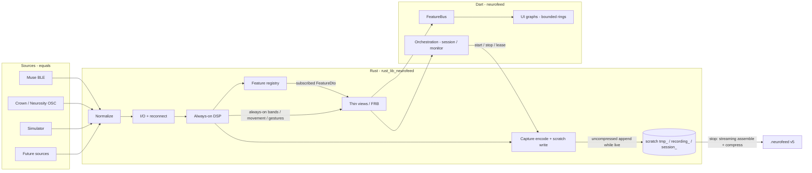
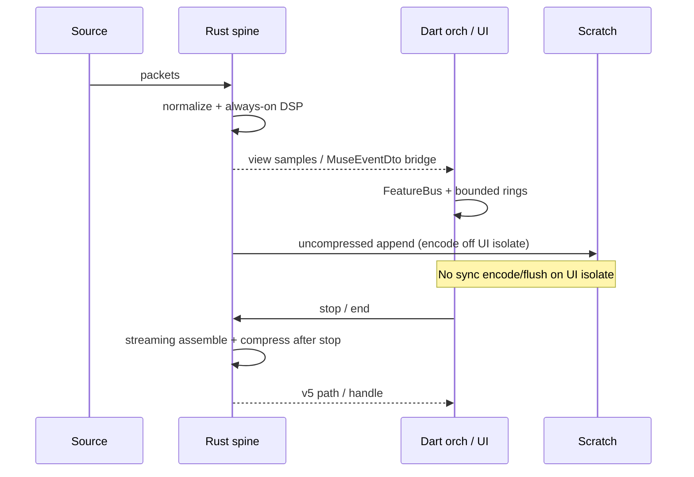

# Data-Plane Spine Contract

| Field | Value |
|---|---|
| Status | **Draft / freeze-in-progress** (branch `refactor/spine`) |
| Date | 2026-09-20 |
| Author | — |
| Scope | Freeze the acquisition → Flutter subscribe → capture **data plane** so later Rust-owned I/O / DSP / scratch-writer work does not relitigate ownership, compression policy, or multi-source equality |
| Not this doc | Rewrite of [../feedback/pipeline-contract.md](../feedback/pipeline-contract.md) (Key Decisions there stay frozen); product pitch; Crown *session run* unlock; Athena optics; v5 byte-layout redesign |
| Packages | App `neurofeed`; Rust crate `rust_lib_neurofeed`. **No `muse_ml`.** |

**Order of work:** freeze *this* contract first, then migrate implementation toward Rust-owned acquisition / DSP / feature registry / scratch writer with thin Dart views. Do not ship large Rust moves before Key Decisions below are accepted as frozen.

**Sibling, not reopen:** this contract is a sibling to the frozen feedback pipeline contract. Align with it (always-on DSP vs subscribed `FeatureDto`, `FeatureBus`, Crown Start refused). **Do not reopen** feedback [Key Decisions](../feedback/pipeline-contract.md#key-decisions).

---

## Overview

Today the “spine” from headset bytes to durable capture is a hybrid kitchen sink:

- Rust already owns BLE / Crown OSC / simulator emit and much of always-on DSP + the feature registry.
- Dart still owns a large share of **subscribe fan-out**, **UI-isolate-adjacent encode/flush**, and **assemble** of overnight-sized raw into `.neurofeed` v5.
- Monitor `tmp_` / `recording_` and feedback `session_` scratch share a format family but not a single ownership story.

The contract:

1. **Multi-source equals.** Muse BLE, Crown/Neurosity OSC, and the simulator are first-class peers behind one normalize boundary (+ future sources only behind that same normalize). No Muse-special-case end state that Crown/sim cannot share.
2. **Rust owns** device I/O, always-on DSP, subscribed feature production, and **capture encode + scratch write**. Dart owns UI, session/monitor orchestration, and `FeatureBus` — **not** sync encode/flush on the UI isolate.
3. **Capture is uncompressed while live.** Compress only after stop. Assemble is **streaming/chunked** — never whole-raw in RAM (12 h overnight must not OOM).
4. **Dart subscribe stays flexible** (broadcast / listen / `FeatureBus`) but **budgeted** for 12 h soak + smooth animation (bounded rings, not unbounded buffers).
5. Agents **must follow** this contract; intentional deviations need an **explicit written why** in the PR / task note.

**Hybrid bridge (allowed, not end state):** keeping `MuseEventDto` as the Dart-facing event pipe plus an off-UI recorder isolate/worker is an **allowed short bridge** while migrating. It is **not** the frozen end state. End state = Rust-owned encode/write; Dart views and orchestration only.

Honest score today: **~4 / 10**. A **9–10** requires the Key Decisions below implemented and soak-proven (see [Score](#score-today--910)).

---

## Relationship to feedback pipeline contract

| Topic | Feedback contract (frozen) | This spine contract |
|---|---|---|
| Always-on vs subscribed | Bands / movement / gestures always-on; `FeatureDto` only while `set_enabled_features` | **Same split.** Spine must not invent a second gating model |
| Event pipe | `FeatureDto` on `MuseEventDto`; not a side stream | Spine may later add a Rust→Dart view API; until then the hybrid `MuseEventDto` bridge is allowed |
| Ownership of lanes / protocol JSON | Dart `FeatureBus`, Reward/Guard lanes, protocol documents | **Unchanged.** Spine does not own reward/guard semantics |
| Crown Start | Refused | Still refused. Spine multi-source equality ≠ Crown session unlock |
| v5 container layout | Non-goal to redesign computed/raw layout | Spine owns **when/how** compress + assemble; does **not** reopen the 68-byte header / tag set without a separate format PR |

If a spine change would force a feedback Key Decision reopen, **stop** and escalate to windwerfer — do not silently contradict.

---

## Background & Motivation

### Current path (honest)

```
Headset / OSC / simulator
  → Rust forwarder (muse.rs / neurosity_osc.rs / simulator.rs)
  → MuseEventDto stream (FRB)
  → Dart: connection_provider / MonitorController / FeedbackStateNotifier / FeatureBus
       ├─ UI graphs (bounded-ish rings; still Dart-heavy)
       ├─ SessionRecorder / monitor recording — encode + append often near UI work
       └─ end(): assembleV5 (Dart orchestration → Rust zstd container encode)
```

Pain this contract freezes a direction against:

| Pain | Why it matters |
|---|---|
| Sync encode / flush on or near the UI isolate | Jank + risk of dropped samples under max-rate EEG |
| Live zstd (or any compress) during capture | CPU spikes; fights “append forever” overnight |
| Assemble that materializes whole raw in RAM | **12 h overnight OOM** hypothesis |
| Muse-shaped assumptions in capture paths | Crown / sim / future sources become second-class |
| Unbounded Dart buffers “for convenience” | 12 h soak + animation smoothness fail together |
| Agents waiting on real 12 h runs | Slow feedback loop; regressions slip |

### What stays (until an explicit format PR)

- `.neurofeed` v5 container shape and Rust `session_format.rs` as byte-layout authority.
- Exclusive scratch lease prefixes: `tmp_` / `recording_` / `session_`.
- Feedback pipeline Key Decisions; Connect UX freeze; Crown Start refused.
- Package names `neurofeed` / `rust_lib_neurofeed`.

---

## Goals & Non-Goals

### Goals

- Freeze multi-source equality, Rust vs Dart ownership, compression/assemble policy, subscribe budgets, soak harness, and spine folder locality.
- Make the hybrid `MuseEventDto` + off-UI recorder path an explicit **bridge**, with a clear Rust-owned end state.
- Require a **max-rate soak/filler harness** so agents prove 12 h-class behavior without wall-clock 12 h.
- Propose a spine-oriented tree for **AI token locality** (docs + future code), without moving code in this doc-only change.

### Non-Goals (out of this freeze)

- Reopening feedback pipeline Key Decisions, Crown Start, or Connect UX.
- Changing v5 header / raw tags / computed columnar layout (separate format series if ever needed).
- Athena optics / new device protocols (queued elsewhere); they must still enter behind **normalize**.
- Moving Dart/Rust files in the same change as this contract (doc-only).
- Rewriting SoLoud / BLE stack / JNI / btleplug forks.
- Medical-device claims.

---

## Stage diagram





---

## Current vs target

| Concern | Today (~4/10) | Target (9–10) |
|---|---|---|
| Source equality | Works, but Muse-centric gravity in Dart paths | Muse / Crown OSC / sim (+ future) equal behind normalize |
| DSP / features | Rust registry + always-on largely done; aligns with feedback contract | Keep alignment; no Dart re-FFT for capture truth |
| Capture encode/write | Dart `SessionRecorder` / monitor recorder + FFI helpers; risk of UI-adjacent sync work | **Rust owns** encode + append; Dart only orchestration |
| Live compression | Risk of compress-during-capture / heavy assemble paths | **No compress while live**; compress only after stop |
| Assemble | Dart-orchestrated; whole-raw-in-RAM possible on long sessions | **Streaming/chunked** assemble only |
| Subscribe / UI | Flexible but budget discipline uneven | Flexible APIs + **bounded rings** sized for 12 h + smooth anim |
| Proof | Manual long runs | **Required** max-rate soak/filler harness |
| Layout | Capture logic spread (`session_v5/`, `feedback/`, `monitor/recording/`) | Spine-oriented paths (see tree); migrate later |

### Bridge vs end state

| Mode | Allowed? | Notes |
|---|---|---|
| Hybrid: `MuseEventDto` + off-UI Dart recorder | **Yes, short bridge** | Must not do sync encode/flush on UI isolate; must still obey no-live-compress |
| End: Rust capture encode/write + thin Dart views | **Required end state** | Orchestration stays Dart; bytes on disk owned by Rust |

---

## Key Decisions

1. **Multi-source equals.** Muse BLE, Crown/Neurosity OSC, and the simulator are peers. Future sources land only behind the same **normalize** boundary. Equality means shared capture / DSP / subscribe contracts — **not** unlocking Crown catalog Start (still refused per feedback contract).

2. **Always-on DSP vs subscribed `FeatureDto`.** Align with the feedback pipeline contract: bands / movement / gestures (and related always-on streams) are always-on; `FeatureDto` producers emit only while enabled via `set_enabled_features`. Spine work must not contradict that split.

3. **Ownership split.** **Rust** (`rust_lib_neurofeed`) owns I/O, DSP, feature registry production, and capture **encode/write**. **Dart** (`neurofeed`) owns UI, orchestration (session/monitor lease, start/stop), and `FeatureBus`. **Forbidden end state:** sync encode/flush on the UI isolate.

4. **No compression during capture.** While live, `tmp_` / `recording_` / `session_` scratch is **uncompressed append** only. Compress **only after stop**. Assemble **MUST** be streaming/chunked — **never** load whole-raw into RAM (12 h overnight is a hard design load).

5. **Dart subscribe is flexible but budgeted.** Broadcast / listen / `FeatureBus` remain acceptable shapes. Rings and queues must be **bounded** for 12 h soak and smooth animation. Unbounded “keep everything in Dart” buffers are out.

6. **Max-rate soak/filler harness is required.** Agents must not wait wall-clock 12 h. A harness that fills or replays at max rate (or equivalent synthetic pressure) is part of spine acceptance — prove append, assemble, and UI budget under pressure.

7. **Folder locality for AI token locality.** Prefer spine-oriented paths (proposed tree below). This contract **does not move code**; migrations follow in later PRs. New capture/DSP spine code should land near the tree, not scatter new roots.

8. **Agents must follow this contract.** Intentional deviations require an **explicit written rationale** (PR description or `.ai` note) before merge. Silence is not assent.

9. **Hybrid bridge is temporary.** `MuseEventDto` + off-UI recorder is allowed only as a short bridge. PRs should state bridge vs end-state; do not treat the bridge as the frozen architecture.

10. **Feedback contract stays frozen.** Spine may depend on it; spine must not reopen its Key Decisions. Conflicts escalate to windwerfer.

---

## Proposed target tree (doc only — do not move yet)

Token-locality proposal for later migrations:

```
.ai/spine/                    ← governing docs (this file)
rust/src/spine/               ← target: normalize, capture writer, soak harness hooks
  normalize/                  ← multi-source → common sample/events
  capture/                    ← encode + uncompressed scratch append + streaming assemble
  soak/                       ← max-rate filler / replay harness (dev/test)
rust/src/api/                 ← FRB surface stays thin; may re-export spine
lib/src/spine/                ← target: thin Dart views + orchestration adapters
  views/                      ← subscribe helpers, bounded rings
  orchestration/              ← lease start/stop wiring to Rust capture
lib/src/session_v5/           ← interim: format FFI helpers until folded under spine
lib/src/monitor/recording/    ← interim bridge
lib/src/feedback/*recorder*   ← interim bridge
```

Existing paths remain valid until an explicit move PR. Do not create empty stub crates in this doc-only change.

---

## Agent rules

- Read this file before data-plane / recording / scratch / assemble / overnight-capture work.
- Follow [Key Decisions](#key-decisions). If you must deviate, write **why** in the PR or task note first.
- Do not reopen [../feedback/pipeline-contract.md](../feedback/pipeline-contract.md) Key Decisions.
- Prefer bridge → end-state increments that remove UI-isolate encode and live compression; do not add new live-compress paths.
- Prove pressure with the soak/filler harness; do not claim 12 h readiness from short happy-path runs alone.
- Packages: `neurofeed`, `rust_lib_neurofeed` only — no `muse_ml`.

---

## Score (today → 9/10)

**Today ~4/10** — Rust I/O + DSP + registry are real; capture/assemble/UI budgeting and multi-source discipline are not yet one spine.

**9–10 requires:**

1. Key Decisions 1–8 accepted as frozen and reflected in code ownership.
2. Rust-owned encode/write for `tmp_` / `recording_` / `session_` (Dart orchestration only).
3. Zero live compression; streaming assemble proven on max-rate soak ≥ overnight-equivalent volume.
4. Bounded Dart rings under max-rate + UI animation load (no unbounded growth).
5. Soak/filler harness in-tree and used in agent/CI guidance.
6. Bridge retired or clearly time-boxed with no new features piled on it.
7. Spine folder locality started (even if not every file moved).

---

## Risks (hypotheses)

Labelled as hypotheses until the soak harness confirms or falsifies:

| ID | Hypothesis | Severity if true | Direction |
|---|---|---|---|
| H1 | **UI-isolate sync encode + live zstd** (or compress-during-capture) causes jank and/or sample loss under max-rate EEG | High | Move encode/write to Rust; ban live compress (KD 3–4) |
| H2 | **Full-file assemble OOM** on 12 h overnight when whole-raw is held in RAM | High | Streaming/chunked assemble only (KD 4) |
| H3 | Unbounded Dart subscribe buffers pass short tests but fail 12 h + animation | Med | Bounded rings + harness (KD 5–6) |
| H4 | Muse-centric capture helpers silently break Crown/sim equality | Med | Normalize-first; equal sources (KD 1) |
| H5 | Bridge (`MuseEventDto` + off-UI Dart recorder) becomes permanent by inertia | Med | Time-box bridge; end state = Rust writer (KD 9) |

---

## Observability

Keep existing `[muse]`, `[crown_osc]`, `[session]` logs.

Add / prefer `[spine]` lines for:

- capture start/stop + prefix (`tmp_` / `recording_` / `session_`)
- append bytes / drop counters (if any)
- assemble: chunk counts, peak RSS if available, compress-after-stop timing
- soak harness: rate, duration-equivalent, pass/fail

Debug-only; no new crashlytics requirement.

---

## Rollout

1. **Freeze** this contract (status → Frozen when windwerfer accepts Key Decisions).
2. Bridge hardening: off-UI encode path; remove live compress if present; add soak harness.
3. Rust capture writer behind the same scratch prefixes; Dart becomes start/stop + progress.
4. Streaming assemble; delete whole-raw RAM paths.
5. Folder moves under `spine/` as follow-ups (separate PRs, behavior-preserving).

No feature flag required for docs. Implementation PRs should say `bridge` or `end-state` in the summary.

---

## Open Questions (non-blocking defaults)

Defaults frozen enough to implement; windwerfer may tighten later:

1. **Exact FRB view API** replacing pure `MuseEventDto` fan-out — deferred; bridge allowed until specified.
2. **Soak harness location** — prefer `rust/src/spine/soak/` once tree exists; until then `rust` tests + scripts are fine.
3. **zstd level after stop** — keep today’s container level unless a format PR says otherwise.
4. **Whether monitor and feedback share one Rust writer type** — yes in spirit (one capture spine); two Dart facades OK.
5. **Bridge time-box** — no new features piled on the hybrid bridge after the first Rust capture-writer PR lands; bridge retirement is a scored spine milestone (see Score), not an open-ended parking lot.
6. **Numeric ring caps** — leave concrete sample counts to the first implementation PR that measures under the soak harness; this freeze only requires *bounded* and *animation-safe*, not a specific N yet.

---

## Alternatives considered

### 1. Keep Dart `SessionRecorder` as permanent encode owner

- **For:** Smallest diff.
- **Against:** Extends UI-isolate risk; fights overnight + max-rate; locks Muse-shaped helpers in Dart.
- **Rejected** as end state; bridge only.

### 2. Compress every N minutes while live

- **For:** Smaller scratch on disk during the night.
- **Against:** CPU spikes; complexity; still need correct assemble; violates KD 4.
- **Rejected.**

### 3. Side-stream raw bytes to Dart, bypassing normalize

- **For:** “Simple” Muse dump.
- **Against:** Breaks multi-source equals; duplicates DSP/capture paths.
- **Rejected.**

### 4. Chosen: Rust-owned spine + budgeted Dart views + compress-after-stop

Matches overnight + multi-source + feedback-contract alignment.

---

PR / implementer notes live with the branch `refactor/spine`. This file is the gate: **contract first, then Rust-owned implementation.**
