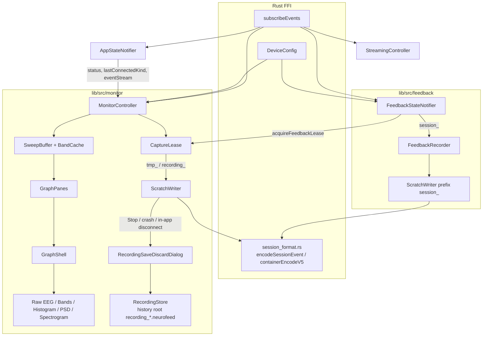
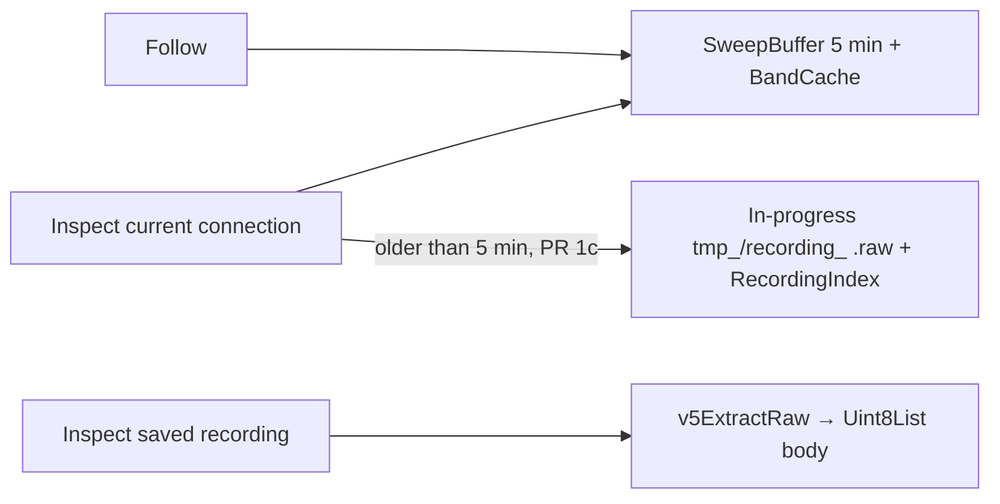
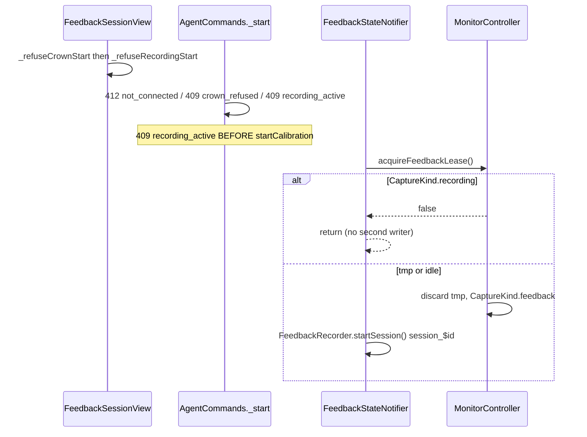
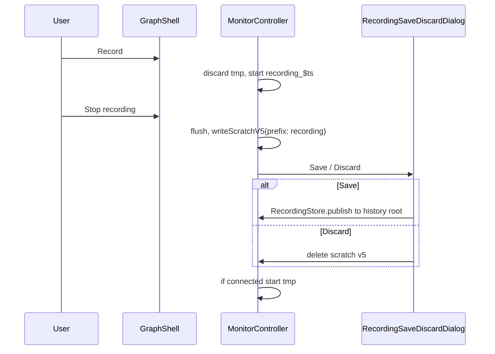
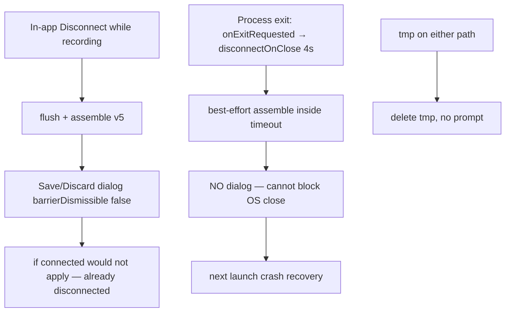
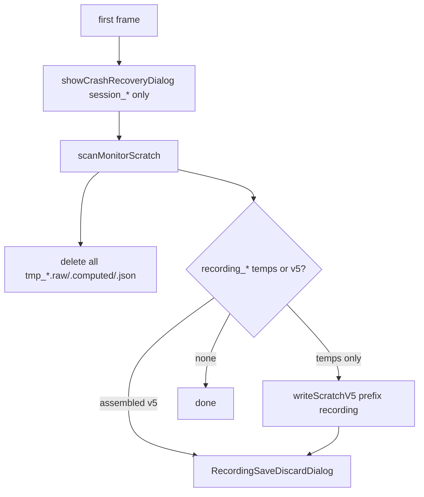

# Live Monitor Graphs + Connect-Time Recording

| Field | Value |
|---|---|
| **Status** | **Implemented** (rev 6). PRs 0–7 landed. **PR 8 cancelled** 2026-09-13. |
| **Author** | TBD |
| **Date** | 2026-09-13 |
| **Audience** | Senior engineers on NeuroFeed |
| **Companion** | Frozen spec (includes historical PR plan). Runtime map: [architecture.md](architecture.md) Monitor. Chrome names: [ui-map.md](ui-map.md). Handoff: [archive/handoff-monitor.md](archive/handoff-monitor.md). |
| **Does not reopen** | Pipeline-contract Key Decisions, Crown Start, Connect UX, v5 68-byte header, exclusive lease, prefixes, GraphShell B, Follow/Inspect names, history-root files, MonitorController in `main()`, 409 `recording_active`, lease release only when `!isRecording`, **Bands Y is dB display (storage stays linear µV²/Hz)**, **PR 4 ASCII (rev 6): landscape cinema, spectrogram magnitude dual-thumb, Histogram/PSD + Bands context strip**, **PR 8 FFT chrome cancelled (256-pt only)** |

---

## Overview

The sidebar live-signal views (Bands, Raw EEG, Spectrogram, PSD) were a first test: oscilloscope-style sweep EEG with add/remove graphs, a one-off Bands dashboard, and two placeholder pages. Recording is accidentally dual-owned — `AppStateNotifier.sessionRecorder` writes `session_$ts` temps from connect until disconnect (then **deletes** them), while `FeedbackRecorder` starts a **second** `SessionRecorder` on `startCalibration()`. Neither assembles a user-facing artifact for the connect-time capture.

This design splits **Monitor** from **Feedback**: a dedicated folder (`lib/src/monitor/`), a standardized graph shell with a fixed pane count, Follow/Inspect viewports, and an exclusive recording lease. On connect, a `tmp_$ts` v5 scratch capture starts automatically (rolling **30 min**, the Inspect-beyond-RAM window). An explicit **Record** control starts a new `recording_$ts` artifact with crash recovery and a Save/Discard dialog. Feedback sessions keep `session_$id` and never share a writer with Monitor.

Published recordings sit in the **same history folder** as sessions: `recording_$ts.neurofeed` next to `session_*.neurofeed` (same v5 container type; two files, not merged). A `recordings/` child directory is **not** used. **Unified History:** one sidebar item **History** (`AppView.feedbackHistory`, label only) with filter All | Feedback | Recordings. One sqlite (`session_metadata.db`) with a `kind` column.

Raw EEG stays the current **oscilloscope sweep** (`SweepBuffer` / green wipe bar). Spectrogram keeps its name (`AppView.spectrogram`). Histogram is new.

### User decisions (2026-09-07)

Locked by the product owner. Do not re-litigate:

1. Unified History (no sixth Recordings sidebar). Enum stays `feedbackHistory`; on-screen **History**.
2. Settings card **Save files to folder**.
3. Sidebar **Spectrogram** (not Waterfall). `AppView.spectrogram` stays.
4. File layout / architecture B / Follow|Inspect / Record|Stop — approved.
5. Raw EEG **stays sweep**. File-backed Inspect of tmp (30 min) is **v1 required**.
6. Non-EEG graphs: electrode **text labels, top-right, tap toggles average**, depressed = selected, default all on, last-one stays on.
7. Graph PRs (2, 3, 4) paste an **ASCII wireframe** and wait for approval before painters.
8. tmp cap **30 min** silent rotate. 5 min RAM hot cache stays.
9. 5 min RAM is the right split vs OpenBCI / Muse Monitor / bedside (see comparison table). Do not grow RAM to 30 min.

### User decisions (2026-09-09) — Bands ASCII

Locked after the PR 3 wireframe. Do not re-litigate:

10. Bands Y is **dB**, matching the Muse app (Live / post-session Powerbands), the Muse SDK (absolute band power = log of PSD, units Bels), and Mind Monitor. Display `10·log10(max(linear µV²/Hz, ε))`. BandCache, FFI, and the raw body stay **linear µV²/Hz**. This **lifts** Bands skip-v1 **log-Y** (display only). Relative % stays v2.
11. Bands pinch-zoom is **X only**. When the window is not 15 / 30 / 60 / 120 s, the dropdown closed label is **`custom`**. Picking a preset restores that length. Zoom-in floor ~5 s; zoom-out cap `min(elapsed, BandCache 30 min)`. Raw EEG stays discrete 2 / 4 / 8 / 10 s — no custom.
12. Sample above the current Y-max: **dashed hold at last in-range Y**. Isolate in `monitor/panes/overshoot_hold.dart` so it can be deleted later (**< 100 lines**). Blink is small on dB; electrode pops may still overshoot. Do not use overshoot samples for the auto scale.

### User decisions (2026-09-12) — PR 4 ASCII

Locked after the PR 4 wireframes. Do not re-litigate. **PR 4 ASCII is approved;** the next thread implements painters (do not paste-and-wait again).

13. **Landscape cinema** on the five graph views only (`bands`, `rawEeg`, `histogram`, `psd`, `spectrogram`). **Mobile** landscape hides status bar, sidebar, and GraphShell toolbar; the pane fills the screen. Portrait restores chrome. **Desktop** keeps chrome (a landscape monitor is not cinema). **F11** on desktop toggles the same hide. Settings / Feedback / Streaming / History keep normal chrome. Connect is portrait (no status bar to tap). Plot gestures still work. Bands and Raw EEG **painters are unchanged**; they only get extra pixels. Land in PR 4 (`AppShell` + `GraphShell`); mobile/desktop split + F11 in `graph_cinema.dart`.
14. Spectrogram dual-thumb is **magnitude** (color min/max of log power), live as the thumbs move — **not** Hz range. Y stays **0–60 Hz**. Closed chrome label **`mag ▾`**. Not auto-pumping every frame (Mind Monitor Magnitude Min/Max, not a frequency cutoff).
15. Spectrogram time: discrete **10 s / 20 s / 30 s / 2 min / 5 min**, default **20 s**. Pinch-X → GraphShell **`custom`**. Pan in Inspect (like Bands). Zoom-out cap **5 min** (SweepBuffer RAM). No 10 min in this series.
16. No spectrogram averaging (1/4/8 s). No hold-finger readout (hold becomes drag, which pans).
17. FFT stays **256-pt** Hamming `1/N²` (1 s at 256 Hz). **PR 8 cancelled** (2026-09-13): no Spectrogram `FFT 1s ▾`. `dsp.dart` `n` stays parameterized; live spectrogram and PSD Welch both use `n = 256`. No averaging.
18. Histogram / PSD in **PR 4 are one pane each.** Windows **2 / 4 / 8 s** (Histogram default **8 s**, PSD default **4 s**). Follow = last T seconds. Inspect = freeze. Chrome shows elapsed **`m:ss–m:ss`** in Inspect. Tap (not drag) draws a vertical hairline + numeric label above the plot. **No time slider.** No pinch-`custom` on µV/Hz. Histogram X own **±100 µV** (overflow ±50 / ±200). PSD X **0–60 Hz** (overflow 0–100).
19. **PR 7** (after 6): squished **Bands context strip (~30% height)** under Histogram and under PSD. Highlight = the T-second averaging window; the Bands strip is **wider** than T (Bands-like 30 s default, pinch-X). One electrode-toggle set drives both panes. The highlight is **time only** — Histogram is still raw µV in that window; PSD is still Welch of that window; Bands is the map, not the data source. Spectrogram does **not** get this strip (X is already time). ASCII first. Drops any Inspect-only time slider (none in PR 4).
20. **PR 4 left the door open for PR 7** (see [Build PR 4 with PR 7/8 in mind](#build-pr-4-with-pr-78-in-mind)). Do not ship a time slider. PR 8 FFT chrome was planned here and is **cancelled**.

### User decisions (2026-09-13) — PR 8 cancelled

21. **No Spectrogram FFT-window chrome.** 1 s / 256-pt Hamming is the only window. Not a Settings toggle. Averaging stays rejected. Series complete after PR 7.

No FFI surface change. Rust still owns `.neurofeed` byte layout. `kind: "recording"` lives **inside** the zstd metadata JSON blob **and** as a sqlite column; not in the 68-byte header.

---

## Background & Motivation

### Current sidebar IA

`AppShell` (`lib/src/app.dart`) switches on `AppView` (`lib/src/settings.dart`):

| Sidebar label | `AppView` | Body widget | Reality |
|---|---|---|---|
| Feedback | `feedback` | `FeedbackListView` | Product. Isolated in `lib/src/feedback/` + `views/feedback_*.dart`. |
| Feedback History | `feedbackHistory` | `FeedbackHistoryView` | Saved `session_*.neurofeed`. **Rev 4:** on-screen rename to **History**; same enum; also lists `recording_*`. |
| Bands | `bands` | `BandsView` → `BandsDashboard` | Custom painter, 30 s window, electrode/band drawer, no-op Add graph. |
| Raw EEG | `rawEeg` | `RawEegView` → `SweepEegView` | Oscilloscope sweep, add/remove up to 12, persisted `eeg_layout_$key`. |
| Spectrogram | `spectrogram` | `SpectrogramView` in `terminal.dart` | Placeholder: “raw event/control log”. |
| Power Spectral Density (PSD) | `psd` | `PsdView` | Placeholder text. |
| Streaming / Settings | unchanged | — | Out of scope. |

Histogram does not exist. Spectrogram is a placeholder. `EegDashboard` (`lib/src/charts/eeg_dashboard.dart`) also has `_addGraph` / `_removeGraph` and is **unreferenced**.

### Current data path

```
subscribeEvents()
  └─ AppStateNotifier._onEvent
        ├─ sessionRecorder.writeEvent          // charts/session_recorder.dart
        ├─ liveCache.appendEeg                 // 5 min ring, 256 Hz
        ├─ bandCache.appendBands
        └─ Connected → _startContinuousRecorder()
           Disconnected → sessionRecorder.stop()  // DELETES temps
```

`SessionRecorder.start` always creates `session_$ts.{raw,computed,metadata}` in `scratchDirectory()`. It never assembles. `stop()` deletes. Connect-time recording does **not** apply `Settings.recordStreams` (defaults to all). Feedback does, via `FeedbackRecorder.setRecordStreams` before `startSession()`.

Independently, `FeedbackStateNotifier.startCalibration()` → `FeedbackRecorder.startSession()` → **another** `SessionRecorder` also writing `session_$id` into the same scratch directory. Two writers, same prefix family. Crash recovery (`lib/src/feedback/crash_recovery.dart` `_idFrom`) scans `session_*` only and cannot tell a leftover connect-time dump from a crashed feedback session.

`eventStream` is a **broadcast** `StreamController` (`connection_provider.dart`). Events with no listener are dropped. `main()` does `container.read(appStateProvider.notifier)` **before** `runApp`; `AppStateNotifier._init()` can mark `status.connected` (or fire `MuseEventDto_Connected`) before `AppShell.initState`. Today `_startContinuousRecorder()` runs inside `_onEvent`, so connect-time recording does not depend on the widget tree. `StreamingController` is constructed from AppShell and does **not** hydrate from `status.connected` — that pattern is insufficient for tmp-on-connect.

### Pain points

1. **Add/remove graphs** (`SweepEegView._addGraph`, cap 12, SharedPreferences `eeg_layout_*`) is cancelled. `GraphConfig.avgMode` overlay is cancelled. The **sweep itself stays** (`SweepBuffer` 300 s history ring + display ring, green wipe `dispPos`).
2. **UI is not standardized** — Bands has SMOOTH/REALTIME/LIVE/drawer; Raw EEG has AUTO/LIVE/add; PSD/Spectrogram are stubs. Histogram does not exist.
3. *(removed)* Sweep is **kept** as Follow = live green wipe left→right; Inspect = freeze (grey cursor) + pan/scrub. Not stripchart.
4. **Connect-time recording is throwaway** and collides with feedback temps.
5. **SweepBuffer is already 5 min** (`windowSeconds = 300`) plus a 10 s display ring. Inspect-back of a long connection must use the rolling `tmp_` file (30 min). Raw-body EEG timestamps are **ms epochs**. Computed JSONL `t` is seconds from capture start. Convert at the source boundary. Do not add a second 5 min LiveCache EEG ring.
6. **ComputedSampler is hardcoded to 4 electrodes** (`List.generate(4, …)`). Crown graphs are in scope; Crown **Start Session** stays refused.
7. **Channel names** in `eeg_data_source.dart` are hardcoded `TP9/AF7/AF8/TP10` then `CH{n}`. `DeviceConfig.electrodeNames` already knows Muse 4 and Crown 8 (`CP3,C3,F5,PO3,PO4,F6,C4,CP4`). Dart `DeviceConfig.channelCount` is **`BigInt`** (FRB `usize`).
8. Graph code lives in `lib/src/views/` + `lib/src/charts/` with no agent-isolatable root, unlike `lib/src/feedback/`.

---

## Goals & Non-Goals

### Goals

- Isolate live graphs + connect/explicit recording under `lib/src/monitor/` so a graph agent primarily pulls that folder plus a short **required-siblings** list (not “only that folder”).
- Fixed graph count: **1 pane** for Bands / Histogram / PSD / Spectrogram in PR 4; **N stacked sweep panes** for Raw EEG (`N = config.channelCount.toInt()`). **PR 7** adds a ~30% Bands context pane under Histogram and PSD only (not Spectrogram, not standalone Bands).
- Cancel add/remove, `GraphConfig.avgMode` overlay, and persisted multi-graph layouts. **Keep oscilloscope sweep.**
- Shared chrome: Follow | Inspect, window length, Record / Stop recording, disconnected/waiting empty state. Landscape cinema on graph views (PR 4).
- Auto `tmp_` capture on connect; exclusive with feedback sessions and explicit Record; crash-safe `recording_` with Save/Discard.
- Device-aware channel counts and labels (Muse 4, Crown 8). Crown **graphs and recording are allowed**.
- On-screen copy changes land with `.ai/ui-map.md` in the same PR.
- `flutter analyze lib/src` stays clean. Prefer no FFI change.

### Non-Goals

- Unlocking Crown / Notion **Start Session** (frozen). `deviceKindIsCrown` refuse stays in `feedback_state.dart` / `protocol.dart` / `_refuseCrownStart`.
- OSC-connect, OSC discovery, mixing Connect UX (frozen `.ai/connect-simulator-ux.md`).
- Changing the v5 68-byte header, magic `MUSE5\0`, or record tags in `rust/src/api/session_format.rs`.
- Athena optics raw stream (queued `.ai/TODO/athena-optics-contract.md`).
- Android foreground service so recording survives app background (known gap; `.ai/archive/graph-todo.md` Phase 2; active-task “Not this thread”). Call out only.
- Making Feedback `ComputedSampler` device-aware (Crown-run leftover; stays 4-ch this series).
- Growing the status-bar pad-quality ring past 4 channels (`_lineNoise` / `_maybeComputeSignalQuality` skip `ch > 3`). Out of scope; Crown-run leftover.
- EDF/CSV/PDF export of recordings (can reuse `SessionExporter` later; not v1).
- Widget goldens / `integration_test` (deferred per `.ai/test-matrix.md`).
- Ducking audio, changing SoLoud, or touching `guard_lane.dart`.
- Restoring Simulated* `DeviceKind` variants.
- Extending SAF MethodChannel `listFiles` / `readFile` / `deleteFile` with `dir:` (rejected for v1; see storage decision).

---

## File layout

### Why `lib/src/monitor/` (not `graphs/` or `live/`)

| Name | Why not / why |
|---|---|
| `graphs/` | Describes painters only; recording, crash recovery, and history would be misfiled. |
| `live/` | Collides with the Follow/Inspect vocabulary and with `LiveCache`. |
| **`monitor/`** | Industry term for the live-signal surface. Covers graphs + recording + recording dashboard/save-discard. History list stays in `lib/src/views/feedback_history.dart` (on-screen **History**). Parallel to `feedback/`. |

Canonical spec is **`.ai/monitor.md`**. Feedback isolation today is **partial**: logic in `lib/src/feedback/`, screens still in `lib/src/views/feedback_*.dart`. Monitor is **stricter** for graphs/recording. History list is the exception (extend existing view). No new graph code in `lib/src/feedback/`. Monitor agents do not edit reward/guard lanes.

A monitor agent is **not** folder-only. Required siblings are listed below.

### Proposed tree

```
lib/src/session_v5/                      # PR 0 — shared, tiny, no UI
  assemble.dart                          # assembleV5Container, writeScratchV5(prefix:)
  placeholder_webp.dart
  scratch_writer.dart                    # parameterized SessionRecorder
  computed_frame.dart                    # moved from feedback/ (+ .freezed.dart)
  computed_frame.freezed.dart            # move together; do not rerun build_runner unless the .dart changes
  models.dart                            # moved from feedback/session_v5_models.dart
                                         #   DeviceInfoV5, StreamInfo, StreamsConfig, ModelSnapshot

lib/src/charts/band_style.dart           # NEW, ~20 lines: bandNames, bandColors
                                         # extracted so feedback_dashboard / session_export
                                         # do NOT import monitor/

lib/src/monitor/
  monitor.dart                           # barrel: views + providers the shell needs
  monitor_controller.dart                # Riverpod: caches, lease, Record API
  monitor_state.dart                     # CaptureKind, montage, captureStartedAtMs, elapsed
  monitor_providers.dart                 # monitorControllerProvider, recordingStoreProvider
  device_montage.dart                    # monitor-only; N = config.channelCount.toInt()
                                         # feedback uses DeviceConfig.forKind, not this file
  viewport_controller.dart               # Follow / Inspect (sweep freeze/pan; elapsed for non-EEG)
  graph_shell.dart                       # ConsumerWidget chrome
  electrode_toggles.dart                 # top-right text labels; average membership
  empty_state.dart                       # "Waiting for signal" — does NOT duplicate connect UX
  dsp.dart                               # Dart Cooley–Tukey FFT / Welch / histogram (no pub package)
  cache/
    sweep_buffer.dart                    # MOVED from charts/. EEG RAM: 300 s history + display ring
    band_cache.dart                      # 1 Hz bands; cap shrunk; imports band_style.dart
    eeg_data_source.dart                 # ChartSample / SeriesSlice; SweepBuffer adapter
    recording_index.dart                 # PR 1c — frame-boundary (elapsedT, fileLength)
    file_backed_source.dart              # PR 1c — prepend sessionHeaderBytes() then sessionParseBody
    # NO second 5 min LiveCache EEG ring — SweepBuffer IS the EEG RAM
  panes/
    sweep_pane.dart                      # Raw EEG, one electrode, green wipe / grey freeze
    time_series_pane.dart                # Bands only (5 series)
    histogram_pane.dart
    psd_pane.dart
    spectrogram_pane.dart
  recording/
    capture_lease.dart
    monitor_recorder.dart
    monitor_sampler.dart
    recording_metadata.dart
    crash_recovery.dart                  # recording_* only
    recording_store.dart                 # publish recording_ into SAME session_metadata.db (kind)
  views/
    raw_eeg_view.dart
    bands_view.dart
    histogram_view.dart
    psd_view.dart
    spectrogram_view.dart                # AppView.spectrogram
    recording_save_discard.dart
    recording_dashboard.dart             # History row → recording

# History list is NOT under monitor/:
lib/src/views/feedback_history.dart      # on-screen History; filter All|Feedback|Recordings

.ai/monitor.md                           # this document (canonical)

test/monitor/
  capture_lease_test.dart
  recording_metadata_test.dart
  monitor_sampler_test.dart
  viewport_controller_test.dart
  dsp_test.dart
  crash_recovery_test.dart
  recording_store_test.dart              # Dart+FFI (host .so)
```

`test/agent/agent_protocol_test.dart` gains `parseAppView('histogram')` in PR 4. `spectrogram` stays the real `AppView` name (no alias). No `AppView.recordings`.

### What moves, deletes, stays, wraps

| Path | Action |
|---|---|
| `lib/src/charts/session_recorder.dart` | **Move** into `session_v5/scratch_writer.dart`. Parameterize `prefix` + sidecar (`.metadata` JSONL vs `.json` snapshot). Thin re-export then delete. |
| `lib/src/feedback/session_assembler.dart` | **Split**: `assembleV5Container` / `writeScratchV5` / `placeholderWebP` / `parseComputedJsonl` / `toFfiFrame` → `session_v5/assemble.dart`. `writeScratchV5` gains `prefix` (default `'session'`). `extractComputedScalars` may move with it. Thin re-export left in `feedback/session_assembler.dart`. The **FeedbackRecorder** method remains `assembleScratchV5` (wrapper around `writeScratchV5`); do not rename that. |
| `lib/src/feedback/computed_frame.dart` **and** `computed_frame.freezed.dart` | **Move together** to `session_v5/`. `part 'computed_frame.freezed.dart'` stays valid. Call sites: `computed_sampler.dart`, `feedback_recorder.dart`, `session_assembler.dart`, `session_recorder.dart`, `test/session_computed_charts_test.dart`. Re-export from old path. |
| `lib/src/feedback/session_v5_models.dart` | **Move** to `session_v5/models.dart`. Re-export from old path so `session_store.dart` `export 'session_v5_models.dart'` keeps compiling. Avoids a name clash with the new folder. |
| `lib/src/charts/live_cache.dart` | **Do not keep as a second 5 min EEG ring.** After PR 2, EEG RAM is `SweepBuffer` only. Histogram/PSD/Spectrogram read SweepBuffer via an `EegDataSource` adapter. Pad quality stays the **1 s** ring in `connection_provider`. Delete `LiveCache` once it has no consumers (PR 2). |
| `lib/src/charts/band_cache.dart` | **Split**: `bandNames` / `bandColors` → `lib/src/charts/band_style.dart` (feedback_dashboard and session_export keep importing **charts**, not monitor). Ring buffer **moves** to `monitor/cache/band_cache.dart` and imports `band_style.dart`. Shrink `_capacityPerBand` from `60000` (~16.7 h) to the tmp cap (30 min × ~1 Hz ≈ 1800). |
| `lib/src/charts/eeg_data_source.dart` | **Move** to `monitor/cache/`. Monitor panes take labels from `device_montage.dart` (monitor-only). `FeedbackStateNotifier.buildSessionMetadata` currently does `recordedChannels.map(channelName)` (`eeg_data_source.dart`). Change that call site to `DeviceConfig.forKind` → `electrodeNames` from `lib/src/rust/api/device_config.dart` — **already imported** by `feedback_state.dart`. Keep `channelName` in `band_style.dart` only as a temporary Muse-4 fallback. **Do not** import `monitor/device_montage.dart` from feedback. |
| `lib/src/charts/chart_controller.dart` | **Move/rename** → `monitor/viewport_controller.dart` (`Follow`/`Inspect` instead of `autoScroll`). Domain: elapsed seconds from `captureStartedAtMs`. |
| `lib/src/charts/smooth_path.dart` | **Stay** in `charts/`. |
| `lib/src/charts/session_reader.dart` | **Stay** in `charts/`. File-backed source calls `sessionParseBody` FFI directly. |
| `lib/src/charts/graph_config.dart` | **Delete** (add/remove + `avgMode` overlay). |
| `lib/src/charts/eeg_dashboard.dart` | **Delete** (dead). |
| `lib/src/charts/eeg_chart.dart` | **Delete**. |
| `lib/src/charts/sweep_buffer.dart` | **Move** to `monitor/cache/sweep_buffer.dart`. Keep 300 s history ring + display ring + `dispPos` green cursor. `freeze()` / `resume()` / `sampleAt` / `displaySample`. |
| `lib/src/charts/disk_session.dart` | **Delete** (stub). Replaced by `file_backed_source.dart` (PR 1c). |
| `lib/src/views/sweep_eeg_view.dart` | **Replace** in PR 2 with `monitor/views/raw_eeg_view.dart` (N stacked `SweepPane`s, no add/remove). Until PR 2 it keeps its own `SweepBuffer` + `eventStream`. |
| `lib/src/views/raw_eeg.dart`, `bands.dart`, `psd_view.dart`, `terminal.dart` | **Delete** when replacements land (`terminal.dart` hosts placeholder `SpectrogramView`). |
| `lib/src/feedback/crash_recovery.dart` | **Stay**. `session_*` only. Must **not** learn `tmp_` / `recording_`. |
| `lib/src/feedback/feedback_recorder.dart` | **Stay**. `session_v5` writer, `prefix: 'session'`, sidecar `.metadata` JSONL. |
| `lib/src/feedback/session_storage.dart` | **Stay** in feedback. Monitor imports it. Do not fork SAF. Do not claim `dir:` works on list/read/delete. |
| `lib/src/connection_provider.dart` | **Thin**: remove `liveCache`, `bandCache`, `sessionRecorder`, `_startContinuousRecorder`. Keep the **4-ch, 1 s** pad-quality ring for status-bar dots. Do not grow it to 8. |
| `lib/src/app.dart` / `main()` | Sidebar labels + body widgets. **`container.read(monitorControllerProvider)` in `main()`** next to `appStateProvider.notifier` — not AppShell. Host monitor crash-recovery dialog after feedback’s `_CrashRecoveryWrapper`. |
| `lib/src/settings.dart` | `AppView`: **keep** `spectrogram`; add `histogram` (PR 4). **No** `recordings`. Sidebar label `Feedback History` → `History` (`feedbackHistory` enum stays). Settings card `Save feedback to folder` → `Save files to folder`. |
| `lib/src/feedback/session_sqlite.dart` | Add `kind TEXT NOT NULL DEFAULT 'feedback'` (`feedback` \| `recording`). `RecordingStore.publish` upserts this same DB. |
| `lib/src/views/feedback_history.dart` | PR 6: on-screen **History**; filter All \| Feedback \| Recordings. Feedback row → `FeedbackDashboardView`. Recording row → `recording_dashboard.dart`. |
| `lib/src/agent/agent_commands.dart` | `GET /state` fields; `AgentCommands._start` 409 `recording_active` **before** `startCalibration`; `/record/start\|stop`. There is **no** `_sessionStart`. |
| `lib/src/views/feedback_session.dart` | `_refuseRecordingStart` beside `_refuseCrownStart`. |
| `lib/src/feedback/feedback_state.dart` | Lease acquire/release only. No graph code. |
| `lib/src/views/settings_view.dart` `_applyFolder` / `_onPickFolder` / `_resetFolder` | PR 6: `RecordingStore.moveAllTo` when migrate is true; confirm dialog counts **both** `session_` and `recording_` prefixes (today `_onPickFolder` counts `session_` only); invalidate recording store/list from **both** `_applyFolder` and `_resetFolder`. |

`lib/src/charts/` after this series: `session_reader.dart`, `smooth_path.dart`, `band_style.dart`. No `sweep_buffer.dart` (moved), no `live_cache.dart` (deleted once unused).

### Isolation: allow-list, required siblings, coupling direction

**`lib/src/monitor/` may import:**

```
lib/src/rust/api/muse.dart
lib/src/rust/api/session_format.dart
lib/src/rust/api/device_config.dart
lib/src/connection_provider.dart      # status, eventStream, lastConnectedKind
lib/src/settings.dart                 # recordStreams, sessionFolder, AppView
lib/src/session_v5/                   # writer, assemble, ComputedFrame, DeviceInfoV5
lib/src/charts/smooth_path.dart
lib/src/charts/band_style.dart
lib/src/version.dart                  # appVersion
lib/src/feedback/session_storage.dart # scratchDirectory, SessionStorage, resolveSessionStorage
lib/src/feedback/session_sqlite.dart  # RecordingStore.publish upserts kind=recording
```

**Monitor must not import:** `feedback_state.dart`, `feedback_phase.dart`, `reward_lane.dart`, `guard_lane.dart`, `feature_bus.dart`, `calibration_runner.dart`, `protocol.dart`, `crash_recovery.dart`. `session_store_core.dart` may be used only if `publishSession` is parameterized with `kind` instead of duplicating upsert — prefer calling `SessionSqlite.upsertSession` from `RecordingStore`.

**Feedback must not import `lib/src/monitor/`** except the lease API (`monitorControllerProvider.notifier.acquireFeedbackLease` / `releaseFeedbackLease`). That is the **only** feedback→monitor edge. Direction is “session asks the lease”, not “monitor watches the orchestrator”. `buildSessionMetadata` maps electrode indices through `DeviceConfig.forKind` → `electrodeNames` (`lib/src/rust/api/device_config.dart`, already imported). It does **not** import `device_montage.dart`.

Record-button disabled state is `CaptureKind.feedback || !connected` on `MonitorState` — no `feedbackStateProvider` watch.

**Required siblings for a monitor agent** (pull these, not “the folder only”):

| Path | Why |
|---|---|
| `lib/src/monitor/` | Feature |
| `lib/src/session_v5/` | Writer / assemble / ComputedFrame / DeviceInfoV5 |
| `lib/src/feedback/session_storage.dart` | Scratch + history `SessionStorage`. |
| `lib/src/feedback/session_sqlite.dart` | Same `session_metadata.db`; `kind` column. |
| `lib/src/views/feedback_history.dart` | Unified History list (PR 6). |
| `lib/src/connection_provider.dart` | `eventStream`, `status`, `lastConnectedKind` |
| `lib/src/settings.dart` | `recordStreams`, `AppView`, save folder |
| `lib/src/app.dart`, `lib/src/main.dart` path (`app.dart` `main()`) | Construct controller; sidebar |
| `lib/src/agent/agent_commands.dart` | `/record/*`, `_start` 409 |
| `lib/src/views/feedback_session.dart` | `_refuseRecordingStart` only |
| `lib/src/feedback/feedback_state.dart` | acquire/release lease only; `buildSessionMetadata` uses `DeviceConfig.forKind` (not `device_montage.dart`) |
| `lib/src/charts/band_style.dart`, `smooth_path.dart` | Shared paint/labels |
| `.ai/ui-map.md`, `.ai/test-matrix.md`, `.ai/testing-guide.md` | Copy + HTTP |

### `session_v5` extraction vs forking the encoder

| Option | Agent isolation | Drift risk | Verdict |
|---|---|---|---|
| Monitor calls `feedback/session_assembler.dart` | Agent must pull `lib/src/feedback/` | Low | Rejected |
| Monitor reimplements `containerEncodeV5` wrappers | Isolated | **High** | Rejected |
| **Extract `lib/src/session_v5/` as PR 0** | Both agents depend on a small module | None | **Chosen** |

No new FFI. `assembleV5Container` remains a Dart wrapper around `ffi.containerEncodeV5`.

---

## Proposed Design

### Runtime architecture



### `MonitorController` lifetime (do not copy StreamingController)

`main()` already does:

```dart
final container = ProviderContainer(overrides: [
  appStateProvider.overrideWith((ref) => AppStateNotifier(settings)),
  settingsProvider.overrideWith((ref) => settings),
]);
final notifier = container.read(appStateProvider.notifier);
```

`AppStateNotifier` constructs and `_init()`s immediately. Autoconnect / `MuseEventDto_Connected` can fire before the first frame. `eventStream` is broadcast — no listener means dropped events.

**Construct `monitorControllerProvider` from that same `ProviderContainer`, immediately after the AppStateNotifier read, still in `main()`, before `runApp`:**

```dart
final notifier = container.read(appStateProvider.notifier);
container.read(monitorControllerProvider); // subscribe + hydrate
```

`MonitorController.build()`:

1. Subscribe to `eventStream`.
2. If `ref.read(appStateProvider).status.connected` already, start tmp (hydrate). Covers `_init()`’s `if (status.connected) { state = …; return; }` path, which does **not** emit `MuseEventDto_Connected`.
3. `ref.listen(appStateProvider.select((s) => s.status.connected), (prev, next) { … })` so a connect flip that missed the event still starts tmp, and disconnect still discards tmp / assembles recording.

Do **not** treat AppShell `ref.read` (the streaming pattern) as sufficient. Streaming may stay late-subscribe; monitor must not.

### Capture lease (exclusivity)

Exactly one of:

```dart
enum CaptureKind { idle, tmp, recording, feedback }
```

| From \ To | tmp | recording | feedback | idle |
|---|---|---|---|---|
| idle | connect, feedback writer closed | user Record (connected) | `startCalibration` after `acquireFeedbackLease` | — |
| tmp | 30 min rotate: discard + new tmp | Record: discard tmp, start `recording_` | session start: **discard tmp, no prompt** | disconnect / process exit: **discard, no prompt** |
| recording | forbidden | — | **refused** (UI dialog + agent 409 + notifier) | Stop / in-app disconnect: assemble + Save/Discard dialog |
| feedback | **only when `!_recorder.isRecording`**, if still connected: restart tmp | Record button **hidden/disabled** | — | writer closed |

**Do not key tmp-restart off `FeedbackPhase.idle` alone.** `end()` sets `FeedbackPhase.ended` even when assemble fails; the session route `pushReplacement`s to the dashboard. Humans linger there with the device still connected.

**Do not release the lease after a failed assemble.** `FeedbackRecorder.assembleScratchV5` (`feedback_recorder.dart`):

- On success: `writeScratchV5` then `cleanupTempFiles()` which nulls `_rawFile` → `SessionRecorder.isRecording` is false. `FeedbackStateNotifier._onEvent` already gates `if (_recorder.isRecording) _recorder.writeEvent(event)`.
- On failure (`catch` or `temps == null`): returns `null`, **does not** `cleanupTempFiles()`. `stopPeriodicFlush()` has already run, but `_rawFile` stays set, `isRecording` stays **true**, and `_onEvent` still appends to `session_` temps so crash recovery can retry.

Releasing the lease and starting `tmp_` in that state is two `ScratchWriter`s on the same `eventStream` — the invariant this design exists to restore. Prefixes would differ (`session_` vs `tmp_`), so crash scanners would not mix them, but exclusivity would be false.

Release and start tmp **only** when the feedback writer is actually closed:

```dart
// FeedbackStateNotifier.end(), after assembleScratchV5:
if (!_recorder.isRecording) {
  await ref.read(monitorControllerProvider.notifier).releaseFeedbackLease();
}
// reset() / discardSession() already stop() the recorder, then:
await releaseFeedbackLease(); // idempotent
```

| `assembleScratchV5` result | `isRecording` | Lease | tmp |
|---|---|---|---|
| path returned (success) | false (`cleanupTempFiles`) | **release**; restart tmp if connected | yes |
| `null` (encode throw / no temps) | **true** (temps kept) | **stay `CaptureKind.feedback`** | no |
| `reset()` / `discardSession()` | false (`stop()`) | release; restart tmp if connected | yes |

Phase may be `ended` while `CaptureKind` is still `feedback` (failed assemble). Record stays disabled until `reset()`. Tests: (1) successful `end()`, still connected → `captureKind == tmp`; (2) `assembleScratchV5` returns null → `captureKind` remains `feedback`, no `tmp_*` files.

Invariant: at most one `ScratchWriter` has open files. Today this is **false** (`AppStateNotifier.sessionRecorder` + `FeedbackRecorder._recorder`).

### Graph architecture

See [One graph object vs one type per graph](#one-graph-object-vs-one-type-per-graph). **Chosen: B.**

```dart
/// Chrome only. Record is global (MonitorController); Follow/Inspect and
/// window length are per-view (ViewportController).
class GraphShell extends ConsumerWidget {
  final String title;
  final ViewportController viewport;
  final Widget toolbarExtras;  // chips, µV range, log-y
  final Widget body;
  // Record/Stop is built inside from monitorControllerProvider.
  // Hidden until PR 5a.
}

typedef GraphPane = Widget Function(BuildContext context, GraphPaneContext ctx);

class GraphPaneContext {
  final ViewportController viewport;
  final SweepBuffer? sweep;               // Raw EEG only
  final EegDataSource? source;            // Bands / Histogram / PSD / Spectrogram
  final List<String> electrodeNames;
  final int channelCount;                 // already .toInt()
  final Set<int> averageElectrodes;       // non-EEG toggles; EEG ignores
  final SharedYScale? yScale;             // Raw EEG column
}
```

`SharedYScale` is owned by **`RawEegView`**, passed into each `SweepPane`.

- **Raw EEG:** `Column` of `N` `SweepPane`s, `N = config.channelCount.toInt()`. One electrode each. Shared sweep cursor. **Oscilloscope wipe**, not stripchart.
- **Bands:** one `TimeSeriesPane`, five series, mean of `averageElectrodes`.
- **Histogram / PSD (PR 4):** own pane widgets; mean of `averageElectrodes`. View `body` is a **`Column`** with the histogram/PSD pane `Expanded` — PR 7 inserts a ~30% `TimeSeriesPane` below; do not assume the painter is the only child forever.
- **Spectrogram:** own heatmap pane; mean of `averageElectrodes`. No Bands strip (PR 7 does not apply).
- No `GraphConfig`. No add/remove. No `avgMode` overlay. No extra graphs from electrode taps.

### EEG RAM: SweepBuffer only (do not double-buffer)

`SweepBuffer` (`windowSeconds = 300`) already **is** the 5 min EEG ring:

| Ring | Role | Size |
|---|---|---|
| `_ChannelBuf.samples` | history, `capacity = 300 * 256` | **5 min** @ 256 Hz |
| `_ChannelBuf.display` | sweep window, `xZoomSamples` (default **2560 = 10 s**) | on-screen wipe |
| `dispPos` | green wipe cursor (`cursor` averages per-channel `dispPos`) | Follow |
| `frozen` + `sampleAt` + pan offset | Inspect within RAM | grey cursor |

Follow writes into the display ring (overwrite in place, left→right). Inspect calls `freeze()`, then reads `sampleAt` from the history ring with `_panOffset` (today’s `_onScaleStart` / `_panBy`).

**Do not also run `LiveCache.appendEeg`.** That would be 5 min × 2. Histogram/PSD/Spectrogram `getRange` through a thin adapter over `SweepBuffer.sampleAt` (index / 256 Hz). Pad quality stays the 1 s ring in `connection_provider`. Delete `LiveCache` once unused.

tmp (30 min file) is why Inspect can go past RAM. See PR 1c.

### 5 min RAM vs other EEG apps

**Keep 5 min** as the RAM hot cache. Do not grow it to 30 min.

| App | On-screen | Live backscroll | Disk |
|---|---|---|---|
| OpenBCI GUI Time Series | typically 4–20 s | widget buffer tens of seconds, not minutes | separate recording |
| Muse Monitor / Mind Monitor | ~2–10 s | little/none in the live view | optional file |
| Clinical review (Nihon Kohden, etc.) | 10 s page | entire file | the recording is the history |
| Bedside/ICU sweep monitors | 6–12 s sweep | often ~1–5 min review memory | then disk |
| **NeuroFeed** | sweep window **10 s** default; **5 min RAM**; **30 min tmp file** | 5 min without disk I/O; 30 min via tmp | explicit Record for keeps |

Verdict: 5 min RAM is generous vs consumer live views and similar to bedside review memory. Growing RAM to 30 min is wrong (8 ch × 256 Hz × 16 B × 1800 s ≈ **59 MB+** just for values+timestamps if we used LiveCache-style rings; SweepBuffer history is already ~8 ch × 76800 × 8 B ≈ 5 MB values, plus display). **5 min hot + 30 min tmp** is the right split. Silent rotate at 30 min. User presses Record for a keepable capture. Inspect-beyond-RAM is **why tmp exists**.

### Viewport domain: elapsed seconds from capture start

**Frozen:** every `ViewportController` and every `EegDataSource.getRange` used by monitor panes speaks **elapsed seconds from the open capture**, same as computed JSONL `t`.

| Clock | Where | Conversion |
|---|---|---|
| EEG / band DTO timestamps | ms epoch (`AGENTS.md`; `LiveCache` currently stores `dto.timestamp / 1000.0` unix seconds) | `elapsed = (tsMs - captureStartedAtMs) / 1000.0` |
| Computed JSONL `t` | already elapsed from capture start | pass through |
| Follow labels | offsets from `visibleEnd` (`-8s` … `0`) | independent of epoch; `visibleEnd` is elapsed |
| Inspect labels | elapsed from capture start | `0:00` … `captureElapsed` |

`MonitorState.captureStartedAtMs` is set when a tmp or recording capture starts (PR 1b: first EEG timestamp if one has already arrived, else wall clock in ms). SweepBuffer is sample-index based @ 256 Hz (no per-sample timestamps). File-backed records use ms epochs converted to elapsed.

**Never treat `captureStartedAtMs == null` as unix epoch.** Fallback origin: first sample in SweepBuffer (index 0 ⇒ t = 0 for the RAM window) or wall clock. PR 2 depends on 1b.

`RecordingIndex` entries are `(elapsedT, fileLength)` at **frame boundaries** produced by `flushRaw` (`sessionFrameBytes`). Do not index mid-frame.

Follow zoom-out cap: 5 min (`SweepBuffer` history). Inspect zoom-out cap: `min(captureElapsed, 30 min tmp or recordingElapsed)` once PR 1c exists; until 1c, Inspect is the SweepBuffer RAM ring only.

### Follow vs Inspect

| Mode | Spoken / on-screen | Behavior |
|---|---|---|
| **Follow** | Follow | **EEG:** live green wipe bar left→right, overwrite in place (`display` ring, `dispPos`). **Other views:** strip/heatmap advances with new data. |
| **Inspect** | Inspect | **EEG:** `SweepBuffer.freeze()`; grey cursor; pan/scrub `sampleAt` + file-backed tmp/recording beyond 5 min. **Other views:** viewport frozen; pan/zoom on user input. One-finger drag pans X; two-finger pinch scales X (Bands: dropdown shows `custom`). Pinch-pan or drag **enters Inspect**. Follow snaps back to live at the **current** window length (preset or custom). EEG: `resume()`. |

**Do not name these Live / History.**

**EEG Inspect beyond 5 min is v1 required** (tmp file, up to 30 min). That is the point of tmp. PR 1c lands the index + `sessionHeaderBytes()` prepend **before** claiming EEG Inspect is done. Until 1c, Inspect is only the SweepBuffer RAM ring — say so in the PR, do not drop the requirement.



- Follow always paints from in-memory rings.
- Inspect of the **current connection** uses SweepBuffer if the window fits in 5 min; otherwise `FileBackedSource` (PR **1c**, required). Until 1c, Inspect is capped at 5 min RAM — documented gap, not silently claimed as 30 min.
- Inspect of a **saved** recording is `RecordingDashboardView`. Follow is disabled (no live stream).

**tmp 30 min rotate** resets `captureStartedAtMs` and the inspectable file-backed range. After rotate, Inspect of “current connection” is the **new** tmp plus whatever is still in the 5 min RAM ring — not “up to 30 min of the previous tmp.”

**Record does not include pre-click bytes.** SweepBuffer / BandCache are independent of the writer. Inspect-beyond-ring of the **recording** cannot see pre-Record EEG; Follow still shows it. Intentional; QA should not file it. Pre-Record Inspect of the **connection** can still use tmp until Record discards it.

### Shared chrome (all five live views)

```
┌──────────────────────────────────────────────────────────────┐
│ Follow | Inspect   10s ▾    Record / Stop     TP9 AF7 AF8 TP10│
│                                                   ^ toggles   │
├──────────────────────────────────────────────────────────────┤
│ pane(s)                                                      │
│   left labels | plot | y-scale                               │
│   EEG: green wipe (Follow) / grey cursor (Inspect)           │
└──────────────────────────────────────────────────────────────┘
```

Electrode labels are **top-right**, **non-EEG views only**. Raw EEG has no chips (each electrode is a pane).

| Control | v1 | Notes |
|---|---|---|
| Follow \| Inspect | yes | `SegmentedButton`. Follow disabled on saved-recording dashboard. |
| Window length | yes | EEG discrete **2/4/8/10 s**, default **10 s** (today `2560/256`). Bands **15/30/60/120 s**, default **30 s**, plus pinch-X **`custom`**. Histogram / PSD discrete **2/4/8 s** (defaults **8 s** / **4 s**), no `custom`. Spectrogram **10s / 20s / 30s / 2min / 5min**, default **20 s**, pinch-X **`custom`**, cap 5 min. GraphShell: if `windowSeconds` is not in `windowOptions`, the closed label is `custom`; picking a preset restores it. |
| Landscape cinema | yes from PR 4 | Graph views only. **Mobile** landscape hides status bar, sidebar, GraphShell toolbar; portrait restores. **Desktop** keeps chrome; **F11** toggles the same hide. |
| Record / Stop recording | yes from PR 5a | **Hidden until 5a.** Disabled when `CaptureKind.feedback` or disconnected. |
| Recording elapsed | yes | When `CaptureKind.recording` only. |
| Electrode labels | non-EEG | Text (`TP9` … / Crown names). Tap toggles **average membership**. Selected = **depressed** (`ToggleButtons` or filled). Default **all on**. Disallow zero (last one stays on). **Not overlay, not extra graphs.** |
| Disconnected | empty axes | Status bar already has `Not connected — tap to connect`. |
| Waiting for signal | muted copy | Connected but no samples yet. |
| Add / remove graph | **no** | |
| SweepEegView drawer | **no** | |
| SMOOTH / REALTIME | **no** on EEG | Optional Smooth on Bands overflow. Drop `BandsDashboard._futureOffset`. |

Record during feedback: button disabled, tooltip `Stop the feedback session to record`.

### Device montage

```dart
final kind = app.lastConnectedKind ?? DeviceKind.muse;
final config = await DeviceConfig.forKind(kind: kind);
final n = config.channelCount.toInt(); // BigInt → int; List.generate(n, …)
```

| `lastConnectedKind` | Empty placeholder panes | Labels |
|---|---|---|
| `null` or `DeviceKind.muse` | **4** | TP9 AF7 AF8 TP10 |
| `DeviceKind.neurosity` | **8** | CP3 C3 F5 PO3 PO4 F6 C4 CP4 |

Do **not** always show Muse-4 placeholders (today’s `_placeholderLayout`). Simulator Crown (`sim:crown-osc`) is 8-ch and **startable for graphs**; Start Session remains refused.

Status-bar pads stay 4-ch. Crown graphs show 8 panes while chrome still has 4 dots. Out of scope.

---

## One graph object vs one type per graph

### A — One mega `Graph` widget, `kind` enum, giant painter `switch`

| Pros | Cons |
|---|---|
| One file to “make graphs look the same” | Painter becomes thousands of lines |
| | EEG is N panes; others are 1 — `build` still special-cases |
| | Hit-testing, y-scale, DSP inputs differ |

### B — One shell + per-kind pane (**recommended**)

Shared: chrome, viewport, Record, empty state, electrode toggles (non-EEG). Unique: `SweepPane`, `TimeSeriesPane` (Bands), `HistogramPane`, `PsdPane`, `SpectrogramPane`. `GraphPane` is a typedef, not a class hierarchy.

| Pros | Cons |
|---|---|
| Chrome is one `ConsumerWidget` | Five painter files |
| EEG is N × `SweepPane` (kept sweep) | Need `GraphPaneContext` |
| Each pane unit-testable | — |

### C — Fully separate widgets per view, copy-pasted chrome

Today (`BandsDashboard` header vs `SweepEegView._HeaderBar`). Chrome already drifted.

**Recommendation: B.**

---

## Naming

On-screen copy changes **must** land with `.ai/ui-map.md` in the same PR. Do not invent synonyms for Muse / Neurosity / Simulator / Start Session.

### (a) Graph modes

| Spoken | On-screen | Code | Why |
|---|---|---|---|
| Follow | `Follow` | `ViewportMode.follow` | Does not collide with Feedback. |
| Inspect | `Inspect` | `ViewportMode.inspect` | Clinical review term. |

Rejected: Live, History, Freeze, Review, Playback.

### (b) Sidebar items

| Spoken | On-screen | `AppView` | Notes |
|---|---|---|---|
| Feedback | `Feedback` | `feedback` | Keep. |
| History | `History` | `feedbackHistory` | **Rename label only.** Enum stays `feedbackHistory` (no second AppView churn). Was `Feedback History`. Filter All \| Feedback \| Recordings. |
| Bands | `Bands` | `bands` | Keep. |
| Raw EEG | `Raw EEG` | `rawEeg` | Keep. Sweep. |
| Histogram | `Histogram` | `histogram` | **New (PR 4).** |
| PSD | `PSD` | `psd` | Shorten from `Power Spectral Density (PSD)` (`kSidebarWidth = 220`). Full name in the view title. |
| Spectrogram | `Spectrogram` | `spectrogram` | Keep enum and label. Industry synonym “waterfall” **once in docs**, not on screen. No alias. |

No `AppView.recordings`. No `AppView.waterfall`. `parseAppView('spectrogram')` is the real name.

### (c) Recording vocabulary

| Spoken | On-screen | Files | User-visible? |
|---|---|---|---|
| Background capture | — | `tmp_$ts.{raw,computed,json}` | **Never.** 30 min rolling. |
| Record | `Record` | starts `recording_$ts.{raw,computed,json}` | Graph chrome (PR 5a). |
| Stop recording | `Stop recording` | assemble scratch `recording_$ts.neurofeed` | |
| Recording (noun) | `Recording` | published history folder `recording_$ts.neurofeed` | History list row (`kind = recording`). |
| History | `History` | sidebar | Unified list. |
| Feedback session | `Feedback` (filter) | `session_$id.*` | History row (`kind = feedback`). |

Same folder, same v5 container type, **two filenames**. Not merging two sessions into one container.

---

## Per-graph feature spec

Grounded in OpenBCI GUI, Muse Monitor, and **bedside sweep** monitors. Raw EEG is **sweep**, not clinical paging stripchart.

Common: 256 Hz; Follow default; pinch-pan → Inspect; Record in chrome (from 5a); no add/remove. Graph PRs paste ASCII first (see Implementer protocol).

### Raw EEG

| | v1 |
|---|---|
| **Pane count** | `N = config.channelCount.toInt()` (Muse 4, Crown 8). Stacked, equal height. If `N * minPaneHeight` exceeds the viewport, the column scrolls (today `minH = 160`). |
| **Series** | One sweep trace per pane. **No overlay.** No avg pane (`avgMode` cancelled). |
| **Axes / units** | X: sweep window (samples / 256 Hz). Y: µV. Left `electrodeNames[i]`. Shared green/grey cursor. One `SharedYScale` for all panes. |
| **Default window** | **10 s** (`_initialXZoomSamples = 2560`). Discrete 2 / 4 / 8 / 10 s. |
| **Y-scale** | Default **auto** on the visible window with 15% pad. Overflow: fixed ±50 / ±100 / ±200 µV, **one scale for the column**. |
| **Follow** | Oscilloscope wipe. Green bar left→right, overwrite in place (`display[dispPos % window] = s`). Cite `SweepBuffer.append` + `cursor`. |
| **Inspect** | `freeze()`; grey cursor; pan `_panOffset` over history `sampleAt`. **Beyond 5 min RAM:** file-backed tmp/recording (PR 1c, required). Until 1c, Inspect = RAM ring only. |
| **Channel handling** | All electrodes always shown as panes. **No chips.** |
| **Skip v1** | Stripchart replacement, add/remove, `avgMode`, `eeg_layout_*`, bipolar, notch UI. **Do not skip** the sweep cursor. |

### Bands (band power)

ASCII approved 2026-09-09. Painters in PR 3.

| | v1 |
|---|---|
| **Pane count** | **1** |
| **Series** | 5: delta / theta / alpha / beta / gamma. Colors from `lib/src/charts/band_style.dart`. Always all five; no band toggles. |
| **Axes / units** | X: time (elapsed `m:ss`). Y: **dB** = `10·log10(max(linear µV²/Hz, ε))`. Follow Muse app / SDK / Mind Monitor. BandCache, FFI, and the raw body stay **linear µV²/Hz**. Relative % is v2. |
| **Mean** | Mean of selected electrodes **in dB** (Mind Monitor averages SDK log values). Linear mean-then-log is **not** the display. Still one graph. |
| **Default window** | **30 s**. Discrete 15 / 30 / 60 / 120 s. Pinch-zoom **X** → **`custom`** (dropdown closed label; picking a preset restores). Zoom-in floor ~5 s; zoom-out cap `min(elapsed, BandCache 30 min)`. |
| **Y scale** | Auto on visible **dB** + ~15% pad. Y may be negative; **0 is not the floor**. Ease up ~1–2 s, down ~8–15 s so the axis does not pump. |
| **Overshoot hold** | Sample above current Y-max: **dashed hold at last in-range Y**, not the real spike and not a rail clip. Isolate in `monitor/panes/overshoot_hold.dart` (flag + helpers, **< 100 lines**) so it can be deleted in one file. Overshoot samples do **not** set the auto scale. |
| **Channel handling** | **Mean of selected electrodes.** Top-right text labels (`toolbarExtras`), tap toggles average, depressed = on, default all, last-one stays. Still **one** graph. Not overlay, not extra graphs. Muse-4 vs Crown-8 from `lastConnectedKind`. |
| **Follow / Inspect** | Strip (not sweep). Follow: newest at right. Inspect: freeze; pan/pinch. Drag or pinch **enters Inspect**. Follow snaps to live at the current length. |
| **Skip v1** | SMOOTH in the main bar, REALTIME offset, Add graph, side drawer, relative power, overlay traces, pinch-Y, dashed-at-rail. **log-Y is v1** (display only). |

### Histogram

ASCII approved 2026-09-12. Painters in PR 4. **PR 7** adds a Bands context strip under this pane — structure the view for that (see [Build PR 4 with PR 7/8 in mind](#build-pr-4-with-pr-78-in-mind)).

```
┌─ GraphShell ─────────────────────────────────────────────────────────────────┐
│ [ Follow | Inspect ]   8s ▾                          ±100 µV ▾  [TP9][AF7][AF8][TP10]
│                        2 / 4 / 8                     ±50/±100/   average membership
│                        default 8s                    ±200        last-one stays
│                        Inspect: elapsed m:ss–m:ss    (Record hidden)
├──────────────────────────────────────────────────────────────────────────────┤
│ count                                                                        │
│         ████                                                                 │
│   -100        0        100  µV     tap hairline → “−12 µV   48”              │
│   64 linear bins · mean of selected · no time slider · no pinch-custom       │
└──────────────────────────────────────────────────────────────────────────────┘
```

| | PR 4 (v1) |
|---|---|
| **Pane count** | **1** (PR 7 adds a second pane below; PR 4 `body` is a `Column` + `Expanded`) |
| **Series** | Amplitude histogram of the visible time window. |
| **Axes / units** | X: µV, **own fixed domain independent of Raw EEG’s `SharedYScale`**. Default **±100 µV**. Overflow ±50 / ±200. Y: **count**. |
| **Default window** | **8 s**. Discrete **2 / 4 / 8 s**. No `custom`. |
| **Bins** | Fixed 64 linear bins over that domain. No log bins. |
| **Channel handling** | Mean of selected electrodes (same top-right toggles). Default all on. |
| **Follow / Inspect** | Follow = last T seconds, live. Inspect = freeze that epoch. Chrome elapsed **`m:ss–m:ss`**. Plot-drag does **not** pan time (X is µV). **No time slider** (PR 7’s Bands strip is the time map). |
| **Tap readout** | Tap (not drag): vertical hairline + label above the bars (`−12 µV   48`). |
| **Skip v1 / later** | Log bins, Gaussian fit, overlay per channel, KDE, coupling to EEG Y-scale, time slider. **Bands context strip is PR 7**, not skip-forever. |

### PSD

ASCII approved 2026-09-12. Painters in PR 4. Same PR 7 context strip as Histogram.

```
┌─ GraphShell ─────────────────────────────────────────────────────────────────┐
│ [ Follow | Inspect ]   4s ▾                           0–60 Hz ▾  [TP9][AF7][AF8][TP10]
│                        2 / 4 / 8                      0–60 / 0–100
│                        default 4s                     Inspect: m:ss–m:ss
├──────────────────────────────────────────────────────────────────────────────┤
│ dB                                                                           │
│            * 10.2 Hz                                                         │
│     ╱╲    ╱│╲                                                                │
│    ╱  ╲__╱ │  ╲________                                                      │
│    0  4  8 13  30  50  60 Hz     tap hairline → “10.2 Hz   −8.4 dB”           │
│    |δ| θ | α |  β  | γ |  bandColors shading · one series · no overlay       │
└──────────────────────────────────────────────────────────────────────────────┘
```

Sidebar label **`PSD`**. GraphShell `title` / semantics **`Power Spectral Density`**.

| | PR 4 (v1) |
|---|---|
| **Pane count** | **1** (PR 7 adds a second pane below; same `Column` + `Expanded` as Histogram) |
| **Series** | Welch of the last T seconds. **Mean** of selected electrodes. Still one pane, **no overlay**. |
| **Axes / units** | X: Hz, **0–60** (0–100 overflow). Y: **log power** (`dB` = `10·log10` of `1/N²` power). |
| **Default window** | **4 s** into Welch (1 s Hamming segments, 50% hop, **256-point** FFT). Discrete **2 / 4 / 8 s**. No `custom`. |
| **Band shading** | Copy `compute_fft_bands` in `muse.rs` (~1346–1351), **do not invent edges**: |
| | delta **1–4**, theta **4–8**, alpha **8–13**, beta **13–30**, gamma **30–min(50, Nyquist)**. Nyquist is 128 Hz at 256 Hz / 256-pt; the Rust cap is `half_n.min(50)` → **30–50 Hz**. |
| **Peak marker** | Argmax in 8–13 Hz (Rust alpha). One label. |
| **FFT implementation** | **`monitor/dsp.dart` only.** No FFT package in `pubspec.yaml`. Local Cooley–Tukey, Hamming window, power `(re²+im²)/(n*n)` to match Rust ` / (n * n)`. **`n = 256`** (1 s). `n` is a power-of-two parameter; there is **no** FFT-window chrome (PR 8 cancelled). |
| **Follow / Inspect** | Same as Histogram: freeze + elapsed label. No time slider. Plot-drag does not pan time (X is Hz). |
| **Tap readout** | Tap (not drag): hairline + `10.2 Hz   −8.4 dB`. |
| **Skip v1 / later** | Linear-Y default, 1/f overlay, coherence, topo, SEF/MF, new FFI, time slider. **Bands context strip is PR 7 (landed).** PSD Welch stays 1 s / 256-pt. |

### Spectrogram

Keep `AppView.spectrogram`, sidebar `Spectrogram`, widget `SpectrogramView` in `monitor/views/spectrogram_view.dart`. “Waterfall” may appear **once** in docs as an industry synonym, **not** on screen.

ASCII approved 2026-09-12. Painters in PR 4. FFT is **256-pt** (`kDefaultFftN`). **PR 8 cancelled** — no `FFT 1s ▾`.

```
┌─ GraphShell ─────────────────────────────────────────────────────────────────┐
│ [ Follow | Inspect ]   20s ▾        mag ▾                        [TP9][AF7][AF8][TP10]
│                        10s / 20s / 30s / 2min / 5min             average membership
│                        pinch-X → custom · pan in Inspect         (Record hidden)
│                        mag ▾ = dual-thumb color min/max (live)
├──────────────────────────────────────────────────────────────────────────────┤
│ Hz                                                                           │
│  60 ┤ ░░▒▒▓▓████░░░░▒▒▓▓██░░░░▒▒▓▓████  ┃ color bar = mag range              │
│   0 ┼──────────────────────────────────  ┃                                   │
│     0:00              0:10              0:20  elapsed                        │
│     STFT mean(selected) · 256-pt Hamming · hop ~0.25 s · Y fixed 0–60 Hz     │
└──────────────────────────────────────────────────────────────────────────────┘
```

| | PR 4 (v1) |
|---|---|
| **Pane count** | **1** (no Bands strip here — X is already time) |
| **Series** | Heatmap: X = time, Y = **0–60 Hz**, color = log power. Same Hamming STFT as PSD (`dsp.dart`) of the **mean** of selected electrodes. |
| **Default window** | **20 s**. Discrete **10 s / 20 s / 30 s / 2 min / 5 min**. Pinch-X → **`custom`**. Zoom-out cap **5 min**. Hop ~0.25 s. |
| **Magnitude** | Chrome **`mag ▾`**: dual-thumb **color min/max** (log power), live. Not Hz zoom, not a DSP filter. Not auto-pumping every frame. Slim colorbar on the right tracks the same range. |
| **Channel handling** | Top-right toggles → average. Default all on. Not exclusive-single, not overlay heatmaps. |
| **Follow / Inspect** | Heatmap strip. Follow: newest column at the right. Inspect: freeze; drag pans time; pinch-X scales (dropdown `custom`). |
| **Skip v1 / later** | 3D mesh, colormap editor, stacked per-channel heatmaps, renaming the sidebar, hold-finger column readout, averaging 1/4/8 s, Hz-range dual-thumb, **FFT-window chrome** (PR 8 cancelled 2026-09-13). |

### Landscape cinema (all five graph views)

PR 4; mobile/desktop split + F11 in `graph_cinema.dart`. Portrait = current
chrome. **Mobile** landscape on `bands` / `rawEeg` / `histogram` / `psd` /
`spectrogram`:

```
 portrait                          rotate                         landscape
┌────────┬──────────────────┐              ┌─────────────────────────────────┐
│ sidebar│ status           │              │                                 │
│        ├──────────────────┤              │         graph pane only         │
│ Bands  │ [Follow|Inspect] │     ──►      │     (axes + plot + hairline)    │
│ Raw EEG│  20s ▾  TP9 AF7  │              │                                 │
│ Hist.  ├──────────────────┤              │  no status · no sidebar         │
│ Spect. │                  │              │  no Follow/Inspect · no 20s ▾   │
│ PSD    │   graph pane     │              │  no electrodes · no mag ▾       │
└────────┴──────────────────┘              └─────────────────────────────────┘
```

`AppShell` hides StatusBar + sidebar. `GraphShell` hides the toolbar row.
Feedback / History / Streaming / Settings do **not** cinema. Rotate back to
restore. **Desktop** (Linux / Windows / macOS) keeps chrome even in a
landscape window; **F11** toggles the same hide (F11 again restores). Plot
gestures (spectrogram pan/pinch, Histogram/PSD tap readout) still work.

### Build PR 4 with PR 7/8 in mind

PR 4 ships **one pane** Histogram / PSD / Spectrogram. Two later PRs will attach chrome and a second pane. Do not implement 7 or 8 in PR 4. Do not paint a corner:

| Later PR | What lands | What PR 4 must already have |
|---|---|---|
| **7** — Bands context strip under Histogram and PSD | ~70% histogram/PSD + ~30% `TimeSeriesPane`; highlight = T-second epoch; pan/pinch on the Bands strip | View `body` = `Column` + `Expanded` histogram/PSD pane. Epoch = `ViewportController` strip start/end (same numbers the highlight will use). **No time slider.** One shared `Set<int>` electrode selection. Reuse `TimeSeriesPane` as-is (do not fork). Do not change Bands **view**. |
| **8** — Spectrogram `FFT 1s ▾` | **Cancelled** 2026-09-13. No chrome. | `dsp.dart` already takes power-of-two `n`; live spectrogram stays **`n = 256`**. PSD Welch stays 1 s / 256-pt. |

### Histogram + PSD — Bands as a time map (PR 7)

After PR 6. ASCII first in that thread (two-pane chrome). Not this thread.

Histogram and PSD are summaries of a time window; their X axes are µV and Hz, so they cannot show *which* window. A squished Bands strip with a moving highlight is overview+detail: Bands is the map, Histogram/PSD is the street view. Pan/pinch stay on a graph the user already knows.

```
  PR 7 — not PR 4
┌─ Histogram (same for PSD; highlight width = Welch T) ────────────────────────┐
│ [ Follow | Inspect ]   8s ▾   ±100 µV ▾                      [TP9][AF7][AF8][TP10]
├──────────────────────────────────────────────────────────────────────────────┤
│ count                                        ~70%                            │
│         ████  (tap hairline)                                                 │
│  -100        0        100 µV                                                 │
├──────────────────────────────────────────────────────────────────────────────┤
│ dB  Bands context                            ~30%                            │
│     ····[#### highlight = 8 s ####]····  pan/pinch here                      │
│     0:00              0:20              0:30                                 │
└──────────────────────────────────────────────────────────────────────────────┘
```

Locked for that PR (do not invent a different layout):

- Highlight width = Histogram/PSD window (**2 / 4 / 8 s**). Bands strip **wider** than T (default **30 s**, pinch-X `custom` like Bands). If both were 8 s the highlight would fill the pane and context is gone.
- One electrode-toggle set drives both panes.
- Highlight is **time only**. Histogram = raw µV in `[start, start+T]`. PSD = Welch of that window. Bands is not the data source.
- Spectrogram does **not** get this strip.
- Landscape cinema: both panes, no chrome.
- Reuse `TimeSeriesPane` + a highlight overlay. Do not fork Bands view. Do not change the standalone Bands sidebar view’s behavior except by sharing the pane widget.
- Drops the Inspect elapsed-only navigation as the *primary* time map (chrome `m:ss–m:ss` may stay).

### Spectrogram FFT window (PR 8) — cancelled

**Cancelled 2026-09-13.** No chrome `FFT 1s ▾`. Spectrogram STFT is **1 s / 256-pt** Hamming (`kDefaultFftN`). Longer window would be finer Hz and more time smear; shorter would be the reverse — not a normal-user control. No averaging. PSD Welch stays 1 s / 256-pt.

Placeholder `lib/src/views/terminal.dart` (`SpectrogramView`) and `psd_view.dart` were deleted when the PR 4 views landed.

---

## Recording lifecycle

### Prefixes and sidecars

| Kind | Scratch temps | Assembled scratch | Published |
|---|---|---|---|
| Background capture | `tmp_$ts.raw` `.computed` `.json` | **never** | **never** |
| Explicit recording | `recording_$ts.raw` `.computed` `.json` | `recording_$ts.neurofeed` | **history root** `recording_$ts.neurofeed` |
| Feedback session | `session_$id.raw` `.computed` `.metadata` | `session_$id.neurofeed` | history root `session_$id.neurofeed` |

`$ts` = `DateTime.now().millisecondsSinceEpoch`, same as today’s `SessionRecorder.start`.

Crash scanners are prefix-strict. Feedback `_idFrom` is `session_` only. Monitor recovery is `recording_` only. `tmp_` is deleted with a glob, never assembled.

### Why history **root** + prefix, not `recordings/` (SAF reality)

`SessionStorage.writeFile` / `writeFileAtomic` take optional `{dir}` (used by export). That is the **only** dir-aware API.

| Method | `dir:`? | SAF (`MainActivity.kt`) |
|---|---|---|
| `writeFile` / `writeFileAtomic` | yes | `writeParent(tree, dir)` then create/write |
| `readFile` / `readPrefix` | **no** | `resolveDoc(tree, treeRootDoc(tree), name)` |
| `deleteFile` | **no** | same, tree root |
| `listFiles` / `listFilesMeta` | **no** | `buildChildDocumentsUriUsingTree` on the **tree root**; “does not descend into subdirs” |

A `recordings/` child would appear on SAF as **one** document named `recordings`, not as `recording_*.neurofeed` files. Publish could succeed; list, open, discard, and folder-change would not.

**v1 choice: (b) publish `recording_$ts.neurofeed` in the history root** next to `session_*`. Same folder, same v5 container class, **two files**. Zero MethodChannel work.

`SessionStore.moveAllTo` today copies only `session_` + `.neurofeed`. PR 6 extends it (or a shared helper) to also copy `recording_*.neurofeed`. History **list** unions both prefixes via sqlite `kind`.

(a) — extend `SessionStorage` + SAF with `dir:` on list/read/delete — is a future Android PR if product wants a visible subfolder. Not this series.

### `.json` sidecar vs `.metadata` JSONL

**Decision: a `RecordingMetadata` JSON snapshot, atomically overwritten on a 5 s timer + on stop — not JSONL.**

Feedback `.metadata` JSONL exists because calibration/protocol events stream in. Monitor has none of those.

**This is not `SessionMetadata.toJson()`.** That method is flat (`deviceName` / `deviceModel` / `deviceId`, `recordedChannels`, `recordedData` as a string list). It has **no** `kind`, **no** `formatVersion`, **no** `appVersion`, **no** nested `device`. `README_feedback_format.md` describes a nested schema that Dart does not actually write today.

**Source of truth for recording files:** `RecordingMetadata` in `monitor/recording/recording_metadata.dart`, reusing `DeviceInfoV5` and `StreamsConfig` from `session_v5/models.dart` (today `session_v5_models.dart`).

`RecordingMetadata.streams` is **always a complete `StreamsConfig`**. `StreamsConfig.fromJson` bang-requires all ten keys (`eeg`, `bands`, `pulse`, `spo2`, `movement`, `peakAlpha`, `imu`, `ppg`, `telemetry`, `gestures`). A sidecar or fixture missing any key throws. Disabled streams are present as `{ "enabled": false, "rateHz": 0 }`, never omitted. Enablement follows `Settings.recordStreams`.

```json
{
  "formatVersion": 5,
  "appVersion": "dev",
  "kind": "recording",
  "savedAt": "2026-09-07T12:00:00.000Z",
  "startedAt": "2026-09-07T11:50:00.000Z",
  "elapsedSeconds": 600,
  "durationS": 600,
  "notes": "",
  "device": {
    "name": "Muse 2 (Simulated)",
    "id": "sim:muse-2",
    "firmware": "Classic",
    "model": "Classic",
    "sensors": ["EEG", "PPG", "IMU"],
    "channelCount": 4,
    "channelLabels": ["TP9", "AF7", "AF8", "TP10"]
  },
  "streams": {
    "eeg": { "enabled": true, "rateHz": 256 },
    "bands": { "enabled": true, "rateHz": 1 },
    "pulse": { "enabled": true, "rateHz": 1 },
    "spo2": { "enabled": true, "rateHz": 1 },
    "movement": { "enabled": true, "rateHz": 1 },
    "peakAlpha": { "enabled": true, "rateHz": 1 },
    "imu": { "enabled": true, "rateHz": 52 },
    "ppg": { "enabled": true, "rateHz": 64 },
    "telemetry": { "enabled": true, "rateHz": 1 },
    "gestures": { "enabled": false, "rateHz": 0 }
  }
}
```

`kind` is inside the metadata JSON blob. `v5ParseHead` returns opaque `metadataJson` bytes (`V5ParsedHead` in `session_format.dart`). Tests `jsonDecode(utf8.decode(head.metadataJson))['kind'] == 'recording'` and round-trip `StreamsConfig.fromJson` on the `streams` object. They do **not** claim `v5ParseHead` “reads kind”.

Omit: `protocol`, `calibration`, `music`, `feedbackSound`, `drowsiness`, `modelSnapshot`, `sessionSettings`.

**Atomic snapshot writes:** scratch is always a real `Directory` (`scratchDirectory()`). The sidecar path is `prefix_$id.json` (e.g. `tmp_1725700000000.json`, `recording_1725700000000.json`). `writeSidecarSnapshot` writes a **sibling** `prefix_$id.json.tmp` then `rename`s onto `prefix_$id.json`. Do **not** use `.$id.json.tmp` (id is only the timestamp; the on-disk name includes the prefix). Do **not** truncate in place with `File.writeAsString`. `SessionStorage.writeFileAtomic` is for the history folder, not scratch.

### `Settings.recordStreams` (behavior change)

Today the connect writer ignores the Settings picker (all streams). Feedback applies it.

**After PR 1b:** Settings → Session recording applies to **tmp, explicit Record, and feedback**. Existing connect dumps that ignored the picker go away. Call out in `.ai/monitor/recording.md`. No second card.

### Computed JSONL

Same `ComputedFrame` schema so `v5ExtractComputed` keeps working.

`MonitorSampler` (do not reuse `ComputedSampler`):

- `bands`, `lineNoise`, `signalQuality` length = `config.channelCount.toInt()`.
- Zeroed `GuardrailInfo` / `FeedbackInfo`.
- `t` = seconds from **this** capture’s start.
- Gestures: copy latest 1 Hz names if present.

Rust `ComputedFrame.bands` is `Vec<Vec<f32>>` — N-ch needs **no FFI**. Feedback sampler stays 4-ch.

Do **not** reuse `prepareChartDataFromComputed` (`electrodeAf7 = 1` / `electrodeAf8 = 2`). Recording dashboard uses monitor panes. Keep that as a test assertion.

### Storage estimates

| Item | Size |
|---|---|
| Muse 4ch EEG f32 @ 256 Hz | **4 KiB/s** samples; ~8–15 KiB/s framed with PPG/IMU/bands |
| Crown 8ch | ~12–20 KiB/s |
| 1 hour Muse uncompressed | **~30–50 MB** raw body; zstd v5 **~10–25 MB** |
| LiveCache EEG 4ch × 5 min | **~4.7 MB**; 8ch ~9.4 MB |
| Today’s BandCache 4×5×60000×16 B | **~19 MB** → shrink to **< 1 MB** |
| 2 h Crown uncompressed body in RAM for saved Inspect | **~100 MB** — acceptable v1 (load `v5ExtractRaw` into a `Uint8List`) |

**tmp cap: 30 minutes**, silent rotate. Explicit `recording_` uncapped except a soft warning at 2 h (do not auto-stop).

### Folders vs feedback history

| | Feedback | Recordings |
|---|---|---|
| Scratch | same `scratchDirectory()`, prefix-distinct | same |
| Published | `<saveRoot>/session_$id.neurofeed` | `<saveRoot>/recording_$ts.neurofeed` (**same folder**) |
| SQLite | **one** `session_metadata.db` + `kind` (`feedback` \| `recording`) | same row type, `kind = 'recording'` |
| List | History, filter All \| Feedback \| Recordings | same |
| Folder change | `moveAllTo` copies **both** prefixes | same |

**Unified History (PR 6).** One view (`FeedbackHistoryView`, on-screen **History**). Toggle All | Feedback | Recordings. Opening a `kind = feedback` row still uses `FeedbackDashboardView`. Opening `kind = recording` uses `monitor/views/recording_dashboard.dart`. Save/Discard stays in monitor.

**Folder-change UI (PR 6, `settings_view.dart`).** Today `_onPickFolder` counts only `session_`. In PR 6:

- Count **both** prefixes from `listFiles()`.
- Card title **`Save files to folder`** (was `Save feedback to folder`; ui-map).
- Dialog body (ui-map): `Move {s} session(s) and {r} recording(s) into the new folder? Choosing No leaves them in the current folder.`
- `_applyFolder(migrate: true)` copies both prefixes (extend `SessionStore.moveAllTo` or call a helper).
- Invalidate `sessionListProvider` from `_applyFolder` **and** `_resetFolder`.

**One sqlite.** `session_metadata.db` table `sessions` plus `kind`. `RecordingStore.publish` upserts that DB (`kind = 'recording'`). Do **not** add `recording_metadata.db`. v1 list is sqlite-only (no stub `backfillPending` scan). Default `kind = 'feedback'` migrates existing rows.

### Sequences

**Connect → tmp** (controller already alive from `main()`)

```mermaid
sequenceDiagram
  participant User
  participant App as AppStateNotifier
  participant Mon as MonitorController
  participant Disk as scratchDirectory

  Note over Mon: built in main(); subscribed; hydrated if status.connected
  User->>App: connect
  App-->>Mon: MuseEventDto_Connected or status.connected listen
  alt CaptureKind.idle and feedback writer closed
    Mon->>Disk: start tmp_$ts.{raw,computed,json}
    Mon->>Mon: CaptureKind.tmp, captureStartedAtMs, MonitorSampler.start
  end
```

**Feedback start discards tmp**



**`end()` releases lease only if the writer closed (not `FeedbackPhase.idle`)**

```mermaid
sequenceDiagram
  participant FB as FeedbackStateNotifier
  participant Mon as MonitorController
  FB->>FB: assembleScratchV5 (FeedbackRecorder)
  alt success: cleanupTempFiles, isRecording false
    FB->>Mon: releaseFeedbackLease()
    alt status.connected
      Mon->>Mon: start tmp
    end
  else failure: temps kept, isRecording true
    Note over Mon: CaptureKind stays feedback; no tmp_
  end
  FB->>FB: phase = ended
```

**Explicit Record**



**Disconnect / process exit — split**



In-app Disconnect while `CaptureKind.recording`: flush+assemble, then modal Save/Discard (same dialog as crash recovery). The connection is already gone; the dialog only chooses save vs discard of the assembled scratch.

Process exit: best-effort assemble inside the existing 4 s `disconnectOnClose` timeout. **No dialog.** Recover on next launch. Do not promise blocked OS close (`AppExitResponse.exit` after the timeout).

**Crash, next launch**



Do **not** extend `lib/src/feedback/crash_recovery.dart`. Copy: “Incomplete recording detected”. Feedback first, then recordings.

### Start Session vs Record — three layers, like Crown

Crown today:

1. `FeedbackSessionView` → `_refuseCrownStart` **before** the notifier.
2. `AgentCommands._start` reads `lastConnectedKind` and returns `409 crown_refused` **before** `startCalibration`. There is **no** `_sessionStart`. A silent notifier return would be HTTP 200 with `phase` still idle.
3. `FeedbackStateNotifier.startCalibration` also refuses Crown (`debugPrint` + `return`).

**Recording refuse mirrors that exactly:**

1. **UI:** `_refuseRecordingStart` in `feedback_session.dart`, after `_refuseCrownStart`. Dialog title `Recording in progress`, body `Stop the recording before starting a session.`, actions `Cancel` / `Stop recording`. Start is **not** auto-continued.
2. **Agent:** `AgentCommands._start` after the Crown check:

   ```dart
   if (container.read(monitorControllerProvider).kind == CaptureKind.recording) {
     return agentError(409, 'recording_active',
         'Stop the recording before starting a session.');
   }
   await _feedback.startCalibration(skipCalibration: skip);
   return _ok();
   ```

   Order: 412 `not_connected` → 409 `crown_refused` → 409 `recording_active` → start. Distinct error codes.

3. **Notifier:** `acquireFeedbackLease()`; on false, `debugPrint('[feedback] refusing Start: recording_active'); return;` so a missed UI path cannot open a second writer.

**Stop recording from that dialog while `FeedbackSessionView` is mounted:** call `MonitorController.stopRecording()` (flush + `writeScratchV5`), then show **`RecordingSaveDiscardDialog`** (AlertDialog, `barrierDismissible: false`, same widget as crash recovery and GraphShell Stop). After Save/Discard the user is still on the session intro and can tap Start. Do **not** push a full-screen summary under the session route.

All prompt sites use that one dialog: GraphShell Stop, session-view Stop, in-app disconnect, crash recovery. Charts wait for Recordings dashboard (PR 6).

| Situation | Behavior |
|---|---|
| Record while feedback writer open | Button **disabled**. |
| Start Session while `CaptureKind.recording` | Three-layer refuse above. |
| Start Session while `CaptureKind.tmp` | Discard tmp, grant lease, proceed. No prompt. |
| Crown connected + Record | **Allowed.** Crown Start still refused. |
| recordOnly protocol | Feedback `session_` temps. Not a Monitor recording. |

### File-backed Inspect (PR 1c; required)

`flushRaw` frames with `sessionFrameBytes`. Index **frame-boundary** `fileLength` + last EEG ts converted to elapsed.

`FileBackedSource.getRange(startElapsed, endElapsed)`:

1. Find index entries covering the window.
2. `RandomAccessFile.setPosition` at the first frame start; read complete frames through the last needed frame (do not slice mid-frame).
3. **Prepend `sessionHeaderBytes()`** (12-byte `NFEDBIN` header). `sessionParseBody` rejects a mid-file slice (`Truncated raw-body header` / `Not a NeuroFeed raw body`).
4. Call `sessionParseBody` on that buffer. Convert record timestamps (ms epoch) to elapsed via `captureStartedAtMs`.

**Saved files:** `v5ExtractRaw` returns the decompressed raw **body** (already has the 12-byte header). Hold it as an in-memory `Uint8List` (2 h Crown ~100 MB — acceptable v1). Same parser. Do not treat the zstd container as seekable.

**PR 1c (required, not optional):** `recording_index.dart` + `file_backed_source.dart`. Until 1c: EEG Inspect = SweepBuffer 5 min RAM only — state that in the PR, do not drop the 30 min tmp requirement. `.ai/monitor.md` records the gap until 1c lands.

### Android background (known gap)

Process kill: `tmp_` discarded on next launch; `recording_*` recovered. Foreground service is queued; not these PRs.

---

## API / Interface Changes

### `ScratchWriter.start` (today `SessionRecorder.start`)

```dart
Future<void> start(
  Directory dir, {
  required String prefix, // 'session' | 'tmp' | 'recording'
  String? id,
  SidecarMode sidecar = SidecarMode.jsonl, // jsonl → .metadata; snapshot → .json
});
```

Snapshot path uses temp+rename. JSONL path stays append (feedback).

### `writeScratchV5` (assembler; not `assembleScratchV5`)

`assembleScratchV5` is **FeedbackRecorder**’s wrapper. Shared helper:

```dart
Future<File> writeScratchV5({
  required Directory dir,
  required String id,
  String prefix = 'session',
  required Map<String, Object?> metadataJson,
  required List<int> rawBody,
  required List<int> computedJsonl,
}) async {
  final file = File('${dir.path}/${prefix}_$id.neurofeed');
  // assembleV5Container → placeholderWebP + containerEncodeV5
}
```

Always `placeholderWebP` at assemble time. Do not generate a PNG on Stop in this series.

### `MonitorController`

```dart
class MonitorState {
  final CaptureKind kind;
  final List<String> electrodeNames;
  final int channelCount;          // .toInt() already applied
  final int? captureStartedAtMs;
  final Duration captureElapsed;
  final String? captureId;
}

class MonitorController extends Notifier<MonitorState> {
  SweepBuffer get sweepBuffer;     // EEG RAM (5 min history + display ring)
  BandCache get bandCache;
  Future<void> startRecording();
  Future<void> stopRecording();
  Future<bool> acquireFeedbackLease();
  Future<void> releaseFeedbackLease();
}
```

### `AppView`

```dart
enum AppView {
  feedback,
  feedbackHistory,
  bands,
  rawEeg,
  histogram,   // PR 4
  spectrogram, // keep
  psd,
  streaming,
  settings,
}
```

`parseAppView`: `v.name` only. No `waterfall` alias, no `recordings`. PR 4 updates agent tests + testing-guide `POST /view` (`histogram`; `spectrogram` already listed). Sidebar label for `feedbackHistory` becomes `History` (same PR as History unification, PR 6).

### Agent HTTP

| Verb | Change | Persist |
|---|---|---|
| `GET /state` | Add `captureKind`, `captureElapsedSeconds`. Do **not** reuse feedback `elapsedSeconds`. | n/a |
| `POST /view` | add `histogram`; `spectrogram` unchanged; `feedbackHistory` still the History view. | `persist: false` (already) |
| `POST /record/start` | 412 disconnected; 409 `feedback_active`; else start recording. | `persist: false` |
| `POST /record/stop` | 200; assemble. Tests assert scratch v5 exists; do not publish. | `persist: false` |
| `POST /session/start` | `AgentCommands._start`: 409 `recording_active` **before** `startCalibration`. Distinct from `crown_refused`. | `persist: false` |

---

## Data Model Changes

### On disk

No change to the 68-byte header. `kind: "recording"` is in the metadata JSON blob **and** a sqlite column. Feedback metadata JSON is not migrated; existing sqlite rows get `kind = 'feedback'` by DEFAULT.

Computed JSONL: N-length arrays for Crown recordings. `v5ExtractComputed` already parses `Vec<Vec<f32>>`.

### SQLite `session_metadata.db`

Add a column (inline migration in `session_sqlite.dart`, same file that already `_initSchema`s):

```sql
ALTER TABLE sessions ADD COLUMN kind TEXT NOT NULL DEFAULT 'feedback';
-- values: 'feedback' | 'recording'
```

`RecordingStore.publish` upserts this table with `kind = 'recording'`, `protocol` empty string, path `recording_$id.neurofeed`. `SessionStore.publishSession` sets `kind = 'feedback'`. History `list()` returns both; the view filters.

v1 thumbnails are `placeholderWebP` (1×1). History sparkline for recordings: **none** (placeholder). Feedback rows keep today’s WebP thumb if present.

### Prefs

- No `last_view` spectrogram migration (enum unchanged). PR 6 does not rename the enum.
- Ignore `eeg_layout_*`; do not migrate `GraphConfig` JSON.

---

## Alternatives Considered

### 1. Graph widget structure (A / B / C)

**B chosen.**

### 2. Keep connect-time recording on `AppStateNotifier.sessionRecorder`

Rejected: second writer, `session_` collision.

### 3. Rename temps in place (`tmp_` → `recording_`) on Record

Rejected (graph-todo 2026-07-23). Record starts a new capture. Follow rings still show pre-click EEG.

### 3b. Pause tmp instead of delete on Record

Would keep pre-click bytes on disk without calling them a user artifact. Two open writers / a paused file plus a new `recording_` is exactly the exclusivity bug. Rejected; rings already keep ~5 min of pre-click for Follow.

### 4. One SQLite `sessions` table with `kind`

**Chosen (rev 4).** History is a mixed list, so a `kind` column is the right filter. Separate `recording_metadata.db` would hide recordings from History.

### 5. Auto-stop recording and start the session

Rejected; refuse like Crown.

### 6. FFI FFT for PSD/Spectrogram

Rejected for v1.

### 7. Sixth sidebar item “Recordings”

Rejected (rev 4). Unified **History** with All | Feedback | Recordings. Enum stays `feedbackHistory`.

### 7b. Replace sweep EEG with stripchart

Rejected (rev 4). Keep `SweepBuffer` green wipe. Inspect freeze + pan.

### 7c. Rename Spectrogram → Waterfall

Rejected (rev 4). Keep `AppView.spectrogram` and on-screen `Spectrogram`.

### 8. `recordings/` subfolder vs history-root `recording_` prefix

| | Subfolder + extend SAF | Root prefix **(chosen)** |
|---|---|---|
| `listFiles` / `readFile` / `deleteFile` | Need new `dir:` on Dart + MethodChannel; SAF must query a child document URI | Already works; root listing |
| `moveAllTo` | Invisible child; orphans on folder change | Same `listFiles()` loop, filter prefix |
| Isolation of filenames | Directory | `recording_` vs `session_` |
| Android work | New native code, easy to get wrong | None |

Chosen: **root prefix**. Extending SAF is a future PR if product wants a visible folder.

### 9. `MonitorController` in AppShell vs `main()`

AppShell copies streaming and **misses** autoconnect / `_init` already-connected. **Chosen: `main()` + hydrate.**

### 10. Move `band_cache` constants into monitor

Would make `feedback_dashboard.dart` and `session_export.dart` import monitor. **Chosen: `lib/src/charts/band_style.dart`.**

---

## Security & Privacy

| Threat | Mitigation |
|---|---|
| Always-on tmp writes EEG to disk | Scratch only. Deleted on disconnect, session start, Record, 30 min rotate, launch. |
| Recordings in the save folder | Same user-picked root as sessions; `recording_` prefix. No cloud. |
| Accidental publish of tmp | Never assemble tmp. |
| Mixing into Feedback History | Prefix + separate DB + `kind` in JSON. |
| Agent HTTP | Loopback, compile-out, `persist: false`. |
| Secrets | None. Do not log raw samples. |

---

## Observability

| Prefix | Events |
|---|---|
| `[monitor]` | lease, tmp start/rotate/discard, Record start/stop, assemble, publish |
| `[monitor-crash]` | leftover scan, tmp deletions |
| `[session]` | feedback writer |
| `[feedback]` | `refusing Start: recording_active` |

`GET /state` exposes `captureKind` / `captureElapsedSeconds`.

---

## Rollout Plan

- No feature flag.
- Incremental PRs below.
- No Spectrogram rename. History label change in PR 6.
- Rollback: `tmp_*` glob-delete from PR 1b survives a later revert of UI; `recording_*` temps recovered if 5b shipped.
- Android background kill remains a known gap.

---

## Key Decisions

1. **Feature root is `lib/src/monitor/`.** Required siblings are listed; isolation is not “folder only.”
2. **Extract `lib/src/session_v5/` first**, including `computed_frame.dart` **and** `.freezed.dart`, plus `session_v5_models.dart` → `models.dart`.
3. **Graph architecture B** — `GraphShell` as `ConsumerWidget` + pane typedef. EEG is N × `SweepPane` (shared cursor + `SharedYScale`). Bands is one `TimeSeriesPane`. Cancel add/remove and `avgMode`.
4. **Follow / Inspect.** Recordings is the history noun.
5. **Sidebar: Feedback, History, Bands, Raw EEG, Histogram, PSD, Spectrogram.** No Recordings item. `AppView.feedbackHistory` label **History**.
6. **Fixed pane counts** — `N = config.channelCount.toInt()` sweep panes; others = 1.
7. **Oscilloscope sweep, not stripchart.** Move `SweepBuffer`. Follow = green wipe; Inspect = freeze + pan. Default window **10 s**.
8. **One exclusive capture lease.** Release only when `!_recorder.isRecording` (successful `assembleScratchV5` → `cleanupTempFiles`, or `reset()`/`discardSession()` → `stop()`). A failed assemble keeps temps and **stays `CaptureKind.feedback`** — do not start `tmp_`. Not keyed off `FeedbackPhase.idle`.
9. **Prefixes** `tmp_$ts` / `recording_$ts` / `session_$id`. Prefix-strict crash scanners.
10. **`.json` snapshot, atomic sibling `prefix_$id.json.tmp` → `prefix_$id.json`.** Always a complete `StreamsConfig` (ten keys; disabled = `enabled: false`, `rateHz: 0`). Feedback keeps `.metadata` JSONL.
11. **`RecordingMetadata` + `DeviceInfoV5` + `StreamsConfig`.** `kind: "recording"` is inside the JSON blob. Not `SessionMetadata.toJson()`. `v5ParseHead` does not parse `kind`.
12. **ComputedFrame reused**, N-ch, zeroed guard/feedback. No FFI. Do not reuse `prepareChartDataFromComputed`.
13. **tmp is never a user artifact.** Rotate resets inspectable tmp range.
14. **Record starts a new capture.** Follow rings still show pre-click EEG; Inspect of the recording does not include pre-click bytes.
15. **One `RecordingSaveDiscardDialog`** for Stop, session-view refuse, in-app disconnect, crash recovery. No full-screen summary at Stop. Placeholder WebP; no sparkline in v1.
16. **Published recordings live in the same history folder** as `recording_$ts.neurofeed`. **One sqlite** `session_metadata.db` with `kind`. Unified History list. Settings **Save files to folder**. Folder-change dialog counts both prefixes. `RecordingStore.publish` upserts that DB from PR 5b. PR 6 is History UI + filter, not a new sidebar.
17. **Start Session during recording: three-layer refuse** — `_refuseRecordingStart`, `AgentCommands._start` 409 `recording_active` **before** the notifier, notifier `acquireFeedbackLease`. Distinct from `crown_refused`.
18. **Crown graphs + recording allowed; Crown Start still refused.** Status-bar 4-pad ring stays 4-ch.
19. **EEG RAM is SweepBuffer only** (300 s history + 10 s display). No second LiveCache EEG ring. File-backed Inspect (PR **1c**, required) prepends `sessionHeaderBytes()`. Non-EEG elapsed domain from `captureStartedAtMs` / SweepBuffer index.
20. **tmp cap 30 min silent rotate.** 5 min RAM is the hot cache (see comparison table). Explicit recordings uncapped (soft 2 h warning).
21. **Dart FFT in `dsp.dart`:** Hamming, `1/N²`, band edges 1–4 / 4–8 / 8–13 / 13–30 / 30–50. **256-pt** (1 s). `n` is a power-of-two parameter; there is no FFT-window chrome (PR 8 cancelled). Histogram X-scale is **own** ±100 µV.
22. **No Android foreground service in this series.**
23. **`MonitorController` is constructed in `main()`** from the same `ProviderContainer` as `AppStateNotifier`, and hydrates if already connected. Not AppShell.
24. **Copy changes update `.ai/ui-map.md` in the same PR.** Spectrogram stays `spectrogram`. History label change is PR 6. Histogram is the only new `AppView`.
25. **Settings stream picker applies to tmp, Record, and feedback** — behavior change vs today’s all-streams connect dump.
26. **`bandNames` / `bandColors` stay in `lib/src/charts/band_style.dart`** so feedback export/dashboard never import monitor.
27. **v1 History list is sqlite-only** (`kind` filter). Do not copy the stub `backfillPending`.
28. **Non-EEG electrode toggles:** top-right text, depressed = in the average, default all on, last-one stays. EEG: no chips.
29. **Graph PRs 2/3/4: ASCII wireframe first**, wait for user correction, then painters. **PR 3 ASCII is approved** (2026-09-09). **PR 4 ASCII is approved** (2026-09-12). **PR 7** (Bands context strip) is ASCII first (landed). PR 8 cancelled — no dropdown.
30. **5 min RAM + 30 min tmp** is the locked split. Do not grow RAM to 30 min. Spectrogram zoom-out cap is 5 min.
31. **Bands Y is dB display** (`10·log10` of linear µV²/Hz). Storage / FFI / raw body stay linear. Mean of selected electrodes is in **dB**. Pinch-X → `custom` on Bands (and Spectrogram). Overshoot hold is a strippable dashed last-in-range (see Bands table).
32. **Landscape cinema** (PR 4): graph views hide status bar, sidebar, GraphShell toolbar. **Mobile** landscape only; portrait restores. **Desktop** keeps chrome; **F11** toggles the same hide. Not Settings/Feedback/Streaming/History. `GraphCinema` in `graph_cinema.dart`.
33. **Spectrogram `mag ▾`** is color min/max (log power), not Hz. Y fixed 0–60 Hz. No averaging, no hold-finger. No FFT-window chrome (PR 8 cancelled).
34. **Histogram/PSD PR 4 = one pane.** No time slider. Tap readout. Inspect elapsed `m:ss–m:ss`. **PR 7** is the Bands context strip (~30%) under both. PR 4 `Column` + `Expanded` + shared epoch so 7 does not rewrite painters.

---

## Open Questions

None. Previous questions resolved 2026-09-07:

1. Settings card → **`Save files to folder`**.
2. Soft cap on long explicit recordings → **warn at 2 h, do not auto-stop**.
3. Unified History (not a Recordings sidebar).
4. Spectrogram name kept.
5. Sweep EEG kept.
6. File-backed Inspect is required (PR 1c), not optional.

Resolved 2026-09-09:

7. Bands Y → **dB** (Muse app + SDK + Mind Monitor), not linear µV²/Hz and not robust-percentile linear. Storage stays linear.
8. Bands pinch-X → dropdown **`custom`**; presets restore. No pinch-Y.
9. Overshoot → dashed hold at last in-range Y, isolated so it can be stripped.

Resolved 2026-09-12 (PR 4 ASCII):

10. Landscape → **cinema** on graph views (chrome off, pane fills). **Mobile** only; portrait restores. **Desktop** keeps chrome; **F11** toggles cinema.
11. Spectrogram dual-thumb → **magnitude / color**, not Hz range. Y stays 0–60 Hz.
12. Spectrogram time → **10s / 20s / 30s / 2min / 5min** + pinch `custom`, cap 5 min. No averaging. No hold-finger.
13. FFT window chrome → **cancelled** 2026-09-13. 256-pt / 1 s is the only window. No `FFT 1s ▾`.
14. Histogram/PSD time map → **PR 7** Bands context strip (~30%), not a slider under µV/Hz. Landed.
15. Series complete after 7. **PR 8 cancelled**; handoff archived.

---

## References

- `lib/src/app.dart` — `main()` `ProviderContainer`, `_CrashRecoveryWrapper`, `disconnectOnClose` 4 s then `AppExitResponse.exit`
- `lib/src/settings.dart` — `AppView`, `RecordingStream`, `recordStreams`
- `lib/src/connection_provider.dart` — broadcast `eventStream`, `liveCache`, `bandCache`, `sessionRecorder`, `_startContinuousRecorder`, `_maybeComputeSignalQuality` (`ch > 3` skip), `_init` already-connected early-return
- `lib/src/agent/agent_commands.dart` — `AgentCommands._start` (not `_sessionStart`)
- `lib/src/views/feedback_session.dart` — `_refuseCrownStart`
- `lib/src/views/settings_view.dart` — `_applyFolder` → `SessionStore.moveAllTo`
- `lib/src/feedback/session_storage.dart` — `dir:` on write only; list/read/delete root-only
- `android/app/src/main/kotlin/com/example/neurofeed/MainActivity.kt` — SAF `listFilesMeta` tree-root children; `readFile`/`deleteFile` via `treeRootDoc`
- `lib/src/feedback/session_store_core.dart` — `moveAllTo` filters `session_` + `.neurofeed`; `list` is sqlite-only; `backfillPending` empty
- `lib/src/feedback/session_metadata.dart` — flat `toJson()`
- `lib/src/feedback/session_v5_models.dart` — `DeviceInfoV5`, `StreamsConfig`, `StreamInfo`
- `lib/src/rust/api/device_config.dart` — `BigInt channelCount`
- `lib/src/rust/api/session_format.dart` — `v5ParseHead` → opaque `metadataJson`; `v5ExtractRaw`; `sessionHeaderBytes`; `sessionParseBody`
- `rust/src/api/muse.rs` — `compute_fft_bands` edges 1–4 / 4–8 / 8–13 / 13–30 / 30–min(50, Nyquist); power `/ (n * n)`
- `lib/src/charts/sweep_buffer.dart` — 300 s history, display ring, `dispPos` green cursor, `freeze`/`sampleAt`
- `.ai/ui-map.md` — today `Feedback History` / `AppView.feedbackHistory`
- `.ai/feedback/pipeline-contract.md`, `.ai/connect-simulator-ux.md` (frozen)
- `.ai/archive/graph-todo.md`
- `README_feedback_format.md`, `README_history_cache.md`

---

## Tests / verify

Point at `.ai/test-matrix.md` and `.ai/testing-guide.md`.

| Layer | What | Command |
|---|---|---|
| Pure Dart | lease; successful `end()` → tmp while connected; **failed assemble → `captureKind` stays `feedback`**; `StreamsConfig.fromJson` ten keys; `channelCount.toInt()`; SweepBuffer freeze/pan; DSP Hamming 256-pt `1/N²`; `parseAppView('histogram')`; sidecar `prefix_$id.json.tmp`; tmp glob; sqlite `kind` | `flutter test test/monitor/ test/agent/agent_protocol_test.dart` |
| Dart + FFI | `writeScratchV5(prefix: recording)`; metadata JSON `kind == recording`; `publish` upserts `session_metadata.db` with `kind=recording`; History list unions prefixes | `cargo build --manifest-path rust/Cargo.toml` then `flutter test test/monitor/recording_store_test.dart` |
| Rust | only if FFI changed (prefer not) | `cargo test --lib session_format` |
| Agent Linux | `POST /view` `histogram` / `spectrogram` / `feedbackHistory`; `POST /record/start` after `sim:muse-2`; `GET /state` `captureKind`; `POST /session/start` → 409 `recording_active`; Crown 409 `crown_refused` | `.ai/testing-guide.md`; `persist: false` |
| Visual graphs | **cannot** | human `flutter run` (PR 4 ASCII is approved) |

`flutter analyze lib/src` after every Dart PR.

---

## Docs to update when implemented

- **This file** `.ai/monitor.md` (canonical)
- `.ai/ui-map.md` — History label, Follow/Inspect/Record, electrode toggles, Save files to folder, folder-change dialog, Spectrogram (not Waterfall)
- `.ai/README.md`, `.ai/architecture.md`
- `.ai/test-matrix.md` / `.ai/testing-guide.md` — PR 4 adds `histogram`; PR 5a `/record/*` and 409 `recording_active`; PR 7/8 do not add HTTP
- `README_feedback_format.md` — `kind` in metadata JSON
- `README_history_cache.md` — `kind` column on `sessions`; both prefixes in the history folder

---

## Implementer protocol (graph PRs)

File layout, lease, prefixes, architecture B, **sweep EEG**, Follow/Inspect names, Spectrogram name, unified History, and Record/Stop are **locked**.

Before writing Dart for **PR 2 (Raw EEG), PR 3 (Bands), PR 4 (Histogram / PSD / Spectrogram), or PR 7 (Bands context strip)**:

1. Paste an **ASCII wireframe** of `GraphShell` + that view (header, Follow/Inspect, window length, Record, electrode labels if any, panes, axes, sweep cursor vs time axis).
2. **Wait** for the user to correct it.
3. Do **not** implement the painter until that ASCII is approved.

**PR 3 ASCII is approved** (2026-09-09). **PR 4 ASCII is approved** (2026-09-12). The next thread implements PR 4 painters; do not paste-and-wait again.

PRs 0, 1a, 1b, **1c**, 5a, 5b, 6 do **not** need ASCII. PR 8 was a dropdown and is **cancelled**.

---

## PR Plan

Each PR is independently reviewable and mergeable. UI copy PRs include `.ai/ui-map.md`. Hide Record until 5a.

**Suggested merge order:** 0 → 1a → 1b → **1c** → 2 → (3 ∥ 4) → 5a → 5b → 6 → **7**. **PR 8 cancelled.**

PR 2 Inspect may use SweepBuffer 5 min until 1c, but **1c is not optional** and should land before claiming EEG Inspect is done. Prefer 1c immediately after 1b, before or with PR 2.

### PR 0 — Extract `lib/src/session_v5/`

- **Title:** `Extract session_v5 writer, assembler, ComputedFrame, and v5 models`
- **Files:** new `lib/src/session_v5/{assemble,placeholder_webp,scratch_writer,computed_frame,computed_frame.freezed,models}.dart`; thin re-exports from `feedback/session_assembler.dart`, `feedback/computed_frame.dart`, `feedback/session_v5_models.dart`, `charts/session_recorder.dart`; `feedback_recorder.dart` import; tests that imported old paths.
- **Depends on:** none
- **Changes:** Behavior-preserving. Default prefix `session`, sidecar `.metadata` JSONL. `writeScratchV5(prefix:)` defaults to `session`. Move `.freezed.dart` with the source; do not require `build_runner` unless the Dart source changes. `flutter analyze` + existing `test/session_*` (FFI) green. No UI.

### PR 1a — MonitorController + hydrate (no disk)

- **Title:** `Construct MonitorController in main() and own band cache`
- **Files:** `monitor_controller.dart`, `monitor_state.dart`, `monitor_providers.dart`; split `band_style.dart` / move band ring; `connection_provider.dart` (remove 5 min `liveCache` from AppState; **keep** 4-ch 1 s pad-quality ring); `app.dart` `main()` `container.read(monitorControllerProvider)` after AppStateNotifier. **Do not** rewire `SweepEegView` (own `SweepBuffer` + `eventStream`).
- **Depends on:** PR 0
- **Changes:** Controller lifetime + hydrate-if-connected. No scratch files yet. Do **not** add a second 5 min EEG LiveCache. `sessionRecorder` still exists (1b kills it).

### PR 1b — tmp writer + exclusive lease

- **Title:** `Replace dual session_ writers with tmp_ capture lease`
- **Files:** `capture_lease.dart`, `monitor_recorder.dart`, `monitor_sampler.dart`; remove `sessionRecorder` / `_startContinuousRecorder`; `feedback_state.dart` acquire on `startCalibration`; in `end()` release **only if `!_recorder.isRecording`**; `reset()`/`discardSession()` always release after `stop()`; launch glob-delete `tmp_*` (monitor crash_recovery stub or a function called from `_CrashRecoveryWrapper`); `test/monitor/capture_lease_test.dart`, `monitor_sampler_test.dart`; `GET /state` `captureKind` / `captureElapsedSeconds`.
- **Depends on:** PR 1a
- **Changes:** One writer. Connect starts `tmp_$ts` (Settings `recordStreams` now applied — **behavior change**). Feedback start discards tmp. Successful `end()` while connected restarts tmp. Failed assemble keeps `CaptureKind.feedback` (no tmp). Disconnect deletes tmp. 30 min silent rotate. Test: assemble returns null → still `feedback`, no `tmp_*`.

### PR 1c — File-backed Inspect (required)

- **Title:** `Index tmp_/recording_ raw frames for Inspect beyond SweepBuffer`
- **Files:** `recording_index.dart`, `file_backed_source.dart`; tests.
- **Depends on:** PR 1b
- **Changes:** Frame-boundary index; prepend `sessionHeaderBytes()`; `sessionParseBody`. This is **v1 required** so EEG Inspect can scrub the 30 min tmp. Not optional. Until it lands, Inspect = SweepBuffer 5 min RAM only (state in the PR). Saved-file `v5ExtractRaw` into RAM can wait for the recording dashboard (PR 6) but the **tmp** index is 1c.

### PR 2 — GraphShell + Raw EEG sweep (ASCII first)

- **Title:** `N stacked sweep EEG panes; cancel add/remove`
- **Files:** `graph_shell.dart`, `panes/sweep_pane.dart`, `views/raw_eeg_view.dart`; **move** `sweep_buffer.dart` to `monitor/cache/`; delete `sweep_eeg_view.dart`, `raw_eeg.dart`, `graph_config.dart`, `eeg_chart.dart`, `eeg_dashboard.dart`; `.ai/ui-map.md`.
- **Depends on:** PR 1b. Prefer PR 1c first so Inspect can use tmp.
- **ASCII:** required before painters (Implementer protocol).
- **Changes:** Keep oscilloscope sweep (green wipe Follow, grey freeze Inspect). N panes from montage. Default **10 s**. No add/remove / `avgMode` / `eeg_layout_*`. **Record hidden.** No chips. Do not replace with stripchart. Do not delete `SweepBuffer`.

### PR 3 — Bands in GraphShell (ASCII **approved** 2026-09-09)

- **Title:** `Standardize Bands view on GraphShell`
- **Files:** `views/bands_view.dart`, `electrode_toggles.dart`, `panes/time_series_pane.dart`, `panes/overshoot_hold.dart`; delete `views/bands.dart`; `.ai/ui-map.md`.
- **Depends on:** PR 2
- **ASCII:** approved. Do not wait. See Bands table + user decisions 10–12.
- **Changes:** One pane, 5 series, 30 s default. Y **dB** display (`10·log10`; storage linear). Mean of selected in dB. Pinch-X → `custom`. Overshoot dashed hold (strippable). Top-right electrode text toggles (average, depressed, all-on, last-one stays). Drop SMOOTH/REALTIME/Add graph. Record hidden.

### PR 4 — Histogram, PSD, Spectrogram (ASCII **approved** 2026-09-12)

- **Title:** `Add Histogram; implement PSD and Spectrogram`
- **Files:** `dsp.dart`, histogram/psd/spectrogram panes + views (`spectrogram_view.dart`); `graph_shell.dart` / `app.dart` landscape cinema; `settings.dart` add `AppView.histogram` only; `app.dart` sidebar; `agent_protocol.dart` + tests; delete `psd_view.dart`, `terminal.dart`; `.ai/ui-map.md`, `.ai/test-matrix.md`, `.ai/testing-guide.md` (`histogram`; **keep** `spectrogram`).
- **Depends on:** PR 2
- **ASCII:** approved (user decisions 13–20). Do not wait. See Histogram / PSD / Spectrogram / landscape tables.
- **Changes:** Keep `AppView.spectrogram` and sidebar **Spectrogram**. PSD sidebar label **PSD**. Histogram new. Same electrode toggles as Bands. Dart FFT Hamming `1/N²`, default 256-pt, `n` parameterized. Histogram own ±100 µV, 64 bins, 2/4/8 default 8 s, tap readout, Inspect elapsed, **no time slider**. PSD 2/4/8 default 4 s, 0–60 Hz, band shading, alpha peak, tap readout. Spectrogram 10/20/30s/2min/5min default 20 s, pinch `custom` cap 5 min, **`mag ▾`** dual-thumb color, Y 0–60 Hz. Landscape cinema on graph views. Record hidden. **Do not** implement PR 7 strip or PR 8 FFT dropdown. **Do** `Column` + `Expanded` on Histogram/PSD views. Can land parallel to PR 3 (already landed).

### PR 5a — Record / Stop / assemble / 409

- **Title:** `Explicit Record/Stop with v5 assemble and recording_active 409`
- **Files:** `recording_metadata.dart`; `recording_save_discard.dart`; GraphShell Record/Stop (unhide); `AgentCommands._start` 409 **before** notifier; `_refuseRecordingStart` in `feedback_session.dart`; `/record/start|stop`; `test/monitor/recording_metadata_test.dart`; `.ai/ui-map.md`, `.ai/testing-guide.md` (`recording_active` vs `crown_refused`).
- **Depends on:** PR 1b, PR 2
- **Changes:** Record discards tmp, starts `recording_$ts`. Stop assembles `recording_$ts.neurofeed` in scratch, Save/Discard dialog. In-app disconnect while recording: assemble + dialog. Process exit: best-effort assemble, no dialog. Feedback Start three-layer refuse.

### PR 5b — Recording crash recovery

- **Title:** `Recover leftover recording_ temps on launch`
- **Files:** `recording/crash_recovery.dart`; `app.dart` wrapper after feedback dialog; `test/monitor/crash_recovery_test.dart`; `.ai/monitor/recording.md`.
- **Depends on:** PR 5a (tmp glob already in 1b)
- **Changes:** Launch recovers `recording_*` (assemble temps if needed), prompts Save/Discard. Land `RecordingStore.publish` / `discard`. **`publish` writes the history-folder file and upserts `session_metadata.db` with `kind = 'recording'`** (add the column here or in a tiny sqlite migration in this PR). v1 list is sqlite-only. PR 6 is History UI, not the first sqlite write. No `AppView.recordings`. No `recording_metadata.db`.

### PR 6 — Unified History

- **Title:** `Rename Feedback History to History; list sessions and recordings`
- **Files:** `lib/src/views/feedback_history.dart` (filter All \| Feedback \| Recordings); `app.dart` sidebar label `History`; `session_sqlite.dart` `kind` if not in 5b; `session_store_core.dart` `list`/`moveAllTo` both prefixes; `recording_dashboard.dart`; `settings_view.dart` **Save files to folder** + dialog counts both prefixes; `.ai/ui-map.md`.
- **Depends on:** PR 5b
- **Changes:** No new sidebar item. Enum stays `feedbackHistory`. Feedback row → `FeedbackDashboardView`. Recording row → `recording_dashboard.dart`. Placeholder thumbs, no sparkline. Folder-change copy. `_resetFolder` invalidates the history list.

### PR 7 — Bands context strip under Histogram and PSD (ASCII first)

- **Title:** `Bands time map under Histogram and PSD`
- **Files:** `views/histogram_view.dart`, `views/psd_view.dart` (Column: Expanded histogram/PSD + ~30% `TimeSeriesPane`); highlight overlay on `TimeSeriesPane` or a thin wrapper; `.ai/ui-map.md`.
- **Depends on:** PR 4 (and the series through 6 — do not start before 6 unless product says otherwise)
- **ASCII:** required (two-pane chrome). Spec section [Histogram + PSD — Bands as a time map (PR 7)](#histogram--psd--bands-as-a-time-map-pr-7) is locked; the wireframe is spacing/chrome, not a redesign.
- **Changes:** Overview+detail. Highlight width = 2/4/8 s averaging window. Bands strip wider (30 s default, pinch-X `custom`). One electrode-toggle set. Highlight is time only. Spectrogram unchanged. Reuse `TimeSeriesPane`; do not fork Bands view; do not change standalone Bands. Landscape cinema: both panes, no chrome.

### PR 8 — Spectrogram FFT window — **cancelled** 2026-09-13

No chrome. Spectrogram and PSD stay **1 s / 256-pt**. No averaging. Series closed after PR 7; handoff moved to `.ai/archive/handoff-monitor.md`.
