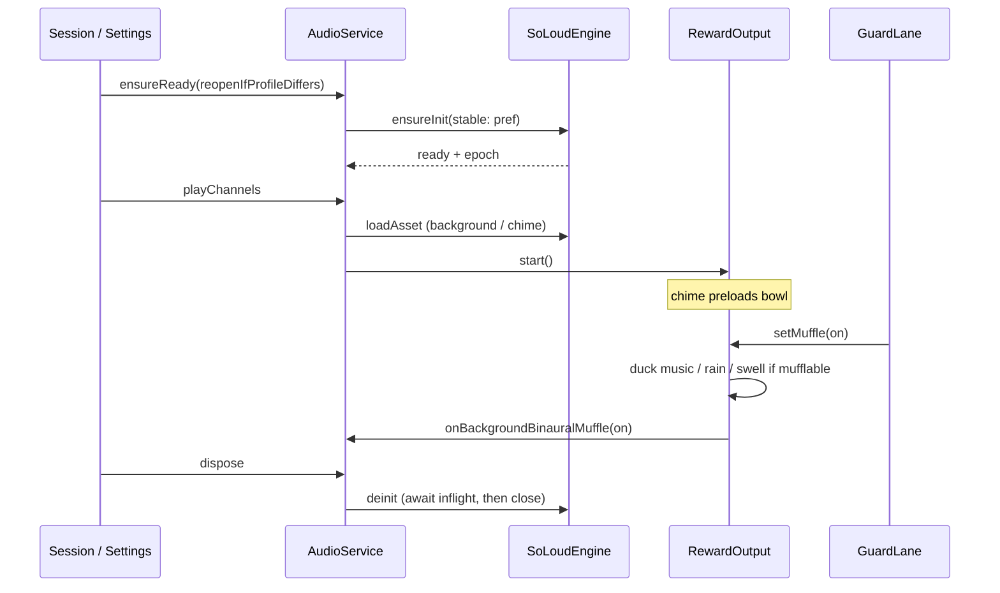

# SoLoud engine hardening

| Field | Value |
|---|---|
| Status | Implemented on `fix/soloud-engine-hardening` |
| Date | 2026-09-05 (implemented 2026-09-06) |
| Scope | `lib/src/audio/*` + session wiring that already calls it. One PR. |
| Not this | Pipeline-contract Key Decisions, Crown Start, connect UX, `.neurofeed` layout, new reward/guard ids, on-device listening pass |

Review findings 1–13 plus the leftover muffle API. Do not reopen
[contracts/pipeline-contract.md](contracts/pipeline-contract.md). That series
listed SoLoud internals as a non-goal; this thread is allowed to change them.

---

## Overview

The five-layer audio stack is the right shape. The native backend is a
process singleton (`SoLoudEngine`) feeding four controllers, two output
adapters, and `AudioService`. That split stays.

What is wrong is ownership and SoLoud API use, not the layering:

- Rain reward loads a Flutter **asset** with `loadFile` and plays it
  without `looping: true`. Bowl chimes never preload. Calibration awaits
  clips with a 15 s timeout that the longest intros exceed.
- `FeedbackAudioController.dispose` tears down the **process** engine.
  `AudioService.setMusicMuffle` is dead leftover from PR 5; the live path
  is `GuardLane` → `RewardOutput.setMuffle`.
- Epoch, source cache, looping, and filter wiring are reinvented per
  controller and are inconsistent.

Fix the engine and the shared play/load path first, then the
user-audible bugs, then leftover API and nits. One PR.

---

## Design recheck (locked)

The review’s layering advice is accepted. Two product calls are **not**
accepted as written:

| Suggestion | Decision | Why |
|---|---|---|
| Duck unmodulated background (drone / static music / rain-as-background) during a guard warning | **No** | Frozen contract: muffle is for *modulated reward* audio. Background is unmapped. Do not change the soundscape policy here. |
| Reopen the AAudio profile when the Settings toggle flips | **No** | [feedback/todos.md](feedback/todos.md) already specifies next session start, not mid-session. Keep that. |
| Keep both `RewardOutput.setMuffle` and `AudioService.setMusicMuffle` | **No — delete the AudioService API** | Leftover. See [Muffle](#muffle-leftover). |
| Shared load helper + engine-owned deinit + `ModulatedVoice` as the play/loop/stop owner | **Yes** | This is the actual design gap. |
| One PR | **Yes** | Half-fixed audio is worse than one larger diff. |

Layering that stays:

```
SoLoudEngine          process singleton: init / deinit / profile / epoch / asset cache
ModulatedVoice        one looped (or one-shot) voice + optional biquad slew
Controllers           FeedbackAudioController, MusicController,
                      RainFeedbackController, BinauralBeatController
RewardOutput /
GuardOutput           frozen adapters (PR 5). GuardLane does not call AudioService.
AudioService          session facade; owns controller lifetime and engine deinit
```

Do not collapse controllers into `AudioService`. Do not add a second
backend type (`AudioBackend`, `SoLoudFacade`) unless a test cannot inject
through `SoLoudEngine.resetForTest`.

---

## Muffle leftover

PR 5’s contract text said `AudioService.setMusicMuffle` *is* `muffleReward`.
The notifier split then wired `GuardLane` to `RewardOutput.setMuffle` and
never called the AudioService method. Grep: `setMusicMuffle` /
`mufflesForWarning` exist only in `audio_service.dart`.

Keep:

```dart
abstract class RewardOutput {
  Future<void> start();
  Future<void> stop();
  void onSample({required double percentile, required bool inTarget});
  void setMuffle(bool on); // no-op for the chime *reward* itself
}
```

`GuardLane.evaluateWarning` is the only production caller. Tests in
`test/feedback_pipeline_test.dart` already stub `setMuffle`. Do not
change `guard_lane.dart`.

Delete from `AudioService`:

- `setMusicMuffle`
- `mufflesForWarning` getter/setter

Replace `onMuffleExtras` (today only passed into music / rain / binaural
reward outputs) with a callback passed into **every** `RewardOutput`,
including `chime` and `none`:

```dart
void Function(bool on)? onBackgroundBinauralMuffle
```

That callback is `_backgroundBinaural.setMuffle`. Frozen contract: muffle
ducks “feedback music, rain, and **both** binaural controllers.” Today
chime / none never duck the background binaural layer. Wiring the
callback on all five outputs closes that without resurrecting a
fan-out-to-everything method.

Do **not** muffle:

- the unmodulated asset background loop (`FeedbackAudioController`)
- background-mode `MusicController` (`MusicModulation.none`)
- chime / bell / alarm one-shots

`MusicController.setMuffle` already no-ops when `modulation == none`.
Keep that.

---

## Proposed design

### 1. Engine ownership

`SoLoudEngine` remains static. It gains an epoch-scoped **asset** cache
and awaited teardown. It does not grow playback APIs (`play` / `stop`
stay on controllers and `ModulatedVoice`).

```
ensureInit(stable?) ── single-flight
    │
    ├─ already ready at the target profile → return
    ├─ ready at a different profile
    │     └─ only reopen when `reopenIfProfileDiffers: true`
    │         (session start). Otherwise keep the open device.
    └─ not ready → try conservative (if requested and not banned),
                   else low-latency; failed conservative is sticky
                   for the process (`_conservativeUnavailable`)

deinit() ── await in-flight open (ignore its error), then `_close()`
            Do **not** null `_inflight` first.
```

`reopenIfProfileDiffers` is **only** set from
`FeedbackStateNotifier.startCalibration`. Every other caller uses
`ensureInit()` / `AudioService.ensureReady()` without it, so a Settings
toggle does nothing until the next session start (engine already open →
no-op; next process start or next `startCalibration` with
`reopenIfProfileDiffers: true` applies the pref).

Settings preview before any session: engine not ready, so
`ensureReady()` opens with the current pref. That is correct.

`FeedbackAudioController.dispose` must **not** call `SoLoudEngine.deinit`.
`AudioService.dispose` is the only teardown caller. Native `SoLoud.deinit`
is synchronous; still `await` the injected `SoLoudDeinitFn` so tests stay
honest, and so an in-flight `ensureInit` finishes before teardown.

`throw lastError!` in `_initWithFallback`: if both attempts `continue`
without assigning, throw a `StateError` instead of null-asserting.

### 2. Asset cache on the engine

```dart
class SoLoudEngine {
  static Future<AudioSource> loadAsset(
    String path, {
    required bool stream, // disk vs memory
  });
}
```

- Key: `(epoch, path, stream)`.
- In-flight map so two callers of the same path share one `loadAsset`.
- On epoch change, `disposeSource` every cached source, then clear.
- `autoDispose: false`.
- Controllers must not call `SoLoud.instance.loadAsset` for bundled files.

`loadFile` for **user music** stays on `SoLoud.instance` (or a thin
`SoLoudEngine.loadFile` that does **not** cache — tracks are disposed on
skip). Rain must not use `loadFile`.

Waveforms stay on `BinauralBeatController` but must
`disposeSource` on epoch change instead of nulling Dart refs.

### 3. `ModulatedVoice` is the play owner

```dart
void play(
  AudioSource src, {
  required double volume,
  double pan = 0,
  bool looping = false,
  bool activateFilter = true,
});
```

Required behavior:

1. `stop()` the previous handle before starting a new one (idempotent).
2. Assign `source` / `handle` **before** wiring the biquad, and pass
   `src` into the immediate cutoff apply — never read a stale field.
3. `SoLoud.instance.play(..., looping: looping)`.
4. Keep pause / resume / slew / muffle as they are.

Rain passes `looping: true`. Music tracks pass `false` (advance via
`soundEvents` → `next()`). Binaural leaves looping false; waveforms are
continuous oscillators.

`source` and `handle` become private (`_source` / `_handle`) with
read-only getters if music’s end-subscription still needs the handle.

### 4. Controller contracts

| Controller | Load | Loop | Epoch |
|---|---|---|---|
| `FeedbackAudioController` | `SoLoudEngine.loadAsset` | background `looping: true`; chimes false | cache is engine-owned; drop local `_sources` |
| `RainFeedbackController` | `SoLoudEngine.loadAsset` (`rainAsset`) | `ModulatedVoice.play(looping: true)` | engine cache |
| `MusicController` | `loadFile` per track, dispose on skip | false | if epoch moved, dispose current source before play |
| `BinauralBeatController` | `loadWaveform` | n/a | dispose both waveforms on epoch change |

`ChimeRewardOutput.start()` preloads `bowlLowAsset` via a new
`FeedbackAudioController.preloadChime()`. `_triggerChime` may still skip
if load failed; it must not be the first (and only) load site.

`startWarningAlarm`: play the first voice **immediately**, then
`Timer.periodic(2s)`. Live volume goes to `_alarmHandle`, not
`_bellHandle`. `AudioService.pause()` / session pause must
`stopWarningAlarm()`; on resume `GuardLane` restarts if still over
threshold.

`_playAndAwaitEnd`: timeout = `SoLoud.instance.getLength(source) + 2s`,
floor 15 s, cap 90 s. On timeout, `stop` that handle before returning so
the intro cannot talk over the silent baseline. Cancel the
`soundEvents` subscription either way.

`_safeHandle`: take an optional `void Function()? onGone` instead of
always removing from `_chimeHandles`. Chime prune uses
`List.of(_chimeHandles)` (no `where` + `remove` on the live list).

`setGuardrailVolume` updates `_alarmHandle` if present. End-session bell
stays on `_bellHandle` + bell volume.

### 5. `AudioService`

```dart
Future<void> ensureReady({bool reopenIfProfileDiffers = false}) =>
    SoLoudEngine.ensureInit(
      stable: _settings.audioStableMode,
      reopenIfProfileDiffers: reopenIfProfileDiffers,
    );
```

Call `ensureReady()` at the top of every public method that can produce
sound (`playChannels`, `startBackground`, `playCalibration`, `playEndChime`,
`startWarningAlarm` path, `startMusic`, binaural starts). Session start
already calls `SoLoudEngine.ensureInit(stable: …)` — switch that to
`_audio.ensureReady(reopenIfProfileDiffers: true)` so the pref is not
sampled in two places.

`stop()` and `_stopChannels()` are identical. Keep `stop()`; make
`playChannels` call it.

`dispose()`:

1. `stop()` (best-effort; ignore errors).
2. dispose each controller (music/rain/binaural actually stop and
   dispose sources; see below).
3. `unawaited(SoLoudEngine.deinit())` — Riverpod `onDispose` is sync.
   Engine `deinit` awaits in-flight init first, so this is safe at
   container teardown.

`MusicController.dispose` = cancel `_endSub`, `stop()`, `disposeSource()`,
close `_trackChanges`. `load()` while a voice is playing must not clear
`_tracks` out from under it: if `isPlaying`, refresh settings only and
return the current count; the session music-settings panel uses
`loadMusic()` as a preview and must not clobber a live playlist.
`toggleShuffle` after moving the current track to index 0 sets
`_position = 0`. `Directory.listSync` is wrapped in try/catch like SAF
materialize.

### 6. Guard / reward wiring (do not change lanes)

```
GuardLane.evaluateWarning
  ├─ rewardOutput.setMuffle(muffleReward && active)
  └─ guardOutput.onGuard(...)
```

No new calls from `feedback_state.dart` except `ensureReady` at
calibration start. No `ui-map.md` copy changes.

`GuardrailSound.softBowl.assetPath` →
`assets/audio/guardrail-softBowl-01.opus` (file already shipped; README
calls it an unused placeholder). Update `assets/audio/README.md`.

---



---

## API / interface changes

### `SoLoudEngine.ensureInit`

```dart
static Future<void> ensureInit({
  bool? stable,
  bool reopenIfProfileDiffers = false,
});
```

### `SoLoudEngine.deinit`

Becomes `static Future<void> deinit()`. Callers that cannot await use
`unawaited`.

### `SoLoudEngine.loadAsset`

New. See [Asset cache](#2-asset-cache-on-the-engine).

### `AudioService`

- Add `ensureReady`.
- Remove `setMusicMuffle` / `mufflesForWarning`.
- `rewardOutputFor(..., onBackgroundBinauralMuffle: _backgroundBinaural.setMuffle)`
  on all five ids.

### `ModulatedVoice.play`

Gains `looping`. Stops the previous voice. Private fields.

### `FeedbackAudioController`

- `preloadChime()`
- no `SoLoudEngine.deinit` in `dispose`
- drop `_sources`; use engine cache
- alarm first tick + `_alarmHandle` volume
- calibration await uses `getLength`

No FFI, no JSON, no prefs migration.

---

## Alternatives considered

| Alternative | Why not |
|---|---|
| Per-controller `SoLoud` instances | The plugin is a process singleton. A second init fights the first. |
| Keep `setMusicMuffle` and have GuardLane call both | Two sources of truth. The AudioService method muffles *all* modulated controllers, including ones that are not the active reward. Leftover after PR 5. |
| Duck the drone background on warning | Product change vs frozen muffle policy. Warning chime-over-drone is the current (and specified) mix. |
| Switch AAudio profile live when the toggle flips | Drops every cached `AudioSource` (epoch++) mid-session. Todos already say next session start. |
| `AudioBackend` interface for tests | `SoLoudEngine.resetForTest` already injects init/deinit. Extend that with a `loadAsset` hook if controller tests need it. Do not add a type. |
| Several PRs (engine, then rain, then muffle) | Rain/chime stay broken between merges. One branch `fix/soloud-engine-hardening`. |

---

## Risks

| Risk | Severity | Mitigation |
|---|---|---|
| `loadAsset` cache shares one `AudioSource` across looping background and one-shot (same file used as rain background **and** rain reward) | Med | Same opus is referenced from `AudioService.soundAssets['Rain']` and `RainFeedbackController.rainAsset`. Sharing the source is correct; looping is per **handle**, not per source. Verify both can play at once only if a bug skipped suppress — suppress still stops background first. |
| Awaited `deinit` during widget dispose | Low | Native deinit is sync; `unawaited` from `AudioService.dispose`. |
| `getLength` of a `LoadMode.disk` stream is 0 / wrong | Med | Floor 15 s, cap 90 s. If length is `Duration.zero`, use 60 s. |
| Preload chime on `start()` adds latency at session start | Low | Memory-mode load of one bowl; happens while background also loads. |
| Removing `setMusicMuffle` breaks an external caller | None | Grep: no callers. Pipeline tests use the RewardOutput stub. |

---

## Observability

Keep existing `debugPrint('[audio] …')` / `[rain]` / `[music]` /
`[guardrail-sound]` prefixes. Add:

- `[audio] chime preloaded` only on failure (already have skip log).
- `[audio] init` already logs fallback; keep it.
- Do not log every slew tick.

`audioInitFailed` on the session state stays the user-visible flag.
Rain/chime load failures already log; if `playChannels` throws, the
notifier already sets `audioInitFailed`. Do not swallow rain
`loadAsset` failure inside `start()` without letting `playChannels`
observe it — rethrow after the log, or return a `bool` and have
`RainStageRewardOutput.start` throw `StateError` on false. Prefer
rethrow so session start surfaces `audioInitFailed`.

---

## Test plan

Pure Dart, no host `.so`, no GTK:

```bash
flutter analyze lib/src
flutter test test/soloud_engine_test.dart test/output_ids_test.dart \
  test/feedback_pipeline_test.dart
```

Extend `test/soloud_engine_test.dart`:

- in-flight `ensureInit` vs `deinit` (deinit waits, then engine is not ready)
- `reopenIfProfileDiffers: false` does not tear down an open opposite profile
- `reopenIfProfileDiffers: true` does
- `loadAsset` shares one in-flight; second epoch disposes (inject a fake
  load/dispose counter)

New `test/modulated_voice_test.dart` and/or `test/feedback_audio_test.dart`
**only if** load/play can be injected without `SoLoud.instance`. If the
plugin cannot be faked cheaply, do **not** add a brittle native test.
Cover instead:

- rain stage hysteresis (extract `_stageFor` if that is the only way)
- `rewardOutputFor` passes the binaural muffle callback into chime / none
  (a tiny fake `RewardOutput` inspector, or inspect via a test-only
  callback counter)
- `MusicController.toggleShuffle` position — extractable without SoLoud

Linux agent: audio silence is N/A in this container
([test-matrix.md](test-matrix.md)). Do not block on `neurofeed-run-linux`
playback. `audioInitFailed=false` after skip-cal on the simulator is a
bonus, not a gate.

`flutter analyze lib/src` must stay clean.

---

## Implementation order (inside the one PR)

Do these as sequential edits (optional commits). Do not ship a
tree where rain still `loadFile`s after the engine cache exists.

1. **Engine lifetime** — awaited `deinit`, inflight, `reopenIfProfileDiffers`,
   `StateError` instead of `lastError!`. Tests first (they already inject).
2. **Asset cache** — `SoLoudEngine.loadAsset` + epoch dispose. Point
   `FeedbackAudioController` at it; delete `_sources`.
3. **`ModulatedVoice`** — `looping`, stop-previous, cutoff-on-the-new-source,
   private fields.
4. **User-audible bugs** — rain `loadAsset` + `looping: true`; chime
   `preloadChime`; calibration `getLength` timeout; alarm first tick +
   `_alarmHandle` volume; chime prune `List.of`.
5. **Pause / dispose** — session pause stops alarm; music/rain/binaural
   dispose actually releases; `AudioService.dispose` deinits; controller
   dispose does not.
6. **Muffle leftover** — delete `setMusicMuffle`; callback on all five
   outputs.
7. **Music playlist** — shuffle `_position = 0`; `load()` while playing
   does not clobber; `listSync` try/catch; `stop`/`_stopChannels` collapse.
8. **Profile wiring** — `AudioService.ensureReady`; session start uses it
   with `reopenIfProfileDiffers: true`; controllers may still call
   `SoLoudEngine.ensureInit()` without stable (no-op if ready).
9. **Nits** — `softBowl` asset, stale `MusicFeedbackController` comment,
   README placeholder line.
10. **Docs** — `.ai/architecture.md` Audio paragraph; this spec Status →
    Implemented; archive the handoff.

---

## PR plan

### PR 1 — `fix(audio): SoLoud engine lifetime, loads, and leftover muffle`

- **Files:** `lib/src/audio/*.dart` (except `calibration_clips.dart`,
  `output_ids.dart` unless a comment), `lib/src/feedback/feedback_state.dart`
  (ensureReady only), `lib/src/audio/guardrail_sound.dart`,
  `assets/audio/README.md`, `test/soloud_engine_test.dart`, new tests as
  above, `.ai/architecture.md`, this file.
- **Deps:** none.
- **Description:** Steps 1–10. Do not touch `guard_lane.dart`,
  pipeline-contract, connect UX, or session format.

No PR 2. If the diff is huge, still one PR: the bugs share the engine
epoch/cache.

---

## Key Decisions

1. **Keep the five-layer stack.** Engine / voice / controllers / output
   adapters / `AudioService`. No second backend type.
2. **`SoLoudEngine` owns init, deinit, epoch, and bundled-asset cache.**
   Controllers do not deinit the process engine.
3. **Profile reopen only at session start**
   (`reopenIfProfileDiffers: true`). Settings toggle is prefs-only until
   then. Matches the existing stutter-switch UX.
4. **`RewardOutput.setMuffle` is the live muffle API.** Delete
   `AudioService.setMusicMuffle` / `mufflesForWarning`. Pass background
   binaural muffle into all five reward outputs. Do not duck unmodulated
   background.
5. **`ModulatedVoice.play` owns looping, stop-previous, and filter
   wiring order.** Rain loops; music tracks do not.
6. **Bundled audio uses `loadAsset`, never `loadFile`.** User music uses
   `loadFile` and is not cached on the engine.
7. **Chime preload is `ChimeRewardOutput.start` → `preloadChime`.**
   `_triggerChime` is cache-hit only.
8. **Calibration await uses `getLength + 2s` (floor 15, cap 90, zero
   length → 60).** Timeout stops the voice.
9. **Alarm starts immediately** and follows session pause.
10. **One PR**, order above. Do not mix Crown / connect / file-format / new
    output ids.

---

## Open Questions

None. Product calls that could have been questions (background duck,
live profile switch, keep vs delete `setMusicMuffle`) are decided
above.

---

## References

- Review (this thread): issues 1–13 on `lib/src/audio/*`
- Frozen muffle / output split: [contracts/pipeline-contract.md](contracts/pipeline-contract.md)
  Key Decision “Muffle is not a GuardOutputId”; PR 5 handoff
  [archive/handoff-pr5.md](archive/handoff-pr5.md)
- AAudio toggle UX: [feedback/todos.md](feedback/todos.md) “On-device
  audio-profile pass”
- Plugin: `flutter_soloud` 4.1.7 — `play(looping: false)` default;
  `loadFile` is filesystem; `loadAsset` is the bundle; `getLength`
- Implementer order (archived): [archive/handoff-soloud-engine.md](archive/handoff-soloud-engine.md)
