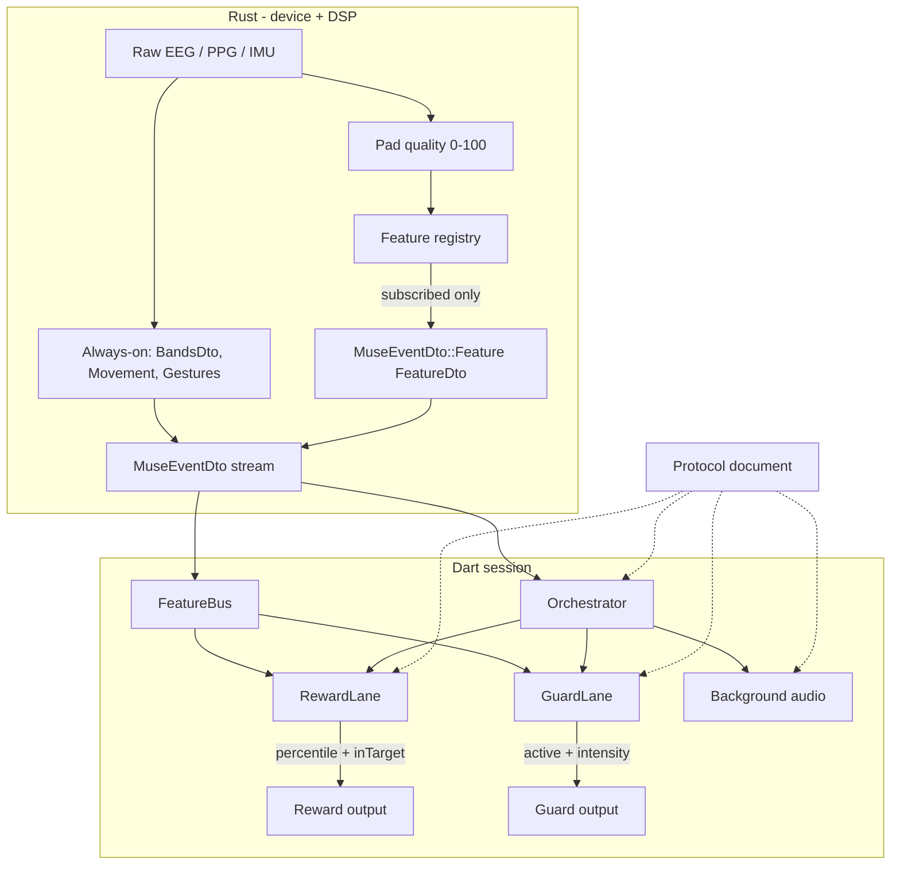
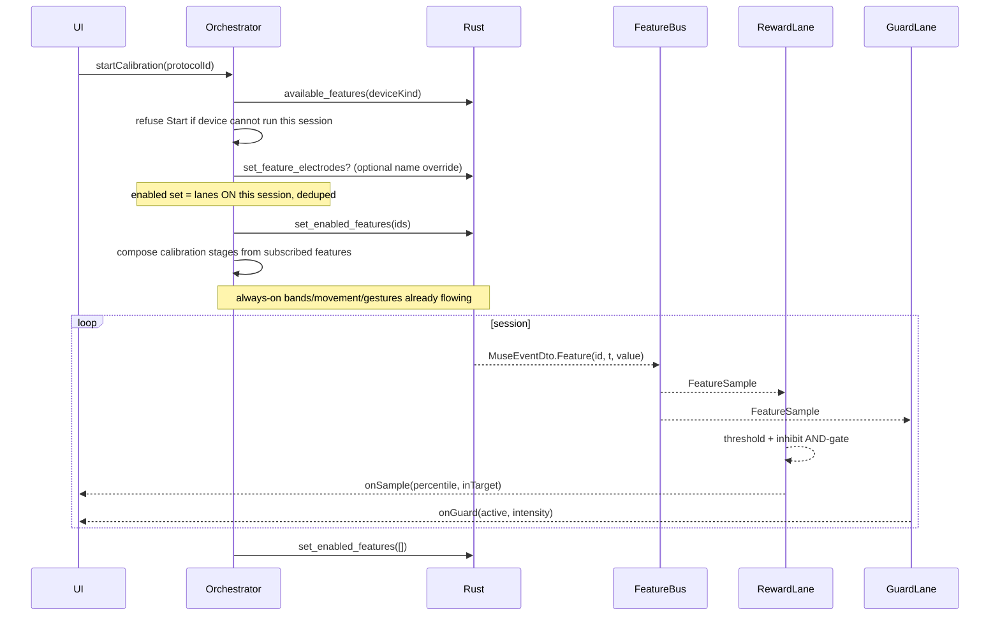
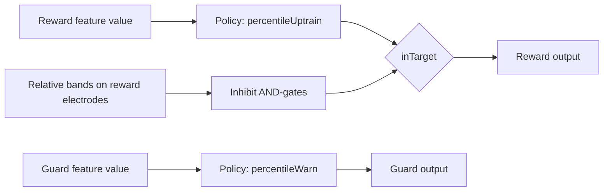

# Feedback Pipeline Contract

| Field | Value |
|---|---|
| Status | Implemented (PRs 1–7 on `refactor/eeg_feature_implementation`) |
| Date | 2026-08-26 |
| Revised | 2026-09-02 (status only; Key Decisions unchanged) |
| Author | — |
| Scope | Freeze the feedback pipeline so later PRs (feature bus, protocol-as-document, notifier split, output methods, calibration recipes, custom builder) do not relitigate architecture |
| Not this doc | Rewrite of `.ai/architecture.md` or `.ai/feedback/architecture.md`; product pitch; session charts (implemented, see [../archive/session-computed-charts.md](../archive/session-computed-charts.md)) |

PRs 1–7 implemented this contract. Decisions in [Key Decisions](#key-decisions) stay frozen. Do not reopen them. **Crown Start stays refused.** Session charts (computed 1 Hz) are implemented — do not mix v5 layout or FRB changes into this contract.

Later (connect-simulator-ux, do not restore): `DeviceKind` collapsed to Muse | Neurosity. Simulation is `simulate` + `sim:*`, not `SimulatedMuse` / `SimulatedNeurosity` / `base_kind`. Key Decision text below still names Simulated* as of this freeze.

---

## Overview

The session stack today is a kitchen sink. `FeedbackStateNotifier` (~1855 lines in `lib/src/feedback/feedback_state.dart`) owns calibration, ATR extraction, inhibit conditions, guardrail scoring, audio routing, signal gating, and recording. `feedback_session.dart` (~2289 lines) owns the session UI plus protocol/audio/guardrail dialogs. Identity is still a Dart enum (`ProtocolType`) even after commit `44a3577` moved copy + structure into `assets/protocols.json`. Electrodes are hardcoded (`electrodeAf7 = 1`, `neededElectrodes = [1, 2]`, `TargetStateAggregator` AF7/AF8-only). Crown `/focus` `/calm` are `trace!`-logged in `rust/src/api/neurosity_osc.rs` and dropped.

`assets/protocols.json` copies `allowedDevices: ["muse","simulatedMuse"]` and `requiredElectrodes: ["AF7","AF8"]` on every row, and `ProtocolInfo.isCompatibleWith` implements those checks — **but nothing calls `isCompatibleWith`**. `FeedbackListView` renders `catalog.all` with no device filter. Crown is not hidden; it is **mislabeled** (Dart still treats indices 1/2 as AF7/AF8, which on `DeviceConfig::neurosity_crown()` are C3/F5). Deleting those JSON fields does not unlock Crown sessions.

The contract:

1. **Rust** owns device I/O, always-on DSP (bands / movement / gestures), a **0–100 pad-quality** score used to autodrop band features, and a **feature registry** that produces `FeatureSample`s for subscribed IDs.
2. **Dart** owns the session: a `FeatureBus`, a **RewardLane** (feature → threshold/inhibit → reward output), a **GuardLane** (feature → threshold → guard output), unmapped **Background** audio, and an **Orchestrator** (calibration, timer, pause, record, quality gate).
3. A **protocol** is a JSON document that wires those pieces. Catalog and user documents are the same type (`origin: catalog | user`). UI may say "Programs"; the type is protocol.

JSON names IDs. Code owns behavior. Availability is derived from the last-connected / selected device + installed models, not copied into every protocol row.

**Crown in this refactor:** the registry **produces** `device.focus` / `device.calm` and **can compute** `band.*` `FeatureDto`s. The catalog **may list** band protocols when the selected kind is Crown. **Running** a catalog protocol on Crown is **out of scope** until quality vectors, computed 1 Hz frames, and charts are device-aware (a later series that is allowed to touch those non-goals). The orchestrator must refuse Start on Crown, not silently train C3/F5.

---

## Background & Motivation

### Current data path

```
Headset → BLE / Crown OSC → Rust forwarder (`rust/src/api/muse.rs`)
        → MuseEventDto stream → FeedbackStateNotifier._onEvent
             ├─ BandsDto → TargetStateAggregator (AF7/AF8) → RatioEngine → AudioService
             ├─ ReveDto  → guardrail threshold / warning chime / optional muffle
             ├─ Movement / Gestures → cleanliness gate
             └─ SessionRecorder (v5 body; Reve/Gestures already no-op in encode_session_event)
```

Pad quality (0–100) is computed **only in Dart**: `connection_provider._maybeComputeSignalQuality` (`List.filled(4, 0.0)`, `if (ch < 0 || ch > 3) continue`, EEG std + `line_noise_ratio` penalty). Autodrop is `TargetStateAggregator.evaluate(quality)` using that vector. Rust has no 0–100 score. Crown `/signalQuality` (0–1) is stuffed into `BandsDto.line_noise_ratio` (a different quantity).

`FeedbackEngine` (`lib/src/feedback/feedback_engine.dart`) is already the reward-lane interface (`addBaselineSample` / `isInTarget` / `percentileOf` / `adapt`). `RatioEngine` implements it. Extraction, inhibit (`TargetCondition` in `protocol.dart`), guardrail, and audio still live in the notifier.

### Pain to retire (verified)

| Pain | Where |
|---|---|
| `ProtocolType` enum is still required by `ProtocolInfo.fromJson` (`ProtocolType.values.firstWhere`) | `lib/src/feedback/protocol.dart` |
| Unknown session protocol **falls back to `drowsiness`** | `SessionMetadata.fromJson` (~941), `SessionStore.list` (`session_store_core.dart` ~98), `crash_recovery.dart` (~226–238, default `'drowsiness'`) |
| Dead JSON: every row copies `requiredElectrodes` / `allowedDevices`; `isCompatibleWith` is **never called**; list shows `catalog.all` | `assets/protocols.json` v3, `protocol.dart`, `feedback_list.dart` |
| Hardcoded Muse indices 1/2 for reward, gate, pause, charts | `target_state.dart` `electrodeAf7`, `feedback_state.dart` `neededElectrodes`, `session_chart_data.dart`, `feedback_session.dart` `_FaultyPadFallback` |
| 4-slot quality + 4-electrode computed frames | `connection_provider.dart` `_maybeComputeSignalQuality`; `ComputedSampler` `List.generate(4, …)`; Rust `ComputedFrame` “4 electrodes × 5 bands” |
| `FeedbackMode` is both background and reward; rain/music *suppress* background | `lib/src/settings.dart`, `AudioService.suppressesBackground` |
| `GuardrailMode` is drowsiness-shaped and mixes **feature** with **model** | `lib/src/feedback/guardrail_mode.dart` |
| `Settings.guardrailModeForProtocol` is `Map<ProtocolType, GuardrailMode>` and `ProtocolType.values.byName` **throws** on unknown keys | `lib/src/settings.dart` ~347–354 |
| Crown `/focus` `/calm` parsed then dropped | `neurosity_osc.rs` 235–244 |
| `DeviceConfig.target_electrodes` / `needed_electrodes` are a single ATR-shaped list (Dart FFI). `DeviceFeatures.guardrail/reward` is unused outside generated bindings | `rust/src/api/device_config.rs` |
| Inhibit and guard share no vocabulary, so later PRs keep rediscovering the distinction | `protocol.dart` `TargetCondition` vs guardrail in the notifier |

### What stays

- `.neurofeed` v5 byte layout (`rust/src/api/session_format.rs`).
- Live capture encode/append: [../spine/data-plane-contract.md](../spine/data-plane-contract.md) (implemented). This file does not own the writer.
- SQLite history cache **schema**, export, graph views, BLE/JNI, SoLoud internals.
- Existing catalog **string IDs** (see [Catalog ID freeze](#catalog-id-freeze)).
- Calibration snapshot pattern (`SessionCalibration.calibrationJson`) — protocols get the same treatment (`protocolJson`).
- `FeedbackEngine` as the reward threshold object.
- Always-on `BandsDto` / movement / gestures for recording and gates.
- Muse 4-pad UI dots from Dart `_maybeComputeSignalQuality` until a later Crown-run series replaces them.

---

## Goals & Non-Goals

### Goals

- Freeze feature IDs, protocol document schema, lane semantics, FFI, catalog mapping, and PR order.
- Make Crown features *producible* (registry + `FeatureDto` for `device.focus` / `device.calm` and `band.*`) without requiring a Crown session UI.
- Kill `ProtocolType` without breaking history listing of existing `.neurofeed` files.
- Split inhibit vs guard, background vs reward output vs guard output.
- Move electrode selection and band-derived feature math into Rust, with autodrop using a Rust 0–100 quality score.
- Compose calibration from subscribed features, starting from `assets/calibrations.json` v2.

### Non-Goals (out of this refactor)

- Changing the v5 container / raw body / **computed columnar layout**.
- SQLite schema redesign, export, **dashboard / history charts** (they keep `electrodeAf7` / 4-ch bands).
- BLE, JNI, btleplug, SoLoud engine internals.
- Implementing the custom protocol builder UI (last PR only).
- Shipping new catalog protocols (Crown-native `device.focus` rows, extra AI labels). Features may exist before catalog rows do.
- **Running** a catalog protocol on Crown (quality length, `ComputedFrame.bands` length, name-based chart electrodes). A later series may touch the computed/chart non-goals; this one must not.
- Medical-device claims; the guardrail remains a statistical estimate.
- Fixing the `guardrailDeltaCeiling` unit mismatch (comment vs code). Preserve today’s code; a later explicit science PR may change it.

---

## Naming glossary

| Word | Meaning |
|---|---|
| **protocol** | Wiring document (catalog or user). UI may say "Programs". |
| **feature** | ATR, TAR, BTR, relative alpha, AI label, Crown focus/calm. **Not** "feedback stream" (that name is taken by OSC/LSL/BrainFlow in `lib/src/streaming/`). |
| **reward** | Uptraining lane: feature → threshold + inhibit → reward output. |
| **inhibit** | AND-gates on the **reward verdict**. Today's `TargetCondition` (`betaCeiling`, `deltaCeiling`). Never a separate alarm. |
| **guard** | Independent alert lane. Never modulates the reward scalar or `inTarget`. Today's sleep guardrail. |
| **output / modality** | What a lane drives: `chime`, `musicFilter`, `rainStage`, `binauralSwell`, `cough`, `alarm`, … |
| **background** | Ambient soundscape, **not** mapped to a feature. |
| **feature source** | `band.*` / `ai.*` / `device.*` |
| **feature catalog** | `assets/features.json` — copy + `usableFor`. |
| **producer registry** | Rust — electrodes, rate, availability, computation. |
| **producer electrodes** | Montage channels the producer reads (AI window includes TP9/TP10). |
| **gate electrodes** | Montage channels that drive continue-anyway + playing-phase pause. **Not** the AI window. |

---

## Proposed Design

### Pipeline





`set_enabled_features` includes `guard.feature` only when the guard is **on** for this session (`defaultEnabled` / Settings not `none`, and a model if the feature is `ai.*`). Duplicate ids are deduped. A disabled guard is not enabled “just because the document has a `guard` object”.

### Ownership

| Concern | Owner | Notes |
|---|---|---|
| BLE / Crown OSC / raw packets | Rust | Unchanged path |
| Per-electrode FFT bands, movement, peak-alpha, line-noise, gestures | Rust, **always-on** | Recording, inhibit's relative-band vector |
| Pad quality 0–100 (autodrop) | **Rust forwarder** (PR 2) | Port of `_maybeComputeSignalQuality`; Crown `/signalQuality` 0–1 → 0–100 |
| Pad quality UI dots (Muse 4-slot) | Dart `connection_provider` | Unchanged this refactor; keep formula in sync with the Rust port |
| Band-derived features (`band.atr` …) | **Rust**, from the same FFT | Autodrop in the producer. Dart deletes `electrodeAf7` after PR 4 |
| AI labels (`ai.*`) | Rust `analysis/{reve,luna,guardrail}.rs` | Dart `model_load` / `guardrail_enable` / `set_enabled_features` / consumes samples |
| Device-native (`device.focus`, `device.calm`) | Rust `neurosity_osc.rs` | Pass through as `FeatureDto`; stop dropping |
| Threshold math (`percentileUptrain`, `percentileWarn`) | Dart lanes, named policies in code | Protocol **names** the policy |
| Inhibit AND-gate | Dart RewardLane | Always-on relative bands on **gate / reward producer** electrodes |
| Output mapping (percentile → cutoff / stage / swell) | Dart output methods | Protocol names the output ID |
| Protocol documents | JSON | IDs only |
| Feature copy + `usableFor` | `assets/features.json` | Builder/gear offers this set; parser rejects violations |
| Producer registry (electrodes, rate, exists-on-device) | Rust | `available_features`; Rust wins on **availability** |

### Always-on vs subscribed

**Always-on (never gated by `set_enabled_features`):**

- Per-electrode `BandsDto` (Muse: 1 Hz/electrode from `FFT_N = 256` @ 256 Hz in `muse.rs`; Crown: `BandAccumulator` emit ~10 Hz in `neurosity_osc.rs`).
- Movement, pulse, SpO₂, peak-alpha, telemetry, IMU, raw EEG — as today, filtered at record time by `Settings.recordStreams`.
- Gestures (`GestureDetector`).
- Pad quality 0–100 inside the forwarder (not a new `MuseEventDto` variant this refactor).

**Subscribed (replace-set via `set_enabled_features`):**

- Cheap band-derived **features** (`band.atr` …): computed in Rust, **emitted as `FeatureDto` only while enabled**. Default enabled set is **empty**.
- Expensive / device-specific: `ai.*` (forwarder inference), `device.focus` / `device.calm` (forwards OSC that is otherwise dropped).

`set_enabled_features([])` at process init and at session end. Do not leave AI scoring running in the live view.

**PR 2 dual-emit of `ai.drowsiness`:** emit `FeatureDto { id: "ai.drowsiness", value: sleep_dir }` **only when today’s `ReveDto` path is already on** (`guardrail_enable` succeeded and the forwarder would emit `Reve`). Do not emit `ai.drowsiness` merely because the id is in the enabled set if Reve is off; do not emit it into the live view when no session has called `guardrail_enable`.

### Missing samples

If the feature cannot be produced this tick (all of its **producer** electrodes below the usable-quality threshold, quality vector null/short, Crown native score absent, AI window not full), **emit nothing**. Never coerce to `0.0`. Dart lanes treat a gap as "hold last output, do not `recordEpoch`". This matches today's `_padUsable`: `quality == null` or `electrode >= quality.length` → **false** (skip), not “use the pad”.

### Two scalars

| Scalar | Where | Used by |
|---|---|---|
| **Native value** | `FeatureDto.value` | `FeedbackEngine` baseline / threshold / `isInTarget`; guard threshold |
| **Percentile rank** (0–100 vs this session's baseline) | Dart `FeedbackEngine.percentileOf` | Continuous reward outputs: `musicFilter`, `rainStage`, `binauralSwell` |

Native examples: ATR ratio (dimensionless), relative alpha (0–1), `sleep_dir` (cosine, ~0–1), Crown focus/calm (0–1), `band.delta` **absolute µV²/Hz average**. Outputs that fire on a boolean (`chime`) use `inTarget`, not the percentile.

### Inhibit ≠ guard



- **Inhibit** is today's `TargetCondition`: `concentration` requires relative beta ≤ 0.25; `relaxedConcentration` adds relative delta ≤ 0.5. The scalar still has to beat the baseline percentile. Inhibit failure ⇒ `inTarget = false` ⇒ no reward. It does **not** play a warning.
- **Guard** is today's sleep guardrail: independent threshold, warning sound, optional muffle of modulated reward audio. `_evaluateGuardrailWarning` already documents that the reward loop is never touched; muffle is an output side-effect, not a change to `inTarget`.

Both exist in the catalog today and remain expressible. A protocol may have neither, either, or both.

Inhibit evaluation **fails closed** if the relative-band vector for the reward electrodes is missing (no `BandsDto` yet): `inTarget = false`, no epoch.

Catalog protocols that use inhibit are band-reward protocols on Muse. Crown-native reward + inhibit is not a v1 catalog row.

---

## Feature catalog (v1 freeze)

Producer registry in Rust. Copy + `usableFor` in `assets/features.json` (new; add a `pubspec.yaml` asset entry next to `assets/protocols.json`). **PR 3 ships all eight rows**; tests assert every `reward.feature` / `guard.feature` in `protocols.json` exists here with matching `usableFor`.

### IDs

| ID | Source | Native value | `usableFor` | Muse producer electrodes | Crown producer electrodes | Native rate |
|---|---|---|---|---|---|---|
| `band.atr` | band | α/θ | `[reward]` | AF7, AF8 | PO3, PO4 | 1 Hz |
| `band.tar` | band | θ/α | `[reward]` | AF7, AF8 | PO3, PO4 | 1 Hz |
| `band.btr` | band | β/θ | `[reward]` | AF7, AF8 | PO3, PO4 | 1 Hz |
| `band.alpha` | band | α / total | `[reward]` | AF7, AF8 | PO3, PO4 | 1 Hz |
| `band.delta` | band | absolute δ µV²/Hz average (guard) | `[guard]` | AF7, AF8 | PO3, PO4 | 1 Hz |
| `ai.drowsiness` | ai | `sleep_dir` (`ReveDto.sleep_dir`) | `[guard]` | model window AF7, AF8, TP9, TP10 (`ELECTRODE_TO_MODEL_ROW`) | **unavailable** | 1 Hz |
| `device.focus` | device | Crown OSC 0–1 | `[reward, guard]` | **unavailable** | n/a (device-native) | ~4 Hz (as received) |
| `device.calm` | device | Crown OSC 0–1 | `[reward, guard]` | **unavailable** | n/a (device-native) | ~4 Hz |

`band.delta` as a **guard** feature preserves today's band-math path: `_frontalDeltaAverage()` averages **absolute** delta power (µV²/Hz) on AF7/AF8. Relative delta for **inhibit** continues to come from always-on `BandsDto` totals, not from this feature ID. Do not conflate the two.

`ai.drowsiness` value is `sleep_dir` only. Extra diagnostics currently on `ReveDto` (`clarity`, `dim`, `kind`, classical `delta`) stay on `ReveDto` until GuardLane migrates (PR 4). The classical delta rail is **code policy** on `percentileWarn` (same absolute `_lastDelta` as today — see [Threshold policies](#threshold-policies)), not a second feature the protocol must list.

### `assets/features.json` (all eight v1 rows)

```json
{
  "version": 1,
  "features": {
    "band.atr": {
      "label": "Alpha over Theta",
      "shortLabel": "ATR",
      "source": "band",
      "usableFor": ["reward"],
      "rewardCopy": "Rewards alpha ÷ theta on the feature electrodes.",
      "guardCopy": null
    },
    "band.tar": {
      "label": "Theta over Alpha",
      "shortLabel": "TAR",
      "source": "band",
      "usableFor": ["reward"],
      "rewardCopy": "Rewards theta ÷ alpha on the feature electrodes.",
      "guardCopy": null
    },
    "band.btr": {
      "label": "Beta over Theta",
      "shortLabel": "BTR",
      "source": "band",
      "usableFor": ["reward"],
      "rewardCopy": "Rewards beta ÷ theta on the feature electrodes.",
      "guardCopy": null
    },
    "band.alpha": {
      "label": "Relative alpha",
      "shortLabel": "α",
      "source": "band",
      "usableFor": ["reward"],
      "rewardCopy": "Rewards relative alpha on the feature electrodes.",
      "guardCopy": null
    },
    "band.delta": {
      "label": "Delta (band math)",
      "shortLabel": "δ",
      "source": "band",
      "usableFor": ["guard"],
      "rewardCopy": null,
      "guardCopy": "Warns when frontal delta rises relative to your rest baseline."
    },
    "ai.drowsiness": {
      "label": "AI drowsiness",
      "shortLabel": "AI sleep",
      "source": "ai",
      "usableFor": ["guard"],
      "rewardCopy": null,
      "guardCopy": "Warns when the live embedding points toward sleep."
    },
    "device.focus": {
      "label": "Crown focus",
      "shortLabel": "Focus",
      "source": "device",
      "usableFor": ["reward", "guard"],
      "rewardCopy": "Crown-native focus score (0–1).",
      "guardCopy": "Warns from the Crown-native focus score."
    },
    "device.calm": {
      "label": "Crown calm",
      "shortLabel": "Calm",
      "source": "device",
      "usableFor": ["reward", "guard"],
      "rewardCopy": "Crown-native calm score (0–1).",
      "guardCopy": "Warns from the Crown-native calm score."
    }
  }
}
```

Per-feature reward-vs-guard copy lives **here**, not in every protocol. Protocol `guard.copy` is an optional one-line override. If omitted, the feature catalog string is used.

**Who wins:**

- **Availability** (exists on this `DeviceKind`): Rust `FeatureInfo.available`.
- **`usableFor` / gear picker:** Dart `features.json`. Document parse **rejects** a lane whose feature is not listed for that lane. A test asserts Rust `FeatureInfo.usable_for` matches the JSON for all eight ids.

### Adding a feature later

1. Register a producer in Rust (electrodes, rate, availability, compute).
2. Add a copy row to `assets/features.json`.
3. No Dart enum. New `ai.<label>` IDs are legal once a producer exists.
4. Catalog or user protocol documents may then name the ID.

Do not add Dart `RewardMetric` / `GuardrailMode` cases for new features.

### Two electrode lists (gate vs producer)

Do **not** derive a single `needed_electrodes` as the union of every subscribed feature’s channels. That would put TP9/TP10 on the playing-phase pause whenever `ai.drowsiness` is on — an unadvertised product change. Today `neededElectrodes = [1, 2]` even with the AI window consuming all four pads.

| List | Meaning | Muse ATR + optional AI | Muse `guardrailOnly` + `band.delta` | Muse `guardrailOnly` + `ai.drowsiness` |
|---|---|---|---|---|
| **Producer electrodes** | Registry defaults; what the feature reads | Reward: AF7, AF8. AI: AF7, AF8, TP9, TP10 | AF7, AF8 | AF7, AF8, TP9, TP10 |
| **Gate electrodes** | Continue-anyway bubble + playing pause | Reward feature’s montage (AF7, AF8). **AI does not add TP9/TP10** | Guard feature’s montage (AF7, AF8) | Guard has no montage gate extras: **AF7, AF8** (same as today’s `[1, 2]`) |

Gate rule (frozen):

1. If a reward lane is on → gate = that feature’s **montage** producer electrodes (`band.*` names; `device.*` have none — Crown run is OOS).
2. Else if a guard lane is on → gate = that feature’s montage electrodes if it has them (`band.delta` → AF7/AF8). `ai.drowsiness` does **not** add TP9/TP10; fall back to AF7/AF8 on Muse (today’s `neededElectrodes`).
3. Else (`recordOnly`) → gate = AF7/AF8 on Muse (enough pads to record a usable frontal pair); Crown run OOS.

Playing-phase pause stays: **all gate pads** below `signal_critical_threshold` (40) for `badSignalPauseSeconds` (10). Rear pads never pause a frontal-gated session.

### Pre-calibration `_allGreen` (frozen this refactor)

Today `_allGreen` requires `quality.length >= 4` and **every montage pad ≥ 80 for 3 s** before the intro clip. `neededElectrodes` only drives the 20 s continue-anyway bubble and the playing pause — not when calibration *starts*.

**Keep `_allGreen` = all montage pads** on Muse (the 4-vector Dart quality already is). Do **not** replace it with gate electrodes in this refactor (that would start the intro with a bad TP9, which is a product change). A later PR may switch `_allGreen` to gate electrodes; call it out then.

Continue-anyway (20 s with gate pads green, some other pad stuck) stays as today.

### Electrode names and `DeviceConfig`

Rust owns per `(device, feature)`: default electrode **names**, native rate, whether the feature exists.

`DeviceConfig` remains the montage authority:

```text
Muse / SimulatedMuse (`DeviceKind::Muse` / `SimulatedMuse`):
  TP9, AF7, AF8, TP10     (indices 0,1,2,3)
Neurosity Crown / SimulatedNeurosity (`DeviceKind::Neurosity` / `SimulatedNeurosity`):
  CP3, C3, F5, PO3, PO4, F6, C4, CP4
```

from `DeviceConfig::muse()` / `neurosity_crown()` in `rust/src/api/device_config.rs`. There is no `SimulatedCrown` variant.

**Known trap:** `neurosity_osc.rs` comments claim `0=PO3, 1=PO4, 2=Fp1, …` and "DeviceConfig uses this same order". That comment is **wrong**. `DeviceConfig::neurosity_crown()` is `CP3, C3, F5, PO3, PO4, F6, C4, CP4` with `target_electrodes = [3, 4]` (PO3, PO4). PR 2 **fixes the comment** and adds a unit test that OSC `electrode` indices match `DeviceConfig.electrode_names`. Do **not** change `DeviceConfig` FFI fields in PR 2 (`targetElectrodes` / `neededElectrodes` / `DeviceFeatures` stay as generated). Per-feature maps live in `features.rs`.

Protocol override: optional `reward.electrodes` / `guard.electrodes` as **names**, never indices. Rust resolves via `DeviceConfig::electrode_index` and **rejects** unknown names or features that refuse the set (`ai.drowsiness` on Crown). Dart must not keep `const electrodeAf7 = 1` **after PR 4**. PR 3’s temporary extractor may resolve names with `electrodeNames.indexOf` (no hardcoded 1/2).

`DeviceFeatures { record, reward, guardrail, gesture }` is unused outside generated bindings. Leave the struct alone this refactor.

### Quality autodrop (Rust, PR 2)

Band-feature aggregation **cannot** autodrop in Dart after the fact: `FeatureDto` is one scalar. So PR 2 ports the 0–100 score into the forwarder and autodrops there.

**Muse:** port `_maybeComputeSignalQuality` (`connection_provider.dart` ~295–345) with the **same wall-clock window**:

- **1.0 second** EEG ring (256 samples @ 256 Hz), skip channel if `< 10` samples (treat as unusable).
- Dart’s `window = 1.0` is seconds because `LiveCache.appendEeg` stores `dto.timestamp / 1000.0` (`live_cache.dart`). `BandsDto.timestamp` / `now_ms()` are **milliseconds** — do **not** pass them into the Dart `window = 1.0` arithmetic unchanged (`now_ms() - 1.0` would be a 1 ms window, `< 10` samples always, every pad unusable, no `FeatureDto`).
- std → score (same branches: `<1 or >100` → 0; `<15` → 80–100; `<40` → 50–75; else 40×(100−std)/60).
- line-noise penalty: `noise >= 0` → `score *= (1 - 0.6 * ((noise-0.2)/0.3).clamp(0,1))`.
- Threshold to keep a pad: `>= signal_good_threshold` (80), same as `atrUsableSignalThreshold`.

**Crown:** map `/signalQuality` 0–1 → 0–100 (`q * 100`) for the aggregator only. Do not change Muse `BandsDto.line_noise_ratio` meaning. Crown **run** still OOS; this mapping exists so `band.*` `FeatureDto` computation on Crown is defined.

**Null / short quality → skip the sample** (match `_padUsable` false). If every producer electrode is unusable, emit nothing.

If none remain, skip. Dart UI dots stay on the existing 4-slot Dart formula this refactor; comment both copies “keep in sync until the Crown-run series deletes the Dart one”. Test vectors: same std/noise → same 0–100.

---

## Protocol document

### Catalog ID freeze

Keep these nine IDs forever as the on-disk `protocol` string in `.neurofeed` metadata and SQLite `sessions.protocol`:

`drowsiness`, `twilight`, `alertnessOpen`, `alertnessClosed`, `mindfulness`, `concentration`, `relaxedConcentration`, `recordOnly`, `guardrailOnly`

Unknown IDs **must not** fall back to `drowsiness`. That includes `SessionMetadata.fromJson`, `SessionStore.list`, and `crash_recovery.dart`.

**Titles** (no extra SQLite column; user documents loaded into the in-memory catalog **do** resolve for both):

- **Session list rows:** `catalog.forName(id)?.copy` else the **raw id** (a history row with an unknown id stays findable).
- **Recent quick-start:** catalog hit only — **skip unknown** (a raw-id slot is not startable; matches today’s `_recentProtocols`).

Do **not** promise list titles from `protocolJson` — `SessionStore.list()` reads SQLite columns only, and adding `catch_phrase` TEXT is a schema change (non-goal).

**`protocolJson` is for detail / export / replay only** (dashboard, PDF/CSV headers, crash-recovery detail once the temp file’s metadata JSON is parsed).

User IDs: `user.<slug>` where `slug` is `[a-z0-9-]{3,64}`. Catalog IDs are reserved; reject a user document whose `id` collides.

### What leaves `assets/protocols.json`

| Old field | Fate |
|---|---|
| `rewardMetric` | `reward.feature` (`alphaOverTheta` → `band.atr`, etc.) |
| `conditions` | `reward.inhibit` (`maxBetaRel`/`maxDeltaRel` → `max`) |
| `hasReward` | presence of `reward` |
| `calibrationSkippable` | `calibrationSkippable` (only `recordOnly` is true) |
| `guardrailAllowed` | presence of `guard` |
| `guardrailDefault` | **unused at runtime** today (`Settings` never reads it). v4 `guard.defaultEnabled` is **true whenever `guard` is present**, matching today’s Settings no-pref (`drowsinessMath` for every allowed protocol), not the unused JSON `false` on three rows |
| `guardrailFeedback` | `guard.muffleReward` (`muffleWhileWarning` → `true`, `chimeOnly` → `false`) |
| `guardrailDefaultMode` | default `guard.feature` (`drowsinessMath` → `band.delta`; user may switch to `ai.drowsiness`) |
| `requiredElectrodes` | **deleted** — dead field |
| `allowedDevices` | **deleted** — dead field; was **not** hiding Crown |
| `requires` / `requires.features` | **not added** — redundant with `available_features` + document lanes |

Kept: all copy fields, `color`, `calibration` id.

Bump `assets/protocols.json` `"version"` **3 → 4**. `test/calibration_assets_test.dart` asserts `expect(json['version'], 4)` (today the catalog parser does **not** reject version ≠ 4). `ProtocolCatalog.fromJson` reads v4 only.

### Schema (v1)

Top-level catalog file:

```text
{
  version: 4,
  protocols: { [id: string]: ProtocolDocument }
}
```

`ProtocolDocument`:

| Field | Type | Default | Notes |
|---|---|---|---|
| `id` | string | (object key; repeat inside for user files) | Catalog keys **are** the id |
| `origin` | `"catalog"` \| `"user"` | `"catalog"` in the asset | User files must set `"user"` |
| `schemaVersion` | int | `1` | Document shape, **not** catalog file version (that is `version: 4`) |
| `copy.catchPhrase` | string | required | |
| `copy.title` | string | required | |
| `copy.subtitle` | string | required | |
| `copy.guideText` | string | required | |
| `copy.algorithmDescription` | string | required | |
| `copy.expectedDelay` | string | `""` | |
| `copy.metadataDescription` | string | required | Written into session metadata as today |
| `color` | int ARGB | required | Same integer encoding as today (`16738533` …) |
| `calibration` | string | required | Id in `calibrations.json` |
| `calibrationSkippable` | bool | `false` | Only `recordOnly` |
| `background` | object \| omit | `{ "kind": "drone" }` | Default matches today's `soundName: 'Ambient Drone'` |
| `background.kind` | see [Background](#background-vs-reward-vs-guard-outputs) | `drone` | |
| `reward` | object \| omit | omit = no reward lane | |
| `reward.feature` | feature id | required if `reward` present | Must be `usableFor` ⊇ reward |
| `reward.output` | reward output id | `chime` | **Catalog default only.** PR 3–4 keep `Settings.feedbackMode` as the live picker |
| `reward.policy` | string | `percentileUptrain` | Named policy in code |
| `reward.inhibit` | array | `[]` | |
| `reward.inhibit[].type` | `betaCeiling` \| `deltaCeiling` | | |
| `reward.inhibit[].max` | number | required | Relative power 0–1 |
| `reward.electrodes` | string[] \| omit | omit = Rust default | Names |
| `reward.locked` | string[] | `[]` | Subset of `feature`, `output`, `inhibit`, `electrodes`, `policy` |
| `guard` | object \| omit | omit = no guard lane | |
| `guard.feature` | feature id | required if `guard` present | Default engine; gear may switch unless `feature` is locked — **catalog does not lock `guard.feature`** |
| `guard.output` | guard output id | `softBowl` | Catalog default; **global** `Settings.warningSoundName` overrides as today |
| `guard.policy` | string | `percentileWarn` | |
| `guard.muffleReward` | bool | `false` | Duck modulated reward audio while warning. Lands in **PR 3** (replaces `GuardrailFeedback`) |
| `guard.defaultEnabled` | bool | `true` if `guard` present | Matches **runtime Settings**, not unused v3 `guardrailDefault: false`. No-pref: any document **with** a `guard` object starts ON (`band.delta`) |
| `guard.electrodes` | string[] \| omit | omit = Rust default | |
| `guard.copy` | string \| omit | feature catalog `guardCopy` | Optional one-liner |
| `guard.locked` | string[] | `[]` | Catalog: **empty** so the gear can switch `band.delta` ↔ `ai.drowsiness` |

**Derived (not stored):**

- `hasReward` ⇔ `reward != null`
- `guardrailAllowed` ⇔ `guard != null`
- `recordOnly` ⇔ both lanes absent
- `guardrailOnly` ⇔ reward absent, guard present

**`locked`:** catalog rows lock `reward.feature` (identity) and `inhibit` when non-empty. They do **not** lock `guard.feature`. Runtime ignores `locked` except the builder. User documents start with `locked: []`.

**Do not put in JSON:** FFT bins, biquad math, percentile numbers, EMA alphas, electrode indices, model kinds (`luna_large`), `usableFor`, device allow-lists.

### Example

```json
{
  "id": "drowsiness",
  "origin": "catalog",
  "schemaVersion": 1,
  "copy": {
    "catchPhrase": "Sleep-Edge Rest",
    "title": "Alpha over Theta with a sleep guardrail",
    "subtitle": "…",
    "guideText": "…",
    "algorithmDescription": "…",
    "expectedDelay": "~1s (ATR) + ~1s (AI model window)",
    "metadataDescription": "…"
  },
  "color": 16738533,
  "calibration": "eyes-closed-01",
  "calibrationSkippable": false,
  "background": { "kind": "drone" },
  "reward": {
    "feature": "band.atr",
    "output": "chime",
    "policy": "percentileUptrain",
    "inhibit": [],
    "locked": ["feature"]
  },
  "guard": {
    "feature": "band.delta",
    "output": "softBowl",
    "policy": "percentileWarn",
    "muffleReward": true,
    "defaultEnabled": true,
    "locked": [],
    "copy": "Warns when the live signal looks like sleep, without changing the reward."
  }
}
```

Copy strings migrate **verbatim** from today's `assets/protocols.json`. The example elides them.

### Catalog mapping (old → new)

This table is the contract. Implementers must not guess.

| ID | Old metric | `reward.feature` | inhibit | `guard` | muffleReward | defaultEnabled | `reward.locked` | `guard.locked` | calibration | skippable |
|---|---|---|---|---|---|---|---|---|---|---|
| `drowsiness` | `alphaOverTheta` | `band.atr` | none | `band.delta` | true | true | `["feature"]` | `[]` | `eyes-closed-01` | no |
| `twilight` | `thetaOverAlpha` | `band.tar` | none | `band.delta` | true | true | `["feature"]` | `[]` | `eyes-closed-01` | no |
| `alertnessOpen` | `betaOverTheta` | `band.btr` | none | **omit** | — | — | `["feature"]` | — | `eyes-open-01` | no |
| `alertnessClosed` | `betaOverTheta` | `band.btr` | none | `band.delta` | false | **true** | `["feature"]` | `[]` | `eyes-closed-01` | no |
| `mindfulness` | `alphaOnly` | `band.alpha` | none | `band.delta` | false | **true** | `["feature"]` | `[]` | `eyes-closed-01` | no |
| `concentration` | `alphaOnly` + β≤0.25 | `band.alpha` | `{type: betaCeiling, max: 0.25}` | `band.delta` | false | **true** | `["feature","inhibit"]` | `[]` | `eyes-closed-01` | no |
| `relaxedConcentration` | ATR + β≤0.25 + δ≤0.5 | `band.atr` | betaCeiling 0.25 **and** deltaCeiling 0.5 | `band.delta` | true | true | `["feature","inhibit"]` | `[]` | `eyes-closed-01` | no |
| `recordOnly` | dummy ATR, `hasReward=false` | **omit `reward`** | — | **omit `guard`** | — | — | — | — | `eyes-closed-01` | **yes** |
| `guardrailOnly` | dummy ATR, `hasReward=false` | **omit `reward`** | — | `band.delta` | false | true | — | `[]` | `eyes-closed-01` | no |

All current rows that **have** a `guard` object default to **band math** (`band.delta`) and `defaultEnabled: true`. That matches today’s **runtime** Settings (`drowsinessMath` for every `ProtocolType` when no `guardrail_mode` key exists; `guardrailEnabledFor` is `allowed && mode != none` and never reads JSON `guardrailDefault`). v3 `guardrailDefault: false` on `alertnessClosed` / `mindfulness` / `concentration` was **never read** — do not carry it into v4 as OFF.

`alertnessOpen` / `recordOnly` omit `guard` → none. `drowsiness` / `twilight` / `relaxedConcentration` / `guardrailOnly` stay default on.

The gear dialog still lists `ai.drowsiness` when a model is installed. That switch is a **session setting**, not a second catalog row. Because `guard.locked` is empty, the gear may change `guard.feature`.

`reward.output` catalog default is `chime` for every reward protocol. **PR 3–4 ignore it at runtime** and keep `Settings.feedbackMode`. PR 5 is when the picker writes output ids.

### Availability (derived) vs listing vs running

`available_features(kind)` does **not** require a live BLE connection (needed to filter the list). Simulated kinds mirror base via `DeviceKind::base_kind`.

**List filter:** last-connected / currently connected `DeviceKind` (including simulated). If no device has been connected this process and none is selected, **show all catalog rows** (today’s `catalog.all`). Do not hide based on “any device in the enum”.

When a kind **is** known:

- A protocol is **listed** if some legal configuration of its lanes is `available` on that kind (band protocols list on Crown; `device.focus`-only user docs would hide on Muse).
- A protocol is **runnable** only if this refactor can actually session it. **Muse / SimulatedMuse:** the nine catalog IDs are runnable. **Crown / SimulatedNeurosity:** listing band protocols is allowed; **Start is refused** (clear error: Crown session run is a later series). `ai.drowsiness` stays unavailable on Crown.

Removing `allowedDevices` is **not** a Crown unlock. The real blockers (4-ch quality, 4-ch computed frames, AF7/AF8 charts, hardcoded indices 1/2) stay until the later series.

AI-gated hide (Muse): if a document's **only** way to fill a required lane is `ai.*` and no `ModelKind` is installed, hide the row. Current `guardrailOnly` defaults to `band.delta`, so it still lists without a model.

`recordOnly` lists on every known kind; Start on Crown is still refused.

---

## GuardrailMode split

Replace `enum GuardrailMode { drowsinessMath, drowsinessLunaLarge, drowsinessLunaBase, drowsinessReveBase, none }`.

| Old value | Guard feature | Model implementation (`ffId`) |
|---|---|---|
| `drowsinessMath` | `band.delta` | none |
| `drowsinessLunaLarge` | `ai.drowsiness` | `luna_large` |
| `drowsinessLunaBase` | `ai.drowsiness` | `luna_base` |
| `drowsinessReveBase` | `ai.drowsiness` | `reve_base` |
| `none` | lane disabled | — |

One installed model is assumed to expose the same label set. `ai.drowsiness` is the only v1 AI label.

Per-protocol remaining knobs: **on/off** and **band vs AI**. The installed model is **global**.

### Settings (PR 3)

| Key | Role |
|---|---|
| `guardrail_mode` | JSON map `protocolId → { "feature": "band.delta"\|"ai.drowsiness"\|"none" }` (no per-protocol model) |
| `guard_model` (new) | Global `luna_large` \| `luna_base` \| `reve_base` \| unset. Written by model install (`model_engine.dart` today writes `ProtocolType.drowsiness` only — **stop that**; write this key) |
| `warning_sound` | unchanged, global |
| `reve_warning_threshold_percentile` | unchanged, global |
| `feedback_mode` | **unchanged through PR 4**; PR 5 splits |

**Eager migrate** in `Settings.load`: rewrite `guardrail_mode` from old `ProtocolType.name → GuardrailMode.name` into the new object shape **before any getter runs**, so `ProtocolType.values.byName` is gone in the same PR that first allows non-enum ids. Lazy migrate on next `setGuardrailMode` is not enough (PR 3 may load `protocols/*.json` if files exist).

**`guard_model` winner** (mixed per-protocol models collapse — documented, accepted):

1. If `guard_model` is already set, leave it.
2. Else walk catalog ids in **freeze / file order**: `drowsiness`, `twilight`, `alertnessOpen`, `alertnessClosed`, `mindfulness`, `concentration`, `relaxedConcentration`, `recordOnly`, `guardrailOnly`.
3. The **first** id whose old stored value `.isAi` sets `guard_model` from that value’s `ffId` (`drowsinessLunaLarge` → `luna_large`, …).
4. Later ids only set `{ "feature": "ai.drowsiness" }` (or `band.delta` / `none` from the old value) and **do not overwrite** `guard_model`.
5. If none are AI, leave `guard_model` unset (band-math).

Example: stored `drowsiness = drowsinessLunaLarge`, `twilight = drowsinessReveBase` → `guard_model = luna_large`; both protocols get `{feature: ai.drowsiness}`. REVE is dropped until the user re-picks it in the global model card.

**Defaults when no pref for that id:**

1. Document **omits** `guard` (`alertnessOpen`, `recordOnly`) → treat as **none**. Do **not** invent `band.delta`.
2. Document **has** a `guard` object → lane **ON** with `band.delta` (today’s Settings: every `ProtocolType` defaulted to `drowsinessMath`; `guardrailEnabledFor` is `allowed && mode != none`). Do **not** honor unused v3 `guardrailDefault: false`.
3. `_guardrailAllowedCache: Map<ProtocolType, bool>` dies; use `document.guard != null`.

**Read path** of a map value accepts mixed leftovers during the same load: old string (`drowsinessMath`) or new object. Unknown protocol keys are ignored, not thrown.

**PR 3 test fixture:**

- Unknown protocol key + mixed old-string / new-object values; `Settings.load` must not throw.
- `alertnessOpen` / `recordOnly` must not gain `band.delta`.
- Empty prefs: `alertnessClosed` / `mindfulness` / `concentration` **ON** (`band.delta`), same as `drowsiness`.
- Mixed AI: `drowsiness = drowsinessLunaLarge`, `twilight = drowsinessReveBase` → `guard_model = luna_large`, both `{feature: ai.drowsiness}`.

**PR 3–4 still use `Settings.feedbackMode`.** Document `reward.output` is catalog default only.

`Settings.warningSoundName` stays global. `guard.output` is the catalog default when the pref is unset.

### SessionSettings / metadata dialects

`feedback_dashboard.dart` `_captureSessionSettings` writes `guardrailEngine: notifier.guardrailEnabled ? mode.name : 'none'` — i.e. **`drowsinessMath` / `drowsinessLunaLarge` / `drowsinessLunaBase` / `drowsinessReveBase` / `none`**. That is **not** `GuardrailMode.ffId` (`bandMath`, `luna_large`, …) and not the test spelling `lunaLarge`. SQLite comments (`bandMath` \| `lunaBase`) do not match the writer.

**Keep writing today’s `GuardrailMode.name` into `SessionSettings.guardrailEngine`.** Add:

- `guardFeature`: `band.delta` \| `ai.drowsiness` \| `none`
- `guardModel`: `luna_large` \| `luna_base` \| `reve_base` \| omit

Do **not** start writing `bandMath` / `luna_base` into `guardrailEngine`.

**Read path — three dialects:**

| Dialect | Examples | Where |
|---|---|---|
| `GuardrailMode.name` | `drowsinessMath`, `drowsinessLunaLarge`, `none` | metadata writer (canonical going forward for `guardrailEngine`) |
| `GuardrailMode.ffId` | `bandMath`, `luna_large`, `luna_base`, `reve_base` | FFI `guardrail_enable` / `ModelKind.ffId` |
| test / comment | `lunaLarge`, `lunaBase` | `session_metadata_roundtrip_test.dart`; SQLite comments |

Readers of `guardrailEngine` accept `name` first, then `ffId`, then camel `lunaLarge`. New code prefers `guardFeature` + `guardModel` when present.

---

## Threshold policies (code-owned)

| Policy id | Lane | Behavior (existing) |
|---|---|---|
| `percentileUptrain` | reward | `RatioEngine`: baseline percentile (default 40, `Settings.baselinePercentile`) is the initial threshold; `adapt()` every `adaptIntervalSeconds` (30) wall-clock; success window below; ceiling `baselineMean + 1.5·sd`; floor = initial percentile; success=0 circuit breaker; optional `adaptEma`. `isInTarget` = native value > threshold, then inhibit AND-gates. |
| `percentileWarn` (band-math) | guard | Rest-stage native `band.delta` (absolute µV²/Hz) → `Settings.warningThresholdPercentile` (default 75). Warn if live native `band.delta` > threshold **or** > `guardrailDeltaCeiling` (0.25). |
| `percentileWarn` (AI) | guard | Rest-stage `sleep_dir` → same percentile threshold. Warn if live `sleep_dir` > threshold **or** absolute frontal delta > 0.25. The delta rail is `_frontalDeltaAverage` / always-on `BandsDto`, **not** `FeatureDto.value` of `ai.drowsiness`. |

Cooldown `warningChimeCooldown` (20 s) for one-shots; continuous alarm ramps while active — both variants.

### `percentileWarn` units — preserve today’s **code**

`_evaluateGuardrailWarning` for band-math is `_lastDelta > threshold || _lastDelta > guardrailDeltaCeiling` with `_lastDelta` = absolute AF7/AF8 µV²/Hz (`_frontalDeltaAverage`). AI mode is `_lastSleepDir > threshold || _lastDelta > guardrailDeltaCeiling` — **the same absolute `_lastDelta`** compared to 0.25.

The comment on `guardrailDeltaCeiling` (`feedback_state.dart` ~54–56) claims “normalized FFT band power of the AF7/AF8 average”. **The code does not normalize.** This refactor does **not** silently switch the rail to relative-δ from `BandsDto`. Fixing units is a later explicit science PR with its own test that relative δ is taken from totals.

PR 4 GuardLane must keep the split: band-math native `band.delta` vs rest percentile **and** vs 0.25; AI `sleep_dir` vs rest percentile **and** absolute frontal delta vs 0.25 (always-on bands, not the AI `FeatureDto`).

### Adaptation window — preserve Muse feel

Cited from `_onBands`:

- Muse `BandsDto` is 1 Hz **per electrode** (`FFT_N = 256` @ 256 Hz).
- `_onBands` runs for **every** pad, including TP9/TP10.
- `TargetStateAggregator.evaluate()` still returns AF7/AF8 once those pads are in `_latest`, so `recordEpoch` fires on rear-pad ticks too → **~4 Hz** when both frontals are usable.
- `epochWindow = 300` events ≈ **75 s**, not the comment’s “~10 Hz → 30 s”.

**PR 4 freeze:** `epochWindowSeconds = 75` (wall-clock equivalent of 300 epochs at today’s ~4 Hz `_onBands` cadence). Do **not** switch to 30 one-Hz `FeatureDto` samples (that would be a large feel change). `adaptIntervalSeconds = 30` stays wall-clock. PR 2 must not change `RatioEngine` (Dart still on `BandsDto`).

---

## Computed 1 Hz frames (no layout change)

Non-goal: do not change `ComputedFrame` columns. Mapping (frozen):

| Field | Write |
|---|---|
| `feedback.ratio` | reward **native** value (ATR, TAR, BTR, relative α, …) |
| `feedback.threshold` / `inTarget` / `pct` | unchanged |
| `guardrail.sleepDir` | AI `sleep_dir`, or **0** for band-math (today band-math does not call `updateGuardrail`; `_recordDrowsinessSample` writes `_lastSleepDir` which stays 0) |
| `guardrail.delta` | frontal **absolute** delta (µV²/Hz) as today |
| `guardrail.warning` / `clarity` | as today |

Do **not** stuff absolute delta into `sleepDir`. Do **not** add feature-id fields on the frame. Reproducibility of which feature ran lives in `protocolJson` / `SessionSettings.guardFeature` only.

---

## Background vs reward vs guard outputs

Today `FeedbackMode` (`bowlChimes` / `rain` / `music` / `binaural` / `none`) is the reward layer, and `soundName` is the background, except rain/music **suppress** background (`AudioService.suppressesBackground`). `AudioService` already comments three layers; the picker still conflates them.

### BackgroundKind (unmapped)

| ID | Today's `soundName` | Engine |
|---|---|---|
| `drone` | `Ambient Drone` | `FeedbackAudioController.feedbackDroneAsset` |
| `droneLoop` | `Drone Loop` | `droneLoopAsset` |
| `rain` | `Rain` | rain asset, **flat** loop |
| `userMusic` | `Music from folder` | `MusicController` `MusicModulation.none` |
| `binaural` | `Binaural Beats` | `BinauralBeatController` at 100th percentile (flat) |
| `none` | `No background` | silence |

### RewardOutputId

| ID | Today's `FeedbackMode` | Engine | Input |
|---|---|---|---|
| `chime` | `bowlChimes` | bowl pool, `onStateUpdate(inTarget)` | boolean |
| `musicFilter` | `music` | `MusicController` filterCutoff | percentile → cutoff Hz |
| `rainStage` | `rain` | `RainFeedbackController` 5 stages | percentile → stage |
| `binauralSwell` | `binaural` | `BinauralBeatController.setPercentile` | percentile → gain |
| `none` | `none` | — | — |

### GuardOutputId (v1)

Freeze to **existing** `GuardrailSound` names so `Settings.warningSoundName` does not migrate:

| ID | `GuardrailSound` | Behavior |
|---|---|---|
| `softBowl` | `softBowl` | one-shot, current default |
| `chime` | `chime` | one-shot "Bell chime" (do **not** rename the stored id to `highChime`) |
| `cough` | `cough` | one-shot |
| `alarm` | `alarm` | `playsContinuously: true`, 1-minute ramp |
| `none` | `none` | silent |

**Muffle is not a GuardOutputId.** It is `guard.muffleReward: bool`. Today's `GuardrailFeedback.muffleWhileWarning` is that flag. Combined with a sound:

- drowsiness / twilight / relaxedConcentration: `muffleReward: true`
- chime-only protocols: `muffleReward: false`
- muffle-only (no chime): `output: none`, `muffleReward: true`

`AudioService.setMusicMuffle` already ducks feedback music, rain, and both binaural controllers. Keep that as the implementation of `muffleReward`. Chime reward is not muffled.

**PR 3** switches `_evaluateGuardrailWarning` to `spec.guard.muffleReward`. **PR 5** does **not** migrate `GuardrailFeedback` (the enum is already gone).

### Suppress policy (engine, not JSON)

`rainStage` and `musicFilter` occupy the soundscape and **suppress background**, matching `AudioService.suppressesBackground`. `binauralSwell` layers under background. `chime` / `none` keep background.

### Settings migration (PR 5 only)

| Old | New |
|---|---|
| `feedback_mode=bowlChimes` | reward output `chime`, keep `soundName` as background |
| `feedback_mode=rain` | `rainStage`, background suppressed at runtime |
| `feedback_mode=music` | `musicFilter`, background suppressed |
| `feedback_mode=binaural` | `binauralSwell`, keep background |
| `feedback_mode=none` | `none` |

`SessionMetadata.sound` / `feedbackSound` stay strings. After PR 5, `feedbackSound` writes the new output id; readers accept both `bowlChimes` and `chime`.

### Output-method interface (PR 5)

```dart
abstract class RewardOutput {
  Future<void> start();
  Future<void> stop();
  void onSample({required double percentile, required bool inTarget});
  void setMuffle(bool on); // no-op for chime
}

abstract class GuardOutput {
  Future<void> start();
  Future<void> stop();
  void onGuard({required bool active, required double intensity});
}
```

`intensity` is reserved (alarm already ramps internally). v1 one-shots ignore it; `alarm` uses `active` to start/stop the ramp.

Background is **not** an output method. Orchestrator starts/stops it from `background.kind` + user override.

---

## Calibration composition

`assets/calibrations.json` v2 stays the clip/stage library (`eyes-closed-01`, `eyes-open-01`, each with `single` and `staged`). The protocol still points at one calibration id. What changes is **which variant and which stages run**, composed from subscribed features — not a global "if guardrail then staged".

Today: `_stagedCalibrationIntent` in `feedback_state.dart` is "guardrail enabled **and** AI model ready". Band-math uses `single`. Clip lengths: artifacts 15 s, challenge 30 s, rest 45 s; `single` baseline 50 s.

### Compose rules (frozen)

Let `S` = features actually enabled for this session (reward.feature if lane present; guard.feature if the guard is **on**).

| Condition | Stages |
|---|---|
| `S` empty (`recordOnly`) | skippable; if not skipped, `single` baseline only |
| any `ai.*` in `S` | `staged`: artifact + challenge (clear anchor) + baseline (rest / V_sleep + reward baseline) |
| else any lane present (band reward and/or `band.delta` guard) | `single` baseline only |

`guardrailOnly` + AI model → all three stages. `guardrailOnly` + band-math → baseline only.

Do not retune 15 s → 12 s in the contract. PR 6 may adjust seconds; clips stay those in `calibrations.json`. Adaptive 45 vs 60 s baseline is a **PR 6 recipe detail**, not JSON.

`CalibrationManifest.recipeFor(protocolName, useStaged:)` becomes `recipeFor(calibrationId, {required CalibrationPlan plan})` where `plan` is `{artifact, challenge, baseline}` booleans. Until PR 6, keep the boolean `useStaged` as a 1:1 of "any ai.* enabled".

Eyes-open vs closed for the baseline still comes from the calibration id (`eyes-open-01` vs `eyes-closed-01`).

---

## FFI / ownership sketches

New file `rust/src/api/features.rs`, exported from `rust/src/api/mod.rs`. Same FRB 2.11.1 style as `device_config.rs` / `muse.rs`: `#[frb(dart_metadata = ("freezed",))]`, DTOs on the API surface. After edits: `flutter_rust_bridge_codegen generate` and commit **both** `rust/src/frb_generated.rs` and `lib/src/rust/`.

### FFI contract (frozen)

- Rust sketches are **`pub fn`** (not `pub async fn`). FRB 2.11.1 still exposes Dart **`Future`s** because these are not `#[frb(sync)]`, same as `DeviceConfig.electrodeIndex` / `model_load`. Session-start awaits them.
- `FeatureDto` is defined **once** in `features.rs`. `muse.rs` and `session_format.rs` `use crate::api::features::FeatureDto`. Do not duplicate the struct.
- Default enabled set = **empty** (`set_enabled_features([])` at init). No band `FeatureDto` in the live view until a session enables ids.
- Storage is a **process-global replace-set** on the forwarder (same idea as `guardrail_enable`). Reconnect does not re-enable; the orchestrator re-calls on session start. Calls **succeed with no headset** (store the set; emission starts when samples exist).
- Unknown ids → `Err`. Unavailable on this kind → `Err`. Always-on-only names (`bands`, …) → `Err` unknown.
- Duplicate ids in the vec: dedupe, `Ok`.
- `set_feature_electrodes` before enable: **allowed** (store override; apply when enabled).
- `set_feature_electrodes` for `device.*`: `Err` (no montage). Unknown electrode names: `Err`. `ai.drowsiness` on Crown: `Err`.
- Empty `names` on `set_feature_electrodes`: reset to registry default.
- `usableFor` violations: **Dart document parse** rejects (do not offer `band.atr` as a guard). Rust still refuses to *produce* a feature on a device where `available == false`.

Dart `default:` branches that must keep compiling after codegen: `feedback_state.dart` `_onEvent` (~1320), `connection_provider.dart` (~290), `streaming_controller.dart` (~143), `session_recorder.dart` (`_ => false`). A new `MuseEventDto.Feature` variant is ignored until PR 4.

### Rust

```rust
/// rust/src/api/features.rs (sketch — names frozen, not compiled here)

#[frb(dart_metadata = ("freezed",))]
pub enum FeatureSource { Band, Ai, Device }

#[frb(dart_metadata = ("freezed",))]
pub enum FeatureLane { Reward, Guard }

#[frb(dart_metadata = ("freezed",))]
pub struct FeatureInfo {
    pub id: String,
    pub source: FeatureSource,
    pub usable_for: Vec<FeatureLane>,
    pub default_electrodes: Vec<String>,
    pub native_rate_hz: f32,
    pub available: bool,
    pub unavailable_reason: Option<String>,
}

#[frb(dart_metadata = ("freezed",))]
pub struct FeatureDto {
    pub id: String,
    pub timestamp: f64, // ms epoch, same convention as BandsDto
    pub value: f64,
}

/// Sync Rust; FRB 2.11.1 exposes Dart `Future`s because these are not `#[frb(sync)]`
/// (same as `DeviceConfig::electrode_index` / `model_load`). Do not write `pub async fn`
/// with no `.await` — not house style.
pub fn available_features(kind: DeviceKind) -> Vec<FeatureInfo> { /* … */ }

/// Replace-set. Unknown / unavailable ids → Err.
/// Empty vec unsubscribes all subscribed features (always-on unaffected).
pub fn set_enabled_features(ids: Vec<String>) -> anyhow::Result<()> { /* … */ }

/// Optional override; names, not indices. Empty names reset to default.
pub fn set_feature_electrodes(id: String, names: Vec<String>) -> anyhow::Result<()> { /* … */ }
```

Extend `MuseEventDto` in `rust/src/api/muse.rs`:

```rust
use crate::api::features::FeatureDto;

pub enum MuseEventDto {
    // … existing variants …
    Reve(ReveDto),
    Feature(FeatureDto),
}
```

**Why one stream:** the forwarder, Dart `_onEvent`, and `SessionRecorder` stay a single pipe. A side stream would duplicate reconnect/watchdog wiring (see AGENTS.md: never `watch::changed()` on an unpolled primary).

**Recording:** `encode_session_event` already no-ops `Reve` and `Gestures`. **No-op `Feature` the same way.** Feature traces belong in metadata / computed 1 Hz per [Computed 1 Hz frames](#computed-1-hz-frames-no-layout-change). This refactor does **not** add a v5 body tag.

PR 2 dual-emits `ReveDto` and `FeatureDto` for `ai.drowsiness` **only while Reve is already emitting**. PR 4 GuardLane consumes `FeatureDto`; then stop emitting `ReveDto`. Crown focus/calm: `FeatureDto` only, no new DTO.

AI: keep `model_load` / `guardrail_enable` / `guardrail_capture_anchor`. Orchestrator calls `guardrail_enable` **and** `set_enabled_features` including `ai.drowsiness` when that lane is on. If `ai.drowsiness` is in the set without `guardrail_enable`, emit nothing.

`available_features` for `SimulatedMuse` mirrors `Muse`; `SimulatedNeurosity` mirrors `Neurosity`. Electrode **overrides** still use the connected `DeviceConfig` (names); orchestrator calls `DeviceConfig.forKind` + `set_feature_electrodes`. `available_features` itself only needs `DeviceKind`.

### Dart

```dart
class FeatureSample {
  const FeatureSample({required this.id, required this.t, required this.value});
  final String id;
  final double t;    // ms epoch
  final double value;
}

class FeatureBus {
  Stream<FeatureSample> of(String id);
  void publish(MuseEventDto event);
}

/// PR 3 temporary extractor — deleted in PR 4 when RewardLane reads FeatureDto.
double? scalarForFeature(String id, RelativeTarget t) => switch (id) {
  'band.atr' => t.atr,
  'band.tar' => t.tar,
  'band.btr' => t.betaTheta,
  'band.alpha' => t.alphaRel,
  _ => null,
};

abstract class RewardLane { /* PR 4 */ }
abstract class GuardLane { /* PR 4 */ }
```

`FeedbackEngine` stays. `RatioEngine.metric: RewardMetric` is replaced in **PR 3** by `scalarForFeature` (engine remains direction-agnostic). PR 4 RewardLane consumes `FeatureDto` and deletes the map / `TargetStateAggregator` AF7/AF8 constants.

PR 4 `RelativeBandAggregator(List<String> electrodeNames)` is **only for inhibit + nerd-stats**, using gate/reward montage names and Dart’s 4-slot quality (Muse). No file-level `electrodeAf7`.

### Electrode maps vs `DeviceConfig` (timing)

| Field | PR 2 | PR 4+ |
|---|---|---|
| FFI `target_electrodes` / `needed_electrodes` | **unchanged** | still unchanged this refactor (Crown run OOS). Internal Rust registry holds per-feature names |
| Dart `neededElectrodes = [1, 2]` | unchanged | become **gate electrodes** resolved from names (Muse AF7/AF8) |
| `DeviceFeatures` | leave | leave |

---

## Dart type fallout (PR 3)

`ProtocolType` is referenced in at least:

- `lib/src/feedback/protocol.dart` (enum + `ProtocolInfo.type`)
- `protocol_catalog.dart` (`forName(info.type.name)`)
- `feedback_state.dart` (`FeedbackState.protocol`)
- `session_metadata.dart` (`SessionMetadata.protocol`, fallback to drowsiness)
- `session_store_core.dart` (SQLite → enum fallback)
- `crash_recovery.dart` (default `'drowsiness'`) — **was missing from the first draft**
- `settings.dart` (`guardrailModeForProtocol`, `_guardrailAllowedCache`)
- `feedback_list.dart`, `feedback_session.dart`, `feedback_dashboard.dart`, `feedback_history.dart` (dummy `ProtocolInfo` / `ProtocolType.drowsiness` constructors)
- `settings_view.dart` `_GuardrailCard`
- `reve/model_engine.dart`, `reve/reve_import.dart` (hardcoded `ProtocolType.drowsiness`)
- `session_export.dart`, `session_pdf_export.dart`
- tests: `session_metadata_roundtrip_test.dart`, `session_export_test.dart`, `session_store_test.dart`, `calibration_assets_test.dart`

`session_chart_data.dart` still imports `electrodeAf7` — **do not change in this refactor** (charts non-goal; Muse-only).

Replacement: `String protocolId` everywhere. `ProtocolInfo` → `ProtocolDocument` parsed from JSON without an enum. `catalog.forName(id)` returns null for unknown; **no drowsiness default**.

`RewardMetric` is replaced by `scalarForFeature` in PR 3 (not deleted with no extractor). `TargetCondition` / `BetaCeiling` / `DeltaCeiling` stay as Dart types parsed from `reward.inhibit`. `GuardrailFeedback` dies in PR 3 (`muffleReward`). `GuardrailMode` dies in PR 3b (split as above).

`SessionMetadata.toJson` already writes `'protocol': protocol.name`. Keep the key; write the string id. Add `'protocolJson': <full document>` next to `calibration.calibrationJson`.

**`protocolVersion`:** dashboard `_save` currently leaves it null. Write the string **`"1"`** (document `schemaVersion`). Readers accept `int` or `string`. Do **not** use this field as the catalog file version (`version: 4`). Tests that use `'2'` stay valid as legacy snapshots.

History **list rows** use `catalog.forName(id)?.copy` else the raw id. **Recent** quick-start is catalog hit only (skip unknown; do not map to drowsiness). User documents in the in-memory catalog resolve for both.

---

## Session metadata snapshot

On save (`feedback_dashboard.dart` `_save`):

```json
{
  "protocol": "drowsiness",
  "protocolJson": { "...full ProtocolDocument as run..." },
  "protocolVersion": "1",
  "sessionSettings": {
    "guardrailEngine": "drowsinessMath",
    "guardFeature": "band.delta",
    "guardModel": null
  },
  "calibration": { "calibrationId": "eyes-closed-01", "calibrationJson": { }, "...": "as today" }
}
```

Snapshot the **resolved** document (user overrides for guard feature applied) so a session is reproducible after catalog edits. Same rationale as `calibrationJson`.

**Detail / export / replay:** prefer `protocolJson.copy`, else catalog, else raw id.

**List rows:** catalog (including in-memory user docs) else raw id. **Recent:** catalog hit only (skip unknown). Never read `protocolJson` in `SessionStore.list()`.

SQLite `sessions.protocol` is already `TEXT`. No schema migration besides stopping the enum coalesce.

---

## User protocol storage (deferred, default frozen)

Builder PR implements I/O. Default so PR 3 can already load them if files exist:

- Directory: app-support `protocols/*.json` (one document per file, `origin: "user"`). **Not** the history SAF tree.
- Loader: catalog asset ∪ support-dir glob, catalog wins on id collision (user file rejected/renamed).
- No remote fetch. No code execution from JSON.

---

## Alternatives considered

### 1. Keep Dart enums + class-per-protocol (status quo)

`ProtocolType` + `RewardMetric` + `GuardrailMode` + `ProtocolInfo.fromJson` requiring the enum.

- **For:** Tiny diff; tests already keyed on enums.
- **Against:** New protocol = Dart change; unknown history IDs become drowsiness; JSON move (`44a3577`) already failed to free identity from the enum. (`allowedDevices` is **not** what blocks Crown — unused `isCompatibleWith` + hardcoded indices 1/2 are.)

Rejected as the target. Acceptable only as the **starting** state PR 1 documents.

### 2. Full visual patcher (OpenViBE / BrainBay)

Boxes for FFT bins, filters, arithmetic, audio.

- **For:** Maximum flexibility.
- **Against:** Product mismatch; would put behavior in JSON; huge UI; unsafe to snapshot. Custom builder is a **form over the document**, last PR.

Rejected.

### 3. Band ratios in Dart from `BandsDto`; only AI + device-native in Rust

Leave `TargetStateAggregator` in Dart; Rust only adds `FeatureDto` for `ai.*` and `device.*`.

- **For:** Smaller PR 2; Dart already has `RelativeTarget.atr/tar/betaTheta`.
- **Against:** Electrode policy splits in two places; Dart keeps `electrodeAf7 = 1` as the **end** state; autodrop cannot follow a single aggregated `FeatureDto`.

Rejected as the **end** state. A **temporary** Dart `scalarForFeature` map in **PR 3** (BandsDto + `FeatureInfo` names, not hardcoded 1/2) is required so PR 3 can kill `RewardMetric` before PR 4 consumes `FeatureDto`. That dual-path is not a reopening of this alternative.

### 4. Code-only protocol registry (Dart `const` objects), JSON only for copy

- **For:** Exhaustive switch checking; no schema drift.
- **Against:** User protocols impossible without a new Dart class; catalog edits require a release; contradicts custom builder.

Rejected.

### 5. Chosen: capability registry in code + protocol documents in JSON

Rust registry + `assets/features.json` copy + `assets/protocols.json` documents + later user files.

- **For:** Matches the product; availability derived; no Dart enum for features or protocols.
- **Against:** Schema discipline required (`calibration_assets_test.dart` must grow); stringly-typed IDs (mitigate with the frozen v1 tables and tests).

This is the contract.

---

## Security & Privacy

- On-device only. No new network. LUNA download / REVE import unchanged.
- Protocol documents are local JSON. Treat as data: IDs must match the registry; never `eval` or interpolate into FFI except as `String` feature ids / electrode names (Rust rejects unknowns).
- Session metadata gains `protocolJson` (local, already in the file). May contain user copy strings — same as notes.
- AI weights stay user-installed; `ai.*` samples are scalars (`sleep_dir`), not embeddings (embeddings already stay Rust-side).
- User protocol directory is app-private. Do not scan the history folder for `.json`.

---

## Observability

Keep `[atr]`, `[guardrail]`, `[muse]`, `[crown_osc]` debug logs.

Add `[feature]`:

- `available_features` result once per connect (`id available=… reason=… electrodes=…`).
- `set_enabled_features` ids.
- `set_feature_electrodes` reject reasons.
- Once-per-session sample-rate line: `id n= k dt_median=`.
- Quality autodrop: skip counts per feature (debug).

No crashlytics. `kDebugMode` / `log::debug` only, same as existing ATR logs.

---

## Rollout

No feature flag. Each PR is behavior-preserving on **Muse** for the current nine programs (same ATR scalars, same inhibit, same guardrail defaults, same catalog list and catch phrases, same ~75 s success window, same absolute-δ vs 0.25 rail).

**Crown:** PR 2 produces `FeatureDto`s; PR 3 **may list** band protocols when the selected kind is Crown. **Start stays refused.** Call that out in PR 3 notes — it is listing, not a session unlock. `ai.drowsiness` remains Muse-only.

Rollback: revert the PR. Catalog v4 is incompatible with a v3 parser — do not mix; tests guard it. Settings readers accept old `GuardrailMode` names and old `FeedbackMode` names.

Old sessions keep listing: `protocol` string IDs unchanged; stop coalescing unknowns to drowsiness (display-only change for corrupt/future ids, not for the nine). List **rows** use catalog copy else raw id; **Recent** skips unknown. Neither reads `protocolJson`.

---

## Risks

| Risk | Severity | Mitigation |
|---|---|---|
| Engineer treats “list on Crown” as “run on Crown” and trains C3/F5 | **High** | Orchestrator refuses Start on Crown; non-goal on computed/charts stays; PR 3 notes |
| Dual quality formula (Dart UI vs Rust autodrop) drifts | **High** | Port `_maybeComputeSignalQuality` 1:1; shared test vectors; comments “keep in sync” |
| Crown OSC index comment vs `DeviceConfig` | **High** | PR 2 comment + unit test; `DeviceConfig` names are authority |
| `ProtocolType` fallout (`byName` throw, SQLite list, `crash_recovery`, Reve card, dummy `ProtocolInfo`) | **High** | PR 3 checklist; eager Settings migrate; unknown-id fixture |
| `guardrailEngine` written as `bandMath` instead of `drowsinessMath` | **High** | Freeze write = `GuardrailMode.name`; document three dialects |
| Audio-role split: `FeedbackMode.rain` expects suppressed background | **Med** | Keep suppress policy; migrate enum 1:1 in PR 5 |
| `muffleReward` vs chime-only on drowsiness music | **Med** | PR 3 wires `muffleReward && modulated output active` |
| Adaptation feel if FeatureDto is 1 Hz × 30 s | **Med** | **`epochWindowSeconds = 75`** (300 / ~4 Hz `_onBands`) |
| `band.delta` vs 0.25 unit bug preserved | **Med** | Intentional; later science PR; test absolute `_lastDelta` vs 0.25 |
| Catalog copy still says "AF7/AF8" | **Low** | Follow-up copy edit; snapshot preserves old text |
| Dual-emit `ReveDto` + `FeatureDto` divergence | **Low** | Same `sleep_dir` assignment; only while Reve is on; delete `Reve` in PR 4 |
| User protocol id collision | **Low** | Reserved id set; reject |

---

## Open Questions

None that block implementation. Defaults frozen:

1. **Guard output set** — existing `GuardrailSound` ids + `muffleReward` bool.
2. **`requires.features`** — dropped.
3. **User protocol storage** — app-support `protocols/*.json`; I/O in the builder PR.
4. **Band `FeatureDto` emission** — gated by `set_enabled_features`; default empty; `BandsDto` always-on.
5. **Crown AI** — unavailable. **Crown catalog run** — out of scope (list only).
6. **Artifact duration 12 vs 15 s** — keep `calibrations.json` (15 s) until PR 6.
7. **`_allGreen`** — stays all montage pads this refactor.
8. **Global `guard_model`** — install writes one selected model for every protocol whose guard feature is `ai.drowsiness`; per-protocol is on/off + band vs AI. Eager migrate: first catalog id in freeze order whose old value `.isAi` wins; later AI ids do not overwrite. Mixed models collapse.
9. **No-pref guardrail** — any document **with** a `guard` object defaults ON (`band.delta`). v3 `guardrailDefault: false` is unused and is not carried into v4 as OFF.

---

## Key Decisions

1. **Inhibit ≠ guard.** Inhibit AND-gates the reward verdict. Guard is an independent alert lane and never changes `inTarget` or the reward scalar.
2. **Background ≠ reward output ≠ guard output.** Split `FeedbackMode` in **PR 5**. `muffleWhileWarning` → `guard.muffleReward` in **PR 3**.
3. **JSON names IDs; code owns behavior.** Protocols may say `band.atr` / `musicFilter` / `percentileUptrain`. They may not say FFT bins, biquads, or percentile math.
4. **Rust owns `(device, feature)` producer electrodes / rate / existence.** Protocol override is names. **Gate electrodes** are a second list: reward montage, else guard montage; **`ai.drowsiness` does not add TP9/TP10 to the gate.** `DeviceConfig` montage is the index authority (fix the Crown OSC comment). **Do not change `DeviceConfig` FFI fields in PR 2.**
5. **Always-on vs subscribed.** Bands, movement, gestures always-on. **Pad quality 0–100 for autodrop is computed in the Rust forwarder (PR 2)**; null/short quality skips the sample. Subscribe only `FeatureDto` producers. Default enabled set is empty.
6. **Band-derived features computed in Rust** from the FFT already running, autodropped there. Dart `scalarForFeature` is a PR 3 dual-path only; PR 4 deletes hardcoded AF7/AF8 from the reward path. Charts may keep `electrodeAf7` (non-goal).
7. **Missing sample = no sample**, not 0.
8. **Two scalars:** native value on `FeatureDto`; percentile rank in Dart `FeedbackEngine`.
9. **Calibration composed from subscribed features**, using existing `single`/`staged` clips. AI in `S` → three stages; otherwise baseline; record-only skippable.
10. **`ProtocolType` goes away.** Keep the nine current IDs. Unknown IDs do not become `drowsiness` (`SessionMetadata`, SQLite list, `crash_recovery`). Snapshot `protocolJson` for detail/export/replay. **List rows:** `catalog.forName(id)?.copy` else raw id. **Recent:** catalog hit only (skip unknown).
11. **`GuardrailMode` splits** into guard feature vs **global** model. Any document **with** a `guard` object defaults ON (`band.delta`) when no pref exists — today’s Settings, not unused JSON `guardrailDefault: false`. Documents without `guard` default to **none**. Eager Settings migrate; first catalog AI id in freeze order fills `guard_model`. `guardrailEngine` **keeps writing `GuardrailMode.name`**.
12. **Availability is derived** (new hide/disable behavior). `requiredElectrodes` / `allowedDevices` leave JSON because they are **dead**, not because they hid Crown. Catalog **may list** band protocols on Crown; **running them is out of scope**. List filter = connected/last `DeviceKind`, else show all.
13. **`FeatureDto` on `MuseEventDto`**, type in `features.rs`, not a side stream, not written to the v5 body. Dual-emit `ai.drowsiness` only while `ReveDto` is already on.
14. **v1 feature IDs frozen** (all eight rows in `features.json`); add more via registry + JSON, no Dart enum.
15. **Custom builder is last** and is a form over the document. Catalog and a hand-built user JSON must already run the same path (on Muse).
16. **`epochWindowSeconds = 75`** in PR 4 (300 epochs ÷ ~4 Hz `_onBands` on Muse). Not 30 s. Preserves current Muse adapt feel.
17. **`percentileWarn` preserves today’s code, split:** band-math = native `band.delta` vs rest percentile **and** vs 0.25; AI = `sleep_dir` vs rest percentile **and** absolute frontal delta vs 0.25 (always-on bands, not the AI `FeatureDto`). Comment/code unit mismatch is a later science PR.
18. **Computed frames stay ATR/sleep_dir-shaped:** `feedback.ratio` = reward native; `guardrail.sleepDir` = AI `sleep_dir` or 0 for band-math; `guardrail.delta` = frontal absolute delta. No feature-id fields on the frame.
19. **`_allGreen` stays all montage pads** on Muse this refactor. Playing pause uses **gate** electrodes only.

---

PR implementer plan (done): [../archive/pipeline-contract-pr-plan.md](../archive/pipeline-contract-pr-plan.md).
